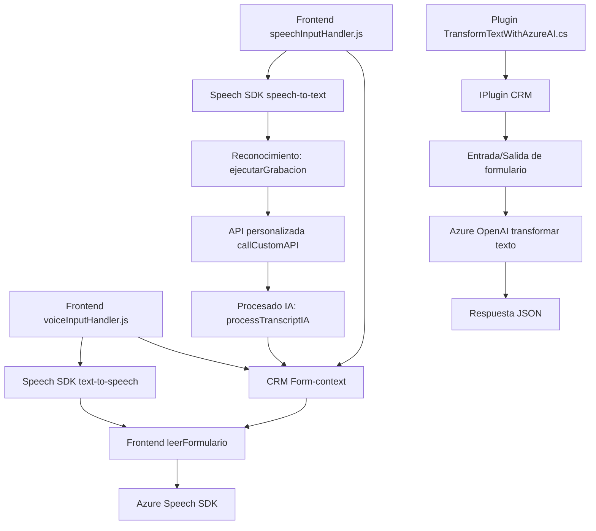

### Breve resumen técnico
El repositorio refleja una solución integral para la personalización de **Dynamics 365 CRM** con soporte de reconocimiento de voz, síntesis de voz, y transformación de texto mediante inteligencia artificial. Utiliza tecnologías de Microsoft Azure para Speech y OpenAI. Los archivos contienen lógicas distribuidas entre un frontend en JavaScript y plugins backend en C#.

---

### Descripción de arquitectura
La arquitectura general es **n-capas con integración de servicios externos**:
- **Frontend:** Scripts en JavaScript que interactúan con los formularios Dynamics CRM para entrada por voz, síntesis de texto y actualización automática de atributos en tiempo real.
- **Backend:** Plugins en C# conectados al SDK y APIs de Dynamics CRM, extendiendo la funcionalidad con procesamiento externo vía Azure OpenAI.
- **Integraciones:** Servicios en la nube de Azure (Speech y OpenAI) para modernizar funcionalidades mediante inteligencia artificial.

Esta arquitectura permite una comunicación y procesamiento fluida entre distintas capas y asegura extensibilidad gracias a su modularidad.

---

### Tecnologías usadas
1. **Frontend (JavaScript):**
   - **Azure Speech SDK** para funciones text-to-speech y speech-to-text.
   - **Vanilla JS** para lógica.
   - **Integration with Dynamics CRM forms:** Uso de `executionContext` y `Xrm.WebApi`.

2. **Backend (C# plugins):**
   - **Microsoft Dynamics CRM SDK (IPlugin, IOrganizationService)** para extender funcionalidades.
   - **Azure OpenAI Service:** Usa modelos de lenguaje natural para transformar texto en JSON.
   - **Newtonsoft.Json** y **System.Text.Json** para el procesamiento de datos JSON.
   - **HTTP client libraries:** Envío de solicitudes HTTP a APIs externas.

3. **General patterns:**
   - **Facade pattern:** Simplifica la interacción con módulos extensos mediante puntos de entrada (`startVoiceInput`, `Execute`).
   - **Decoupling/Modular design:** Cada archivo maneja componentes aislados de lógica, optimizando la mantenibilidad.
   - **External services integration:** Uso de APIs externas de Azure para funcionalidades no implementadas directamente en Dynamics.

---

### Diagrama Mermaid válido para GitHub
Este diagrama representa cómo los componentes del sistema interactúan entre sí:

---

### Conclusión final
El análisis sugiere que la solución está orientada a la **automatización de procesos CRM** mediante herramientas avanzadas de reconocimiento y síntesis de voz, así como procesamiento de texto con IA. Está dividida en una arquitectura **n-capas**, donde cada una cumple un propósito específico (interfaz, lógica de negocio y servicios externos). Esto garantiza escalabilidad, modularidad y flexibilidad para adaptarse a futuras necesidades empresariales.

La solución integra tecnologías modernas como **Azure Speech SDK** y **Azure OpenAI**, lo que la posiciona como una opción robusta para CRM inteligente.