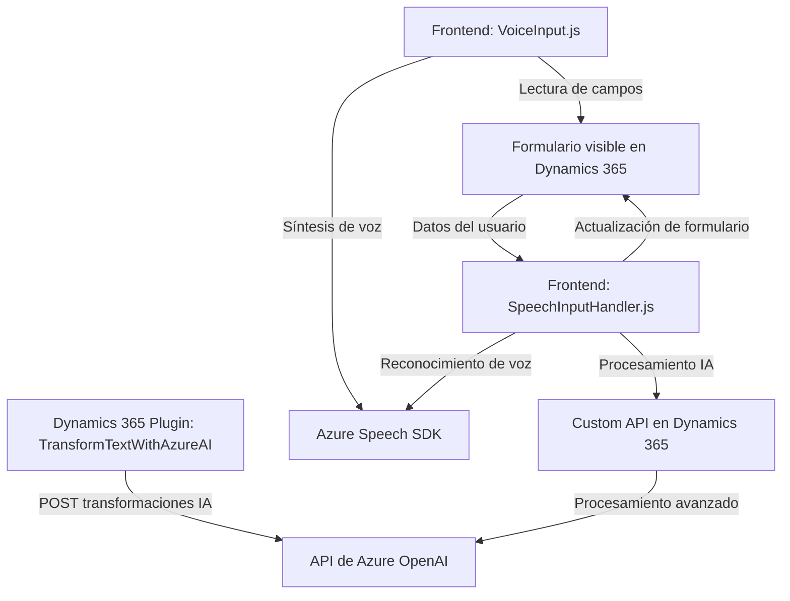

### Breve resumen técnico:

El conjunto de archivos pertenece a una solución centrada en integrar servicios de procesamiento de voz y texto mediante Azure Speech SDK y Azure OpenAI API con Dynamics 365. Incluye funcionalidades para lectura y síntesis de voz, reconocimiento de voz para actualizar formularios, y transformación de texto basada en inteligencia artificial.

---

### Descripción de arquitectura:

1. **Tipo de solución:**  
   La solución representa una combinación de frontend (JavaScript) y un backend basado en plugins para Dynamics 365. Utiliza servicios de terceros (Azure Speech SDK y Azure OpenAI) para enriquecer las interacciones del usuario con formularios dentro del ecosistema Dynamics 365.

2. **Arquitectura detectada:**  
   La solución tiene componentes con una arquitectura de **n capas** y utiliza patrones de **microservicios**:
   - El frontend modular interactúa con servicios externos (Azure Speech SDK).
   - Un plugin de Dynamics 365 actúa como un conector backend para el servicio Azure OpenAI a través de una REST API.

3. **Patrones aplicados:**  
   - Modularización: Funciones tanto en el frontend (JavaScript) como en el backend (C#) están altamente desacopladas y se enfocan en tareas específicas.
   - Adapter Pattern: El plugin adapta los datos entre Dynamics 365 y el servicio Azure OpenAI.
   - Service-Oriented Architecture (SOA): La integración con APIs de Azure Speech y Azure OpenAI sigue principios de arquitectura orientada a servicios.

---

### Tecnologías usadas:

1. **Frontend:**
   - Azure Speech SDK para sintetizar voz y reconocimiento de comandos.
   - JavaScript estándar + librerías específicas del contexto Dynamics 365 (XRM).

2. **Backend Plugin:**
   - C#: Para implementar el plugin en Dynamics 365.
   - API externa: Azure OpenAI (modelo GPT-4/3.5).

3. **Dependencias compartidas:**
   - Dynamics 365: Para manipulación de datos y formularios (XRM SDK y Custom APIs).
   - Azure Speech SDK y Azure OpenAI: Servicios en la nube para IA y procesamiento de texto/voz.

---

### Diagrama **Mermaid** válido para GitHub:

---

### Conclusión final:

Este repositorio implementa una solución híbrida que combina servicios distribuidos con dependencias frontend y backend. La integración con Azure Speech y OpenAI introduce capacidades avanzadas de IA para procesamiento de texto y voz, mientras que el plugin de Dynamics 365 se utiliza para extender las funcionalidades del sistema con una orientación a la personalización del usuario.

Aunque modular, la solución puede beneficiarse de una mayor formalización de estándares de diseño en algunos puntos. Adicionalmente, una evaluación sobre la compatibilidad con arquitecturas modernas como la hexagonal podría potenciar la escalabilidad del sistema para integraciones futuras.