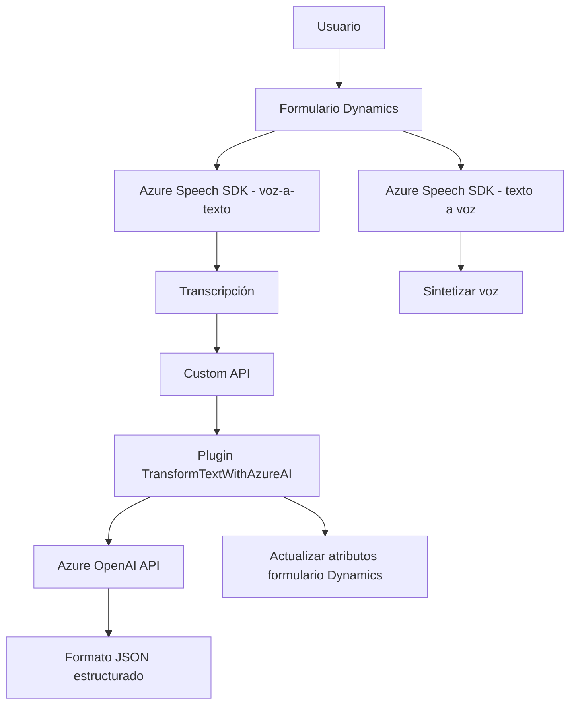

### Resumen técnico

El repositorio parece implementar una solución para integrar funcionalidades avanzadas de reconocimiento de voz, síntesis de texto a voz y procesamiento de transcripciones en aplicaciones basadas en formularios de Microsoft Dynamics CRM. Utiliza el **Azure Speech SDK** y la API de **Azure OpenAI** como principales tecnologías para estas operaciones. Además, se incluye una implementación de un plugin en C# para realizar transformaciones de texto en un entorno Dynamics CRM.

---

### Descripción de la arquitectura

La arquitectura se basa en una integración entre componentes de frontend (JavaScript) y backend (C# plugin) para interactuar con formularios de Dynamics CRM. El frontend maneja voz a texto y texto a voz, utilizando **Azure Speech SDK**. En el backend, un plugin de Dynamics CRM realiza la transformación del texto a JSON estructurado mediante la API de **Azure OpenAI**.

La interacción se da principalmente de la siguiente forma:
1. **Frontend (JavaScript)**:
    - Procesa la entrada/salida de voz (transcripción y síntesis).
    - Manipula DOM y datos en formularios de Dynamics CRM.
    - Utiliza llamadas a APIs personalizadas de Dynamics CRM para interactuar con el backend.

2. **Backend (Plugin en C#)**:
    - Realiza transformaciones avanzadas del texto en la API de Azure OpenAI.
    - Devuelve datos estructurados para su procesamiento en otros sistemas CRM.

La arquitectura sigue patrones que reflejan una organización modular y dependencias externas bien gestionadas. El flujo sugiere una arquitectura **n-capas**, ya que separa claramente la lógica de presentación (frontend), la lógica de negocio (API personalizada) y la interacción con servicios (Azure).

---

### Tecnologías usadas

1. **Frontend**:
   - Lenguaje: JavaScript.
   - Frameworks/Bibliotecas:
     - **Azure Speech SDK**: Para reconocimiento y síntesis de voz.
   - Entorno:
     - Formularios de **Microsoft Dynamics CRM**.
     - APIs personalizadas de Dynamics 365.
   - Patrones usados:
     - Modularidad: Uso de funciones desacopladas por responsabilidad.
     - Promesas: Resolución asíncrona de operaciones con APIs.
     - Failover: Manejo de errores en comunicación con Azure Speech SDK y APIs externas.

2. **Backend**:
   - Lenguaje: C#.
   - Frameworks/Bibliotecas:
     - **Microsoft.Xrm.Sdk**: Para integrar funcionalidad en Dynamics CRM como plugin (IPlugin).
     - **System.Net.Http**: Para realizar solicitudes HTTP hacia la API de Azure OpenAI.
     - **System.Text.Json**: Para manejar JSON.
     - **Newtonsoft.Json.Linq** y **System.Text.RegularExpressions** (opcionales).
   - Patrones usados:
     - Plugin Pattern para extender la funcionalidad de Dynamics CRM.
     - API Integration para comunicar servicios externos con el sistema.

---

### Diagrama Mermaid

El siguiente diagrama describe la interacción general entre los componentes del sistema: frontend, backend, APIs externas y los sistemas de Dynamics CRM.

---

### Conclusión final

La solución en este repositorio es principalmente diseñada para aplicaciones híbridas de **Microsoft Dynamics CRM**, donde las interacciones mediante voz y el procesamiento inteligente del texto transcrito a través de **Azure OpenAI** son clave. La segunda etapa del procesamiento (transformación del texto) utiliza un plugin en C#, mientras que la primera etapa (reconocimiento y síntesis de voz) ocurre en el frontend mediante **Azure Speech SDK**.

El enfoque arquitectónico principal corresponde a un modelo **n-capas**, con una clara separación de responsabilidades. La solución utiliza combinación de servicios externos y funcionalidades locales, logrando una integración eficaz en sistemas modernos de CRM.