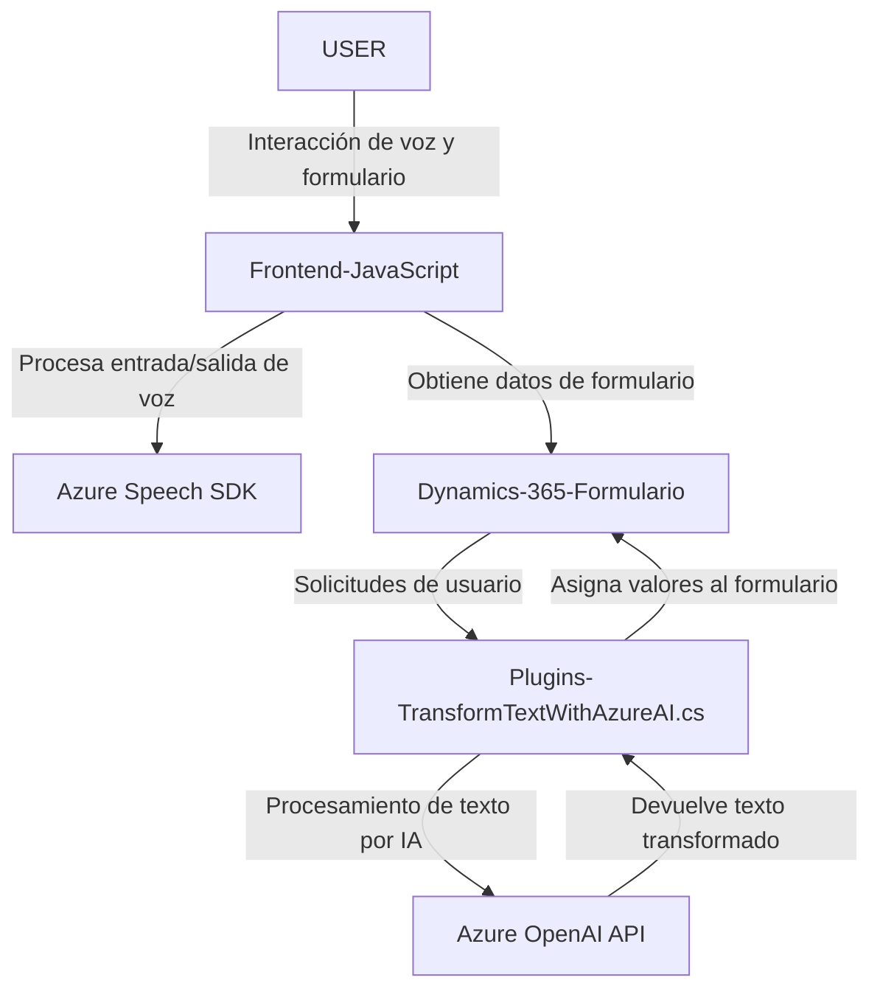

### **Análisis técnico resumido**

**1. Tipo de solución:**  
La solución combina varias tecnologías para proporcionar una **API de procesamiento de texto con integración en Dynamics CRM**, junto con un frontend basado en **JavaScript** para interactuar con formularios y permitir entrada/salida mediante voz. Está diseñada como un **ecosistema híbrido**: una capa de plugins para CRM y un frontend para entrada y salida de voz, junto con conexiones a servicios en la nube (Azure Speech SDK, Azure OpenAI).

---

### **Descripción de la arquitectura**
La arquitectura presenta las siguientes características:  
1. **Híbrida:** Combina un sistema **n capas** y un enfoque de **microservicios** al integrar servicios en la nube. Se centraliza la lógica en una arquitectura CRM (en capa backend integrada con Dynamics) que utiliza plugins para agregar funcionalidad personalizada.  
2. **División técnica:** 
   - **Frontend:** Interacciones de usuario (entrada/salida de datos) mediante formularios de Dynamics 365.  
   - **Servicio externo:** Utiliza SDKs y APIs como Azure Speech SDK y Azure OpenAI para realizar síntesis de voz, reconocimiento de voz y transformación de texto mediante IA.  
   - **Backend/Plugins en CRM:** Procesan solicitudes empresariales, transforman texto con OpenAI y devuelven respuestas estructuradas usando API personalizadas.

---

### **Tecnologías, frameworks y patrones usados**

#### **Tecnologías principales:**
1. **Frontend:**  
   - JavaScript para interacción con formularios Web.  
   - Dynamics 365 APIs (`Xrm.WebApi`) para manipular datos y formularios.  
   - Azure Speech SDK: Utilizado para texto a voz y reconocimiento de voz.  

2. **Backend:**  
   - **C#, .NET Framework/Core**: Para implementar los plugins en Dynamics CRM.  
   - **Newtonsoft.Json y System.Text.Json:** Para manejar el formato JSON en los datos.  
   - **Microsoft Dynamics SDK:** APIs para interactuar con la plataforma CRM.  
   - **Azure OpenAI API:** Servicio externo para procesamiento avanzado mediante inteligencia artificial.

#### **Patrones utilizados:**
1. **Plugin Pattern:** Funcionalidad extendida en Dynamics CRM mediante la implementación de interfaces proporcionadas por `IPlugin`.  
2. **Modularidad** en el JavaScript, con funciones individuales enfocadas en tareas únicas (principio de responsabilidad única).  
3. **Dependency Injection (DI):** Uso de `IOrganizationServiceFactory` para facilitar la comunicación entre servicios en el plugin.  
4. **External Service Integration Pattern:** Comunicación directa con servicios externos mediante SDKs y APIs (Speech SDK, Azure OpenAI).  
5. **Microfrontend:** La solución permite interactuar específicamente con partes del formulario en Dynamics, en paralelo a la integración de IA y procesamiento del habla.  

---

### **Dependencias y componentes presentes**

#### **Externas:**
1. **Azure Speech SDK:** Usado para síntesis y reconocimiento de voz.  
2. **Azure OpenAI API:** Usada para procesamiento avanzado de texto transcrito.  

#### **Internas:**  
1. **Dynamics 365 APIs:** Gestión de campos y datos en formularios.  
2. `Xrm.WebApi.online.execute` y otras APIs enfocadas en la integración directa con la plataforma CRM.  
3. Helpers como `getVisibleFieldData`, `applyValueToField`, `processTranscriptIA`, ofrecidos como recursos internos en el código para procesar entradas y valores de formulario.

---

### **Diagrama Mermaid**

---

### **Conclusión final**
La solución representa un ejemplo claro de integración de múltiples tecnologías y servicios modernos para mejorar la experiencia de usuario en una interfaz CRM usando entrada de voz, procesamiento avanzado con IA y síntesis de texto hablado. La arquitectura combina un enfoque **n capas** en la lógica backend y frontend con integración de APIs externas (Azure Speech y Azure OpenAI). Además, muestra un diseño modular y extensible mediante plugins y JavaScript helpers. Sin embargo, la seguridad podría mejorarse en la gestión de claves API sensibles y cadenas expuestas en el código.