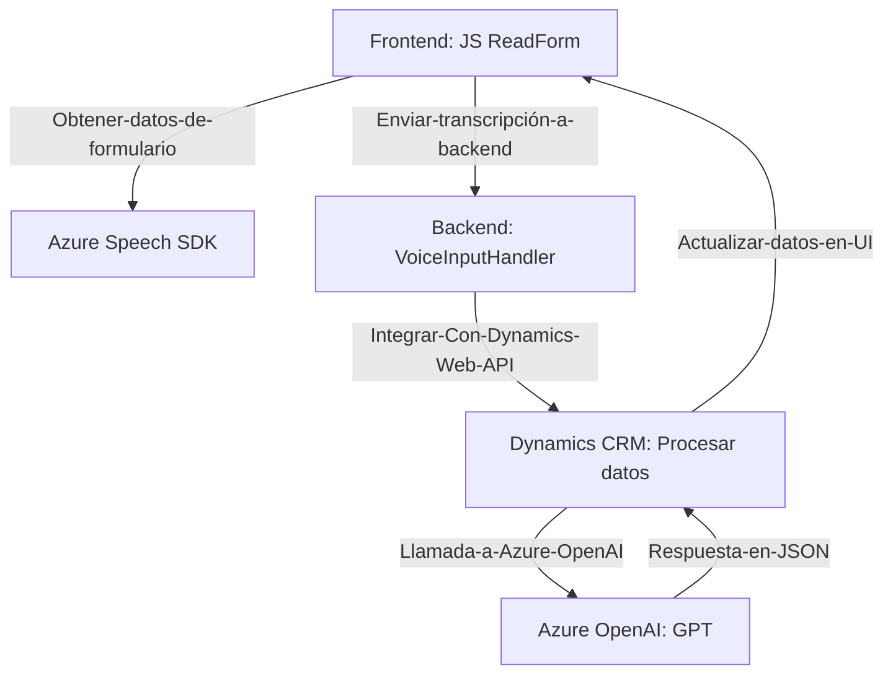

## Breve resumen técnico:
La solución presentada es un sistema híbrido compuesto por componentes frontend, backend y plugins que interactúan con Dynamics CRM y Azure servicios (Speech SDK y OpenAI). Estas piezas habilitan la captura de datos desde formularios, la manipulación textual mediante modelos de IA y la síntesis de voz.

## Descripción de arquitectura:
1. **Modularidad**: Todas las funcionalidades están divididas en módulos (archivos JS y plugins), facilitando el entendimiento y mantenimiento del código.
2. **Backend-Frontend colaboración**: El frontend realiza operaciones como captura de datos y ejecución de voz. El backend plugin de Dynamics CRM transforma y normaliza datos mediante OpenAI antes de enviarlos como respuesta al frontend.
3. **Patrón de microservicios**: Aunque no es un sistema completo de microservicios, las soluciones son independientes y bien aisladas, siguiendo principios de desacoplamiento.
4. **Patrones detectados**:
   - ***Facade***: Métodos centrales como `startVoiceInput` y `Execute` concentran múltiples operaciones internas y delegan a otros componentes.
   - ***SDK Loading Pattern***: Garantiza que dependencias externas como Azure Speech SDK estén disponibles al ejecutar funciones esenciales.
   - ***Service-Oriented Architecture (SOA)***: Integración de Azure Speech API y OpenAI API como servicios subyacentes que amplían las capacidades del sistema.

## Tecnologías usadas:
- **Frontend**:
  - JavaScript.
  - Azure Speech SDK.
  - Dynamics Web API (para interacción con datos).
- **Backend**:
  - Dynamics CRM Plugin Framework.
  - C# para escritura de plugins con clases como `IPlugin`.
  - Integración con Azure OpenAI API para manipulación textual estructurada.
- **Dependencias**:
  - `Microsoft.Xrm.Sdk` para interacción Dynamics CRM.
  - `Newtonsoft.Json.Linq` y `System.Text.Json` para manipulación y serialización JSON.
  - `System.Net.Http` para solicitudes e integraciones con OpenAI.

## Diagrama Mermaid **válido para GitHub**:

## Conclusión final:
La solución combina elementos de arquitectura modular con principios de integración API para ofrecer un sistema avanzado de interacción entre voz, texto y datos en formularios. Al aprovechar soluciones en la nube (Azure Speech SDK y OpenAI) junto con Dynamics CRM, el sistema asegura escalabilidad y adaptabilidad tecnológica. La elección de patrones como Facade y SOA refuerzan la capacidad del sistema para manejar operaciones complejas mientras mantiene un diseño claro y mantenible.