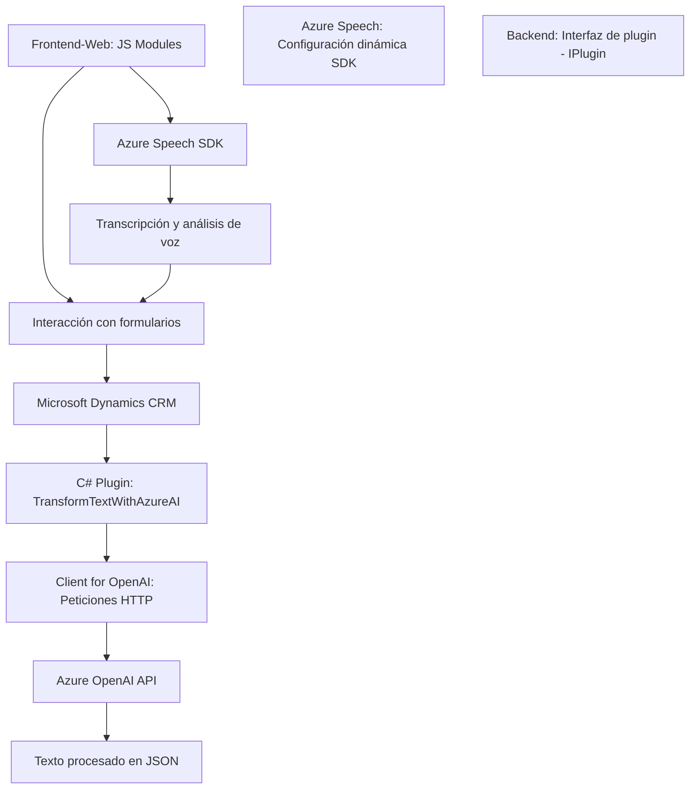

### Breve resumen técnico
Los archivos en el repositorio sugieren que este proyecto integra capacidades de voz y procesamiento de texto, utilizando el Azure Speech SDK y API de Azure OpenAI. Se enfoca en aplicaciones empresariales, particularmente en ámbitos como la interacción con formularios de Dynamics CRM para mejorar la accesibilidad y facilitar el manejo de datos con comandos por voz y la inteligencia artificial.

---

### **Descripción de arquitectura**
La solución tiene una arquitectura híbrida, conformada por componentes frontend (JavaScript en apps del navegador), integración de SDKs externos como Azure Speech y servicios de API (para el uso de Azure OpenAI). Además, existe una capa backend en C# que extiende la funcionalidad de Dynamics 365 mediante un plugin basado en la arquitectura n-capas que define Microsoft (Presentation, Application, Domain, Infrastructure).

1. **Frontend**:
   - Los archivos en la carpeta `FRONTEND/JS` son módulos en JavaScript que implementan interacción entre formularios y entrada/salida de voz (síntesis y reconocimiento).
   - Modularidad clara con funciones especializadas separadas por tarea.
   - Integración dinámica con el Azure Speech SDK.

2. **Backend**:
   - El archivo C# (`TransformTextWithAzureAI.cs`) respeta la arquitectura de plugins de Dynamics 365, actuando como una extensión que posibilita el procesamiento de texto mediante la API de Azure OpenAI.
   - Usa un enfoque de abstracción con un cliente HTTP que encapsula las solicitudes al servicio Azure OpenAI.

3. **Integración con Servicios de Azure**:
   - El proyecto aprovecha servicios como Speech SDK (síntesis y transcripción de voz) y OpenAI para el procesamiento de texto. La integración parece seguir principios RESTful.

### **Tecnologías usadas**
1. **Frontend**:
   - **JavaScript**: Desarrollo modular y uso de eventos basados en el SDK de Azure.
   - **Azure Speech SDK**: Servicios de síntesis y transcripción de voz.

2. **Backend (plugins)**:
   - **Microsoft Dynamics 365 SDK**: Para funcionalidades empresariales.
   - **Azure OpenAI**: Procesamiento de texto en plugin (Cloud AI Service).
   - **C# y .NET Framework**: Desarrollo del plugin en lenguaje robusto para sistemas empresariales.
   - **API REST**: Integración con Azure OpenAI.
   - **JSON**: Formato de intercambio de datos entre frontend, backend y servicios externos.

3. **Integraciones externas**:
   - `https://aka.ms/csspeech/jsbrowserpackageraw`: Referencia dinámica al SDK de Azure Speech embebido en el cliente.

### **Arquitectura**
La solución global utiliza una **arquitectura híbrida**:
1. **Frontend**:
   - **Modular**: Cada archivo JavaScript contiene funciones segmentadas con roles específicos, respetando el principio de separación de responsabilidades.
   - **Evento-based architecture**: Funciones disparadas al recibir datos de voz o al interactuar con el formulario para mejorar la experiencia del usuario.
   - Se utiliza como una capa de presentación (UI) en arquitectura de **n capas**.

2. **Backend/Integración**:
   - **Hexagonal/Ports-and-adapters**: El plugin actúa como un componente desacoplado que interactúa con servicios externos (Azure OpenAI), transformando datos de entrada.
   - Backend adherido a la arquitectura **n-capas**, típica de Dynamics 365:
     - **Presentation Layer**: Formulario y datos del input/voice UI (provistos por JavaScript).
     - **Application Layer**: Lógica del plugin para preprocesar datos y generar resultados con OpenAI.
     - **Domain Layer**: Definición de datos como texto y normas de manipulación.
     - **Infrastructure Layer**: Mediante Xrm Sdk y llamadas HTTP al servicio de Azure.

### **Dependencias y componentes externos**
1. **Azure Speech SDK**: Para la interacción basada en voz mediante reconocimiento y síntesis.
2. **Azure OpenAI API**: Procesamiento avanzado de texto mediante IA en el backend.
3. **Microsoft Dynamics 365 SDK**: Base para el plugin desarrollado en C#.
4. **Other external systems**:
   - APIs externas para interactividad y búsqueda de datos relacionados con Dynamics.
   - Posibles bibliotecas como `Newtonsoft` para manejo JSON avanzado en .NET.

---

### **Diagrama Mermaid**

---

### **Conclusión final**
El análisis de la estructura y del código muestra que esta solución está diseñada para proveer capacidades avanzadas de accesibilidad e interacción de voz con formularios en un entorno empresarial como Dynamics CRM. La arquitectura es un híbrido entre **n-capas** y **hexagonal**, apoyándose en servicios y SDK externos para la implementación. La modularidad del frontend está altamente optimizada para futuras mejoras, mientras que el plugin de C# sigue patrones estándar de extensibilidad en Dynamics 365.