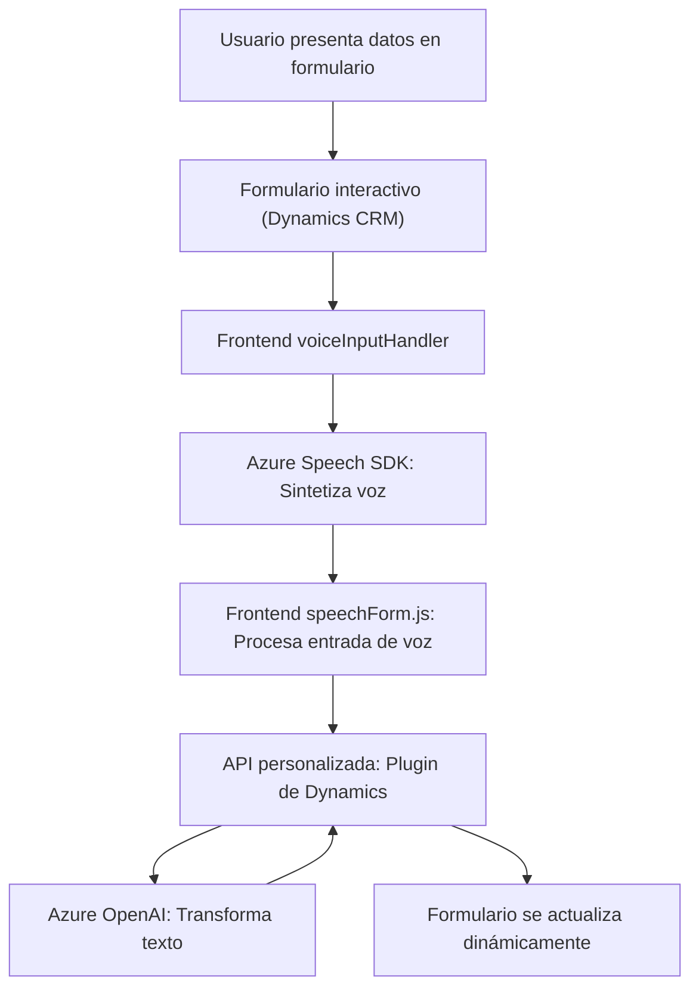

### Breve resumen técnico
La solución es una integración que utiliza funcionalidades basadas en **voz** y **texto**, conectando **formularios dinámicos** (Dynamics 365 CRM), el **Azure Speech SDK** y el **Azure OpenAI Service**. Su propósito principal es mejorar la entrada y procesamiento de datos interactivos, facilitando la actualización y transformación de campos de formularios mediante voz y procesamiento AI.

---

### Descripción de arquitectura
La arquitectura se compone de tres componentes principales:

1. **Frontend lógico**:
   - Archivos como `voiceInputHandler.js` y `speechForm.js` se encargan de *interacciones dinámicas en tiempo real*. Realizan entrada de voz, reconocimiento de texto y manipulación de formularios visibles.

2. **API Plugin**:
   - `TransformTextWithAzureAI.cs` interactúa con Dynamics CRM y conecta con **Azure OpenAI** para procesar y transformar texto de manera avanzada. El resultado, un JSON estructurado, se integra con los formularios del CRM.

3. **Dependencias externas**:
   - **Azure Speech SDK** para reconocimiento y síntesis de voz.
   - **Azure OpenAI Service** para procesos relacionados con modelo IA.

La arquitectura se puede considerar de tipo **n-capas**, donde cada componente (frontend, plugins y servicios externos) corresponde a una capa específica con responsabilidades claras, pero se combinan elementos integrados que recuerdan algo del diseño **hexagonal** debido a los adaptadores hacia servicios externos.

---

### Tecnologías usadas
1. **Lenguajes**:
   - **JavaScript**: Esencial en el frontend.
   - **C#**: Plugin para conectarse con Dynamics CRM.

2. **Servicios y frameworks**:
   - **Azure Speech SDK**: Reconocimiento de voz y síntesis de texto.
   - **Azure OpenAI Service**: Procesamiento interactivo del texto.

3. **Dynamic CRM API**:
   - Utiliza estructuras como `Xrm.WebApi`.

4. **HTTP Client Libraries**:
   - `System.Net.Http` y `Newtonsoft` en el plugin.

5. **Estructura**:
   - Modularización por funcionalidades independientes. Ejemplo: Una función por cada tarea en JavaScript (como síntesis, transcripción, normalización de valores).

---

### Diagrama Mermaid

---

### Conclusión final
La solución combina servicios de procesamiento de voz y AI para interactuar con formularios dinámicos en Dynamics CRM. Presenta una arquitectura **n-capas** con elementos modulares y adaptadores hacia servicios externos como **Azure Speech SDK** y **Azure OpenAI Service**.

Esta implementación es robusta para aplicaciones empresariales que requieran manipulación de datos en tiempo real mediante interacciones intuitivas (voz y texto), logrando una integración fluida en entornos como el CRM y adaptándose a patrones modernos como *event-driven* y *external dependency*.