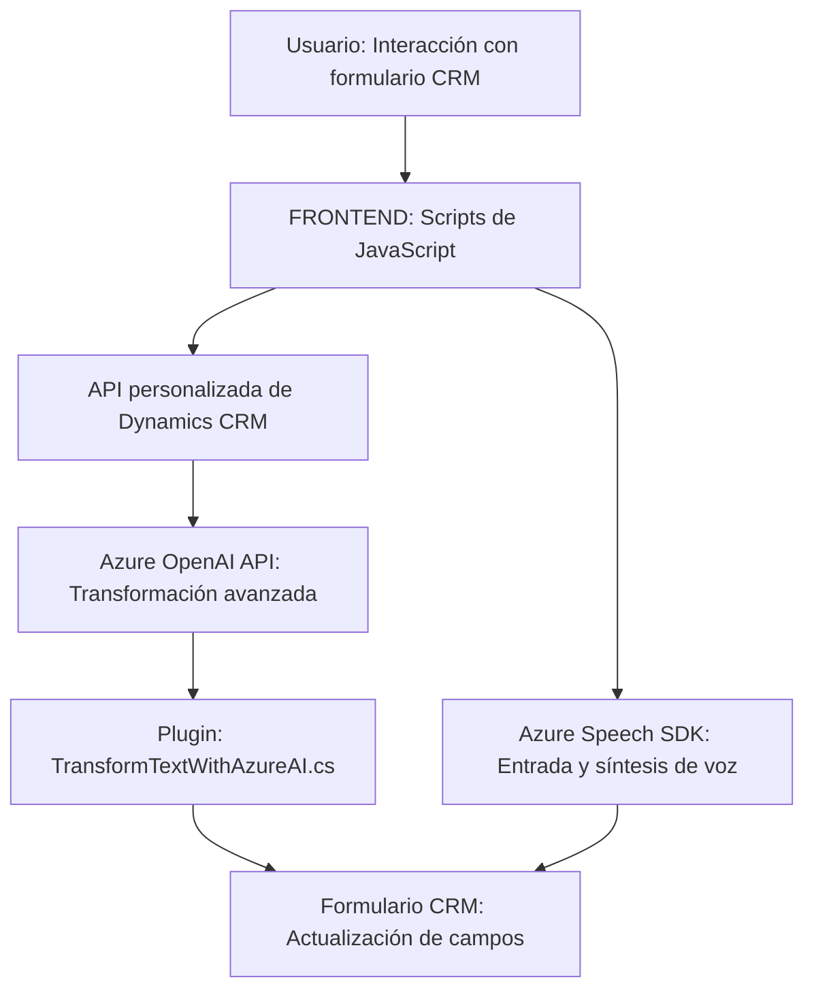

# Análisis técnico y descripción global

---

## 1. Breve resumen técnico  
Este repositorio está orientado al desarrollo de soluciones para CRM (Customer Relationship Management) utilizando Microsoft Dynamics y herramientas en el ecosistema Azure. Se enfoca en procesar datos del formulario (entrada y salida) mediante voz y texto, integrando servicios externos como el **Azure Speech SDK** y **Azure OpenAI API**. Los archivos manejan interacción directa con un formulario del sistema CRM y servicios externos para síntesis de voz, reconocimiento de voz y transformación avanzada de texto.

---

## 2. Descripción de arquitectura  
La arquitectura utilizada en esta solución tiene un enfoque **n-capas** con una separación lógica entre las siguientes responsabilidades:
1. **Interfaz de usuario (UI)**: Archivos JavaScript que interactúan con los formularios HTML/CRM visibles y manejan entrada por voz o texto.
2. **Servicios internos y externos**:
   - **Azure Speech SDK** para síntesis y reconocimiento de voz.
   - **Azure OpenAI API** para el procesamiento avanzado de texto y reglas automáticas.
3. **Plugin de Dynamics CRM (`TransformTextWithAzureAI.cs`)**: Implementación basada en eventos para extender la funcionalidad del sistema CRM utilizando reglas de procesamiento de texto transformado en JSON.

Dentro de Dynamics CRM, la arquitectura se beneficia del **patrón plugin** y se calcula que está basada en el concepto de **eventos** (flujos que se ejecutan sobre cambios específicos en el sistema).

---

## 3. Tecnologías usadas
### Lenguajes:
- **JavaScript**: Para la lógica del frontend y la integración cliente con Azure Speech SDK.
- **C#**: Para la implementación del plugin asociado a Dynamics CRM.

### Frameworks y SDKs:
- **Microsoft Dynamics 365 SDK**: Gestión del contexto y servicios del sistema CRM.
- **Azure Speech SDK**: Reconocimiento y síntesis de voz.
- **Azure OpenAI API**: Procesamiento avanzado usando modelos GPT (como GPT-4).

### Patrones de diseño:
- **Evento-controlador**: Gestiona las operaciones asíncronas (e.g., reconocimiento de voz, configuración de formulario al recibir datos).
- **Service-Oriented Architecture (SOA)**: Interacción con servicios de Azure para síntesis y reconocimiento de voz, así como transformación de texto.
- **Modularidad**: Funciones atomizadas para tareas independientes (e.g., obtener datos, transformar, aplicar valores).

---

## 4. Dependencias o componentes externos  
1. **Azure Speech SDK**:
   - URL del SDK dinámico: `https://aka.ms/csspeech/jsbrowserpackageraw`.
   - Utilizado para ambos modelos: síntesis de voz y reconocimiento de voz.
2. **Azure OpenAI API**:
   - Endpoint configurado para interactuar con modelos GPT (específicamente GPT-4).
3. **Microsoft Dynamics CRM API**:
   - Dependencias internas en servicios CRM (`Xrm.WebApi`) para lectura y escritura en el formulario.
4. Otros:
   - **HttpClient** para realizar solicitudes a servicios externos en plugins.
   - **JSON Libraries** como Newtonsoft.Json y System.Text.Json.

---

## 5. Diagrama Mermaid para GitHub Markdown  

---

## Conclusión final  
El repositorio implementa una solución orientada a la interacción y personalización de Microsoft Dynamics CRM mediante capacidades avanzadas de Azure. Los componentes del sistema están bien encapsulados con conectividad entre frontend (JavaScript), servicios externos (Azure SDK y API), y plugins en el backend (C#). La arquitectura muestra un enfoque modular y en capas con integración externalizada para funciones complejas. Esto proporciona flexibilidad, escalabilidad y una excelente separación de responsabilidades.