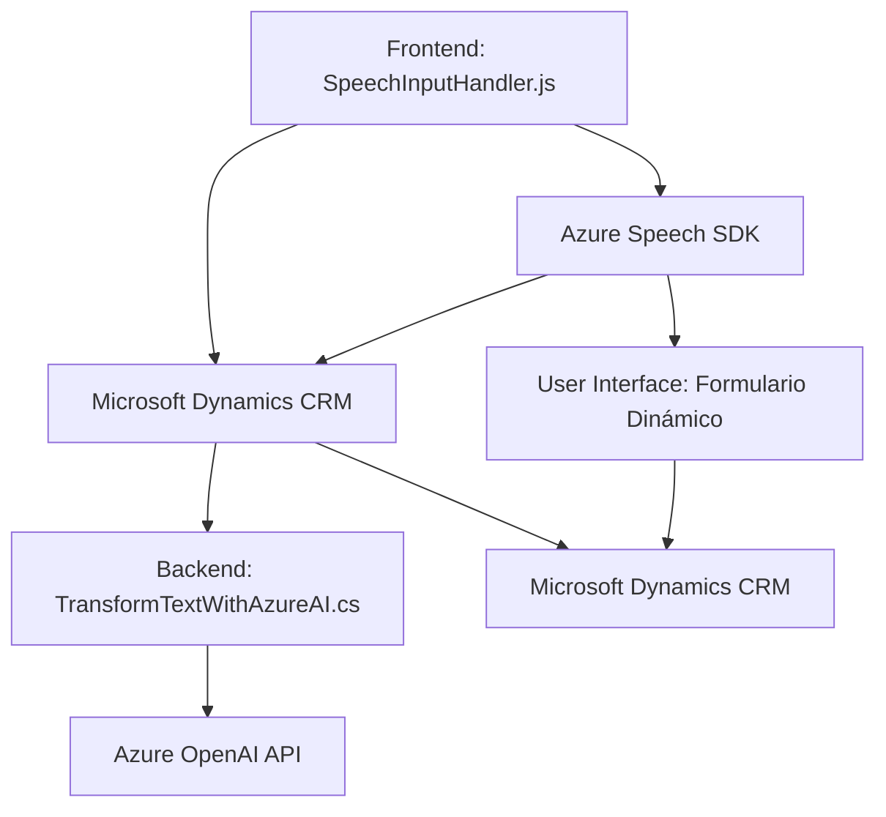

### **Breve Resumen Técnico**
El repositorio parece ser una solución híbrida dividida entre un frontend basado en JavaScript (para operaciones de reconocimiento/síntesis de voz y gestión de formularios dinámicos) y un backend integrado al ecosistema de Microsoft Dynamics CRM, utilizando Azure OpenAI para el procesamiento guiado de texto y otras tareas relacionadas con inteligencia artificial.

---

### **Descripción de Arquitectura**
La arquitectura empleada es de tipo **n-capas**, donde:
- **Frontend:** Implementado usando JavaScript y el Azure Speech SDK, con una capa para interactuar con el usuario (interfaz de voz y formulario).
- **Backend:** Constituido por un plugin para Microsoft Dynamics CRM que utiliza un servicio REST externo (Azure OpenAI API) para manejar funcionalidades de inteligencia artificial.

El sistema adopta algunos principios de **event-driven architecture**, ya que el frontend responde a eventos de voz, entrada en formularios y transcripciones. Además, la arquitectura **Service-Oriented Architecture (SOA)** está presente a través de la integración directa con servicios externos de Azure como Speech y OpenAI.

---

### **Tecnologías, Frameworks y Patrones Usados**

#### **Frontend (JavaScript)**
1. **Azure Speech SDK:** Para reconocimiento y síntesis de voz.
2. **Dynamic CRM APIs:** Para interactuar con los formularios y datos dinámicos del sistema CRM.
3. **Patrones de Diseño:**
   - **Facade Pattern:** Simplificación del SDK mediante funciones de alto nivel (`startVoiceInput`, `leerFormulario`, etc.).
   - **Callback Pattern:** Uso de callbacks para operaciones asíncronas como la carga del SDK y manejo de transcripciones.
   - **Adapter Pattern:** Adecuación de datos hablados a formato entendible (por ejemplo, conversión de números hablados a valores numéricos mediante `palabrasANumeros`).

#### **Backend (C# Plugin)**
1. **Microsoft Dynamics CRM SDK:** Para desarrollar plugins personalizados.
2. **Azure OpenAI API:** Para transformación avanzada de textos utilizando GPT-4.
3. **Librerías Esenciales:**
   - `Newtonsoft.Json.Linq`: Manipulación JSON.
   - `System.Net.Http`: Comunicación con Azure APIs.
4. **Patrones de Diseño:**
   - **Plugin Architecture:** Extensiones personalizadas de CRM mediante la interfaz `IPlugin`.
   - **Adapter Pattern:** Traducción entre el texto normal y JSON estructurado utilizando Azure GPT-4 en el método `GetOpenAIResponse`.
   - **Service-Oriented Architecture (SOA):** Uso de servicios externos como parte de la lógica principal.

---

### **Diagrama Mermaid**

---

### **Conclusión Final**
El sistema es una solución orientada al trabajo con Microsoft Dynamics CRM con funcionalidades enfocadas en la entrada y salida de voz, junto con el procesamiento avanzado de textos utilizando Azure AI. Con una arquitectura de **n-capas** y elementos de **SOA**, el diseño proporciona una forma escalable de integrar tecnología de voz e inteligencia artificial en un entorno empresarial. Los archivos analizados muestran dos partes complementarias (frontend y backend) que están conectadas por servicios en la nube y lógica empaquetada. Esta arquitectura es apropiada para casos donde la interacción dinámica con datos en tiempo real es clave.