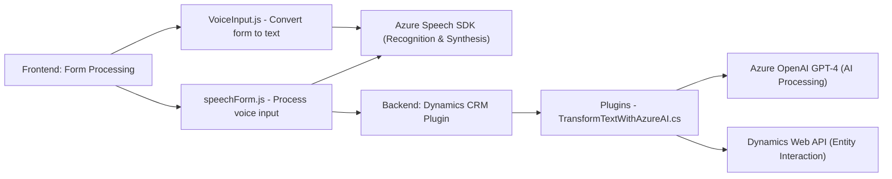

# **Análisis Técnico Completo**

## **Breve Resumen Técnico**
El repositorio en cuestión describe una solución tecnológica centrada en la integración de Microsoft Dynamics CRM con servicios de reconocimiento de voz (Azure Speech SDK) y procesamiento de texto mediante inteligencia artificial (Azure OpenAI). La solución tiene dos componentes principales:  
1. **Frontend**: Implementa funciones para interactuar con formularios dinámicos, reconocimiento de voz y síntesis de voz.  
2. **Backend (Plugins)**: Extiende la funcionalidad de Dynamics CRM para transformar texto mediante servicios AI.

La arquitectura general sugiere una combinación de componentes frontend, integración con APIs, y extensiones personalizadas sobre Microsoft Dynamics CRM como backend.

---

## **Descripción de Arquitectura**
La arquitectura de la solución tiene las siguientes características:
- **Multicapa**: Separación entre frontend (reconocimiento de voz, interacción con formularios) y backend (plugins de Dynamics CRM).
- **Integración API**: Utilización de servicios externos como Azure Speech SDK (para reconocimiento y síntesis de voz) y Azure OpenAI API (para estructuración de texto).
- **Modularidad**: Los componentes están divididos en clases, funciones bien definidas y adecuadas para extensibilidad.
- **Eventos en Dynamics CRM**: Uso de plugins CRM para ejecutar lógica en respuesta a eventos configurables en el CRM.
- Uso de **SDKs de Microsoft**: Como `Microsoft.Xrm.Sdk` y `SpeechSDK`.

---

## **Tecnologías y Frameworks Utilizados**
1. **JavaScript**: Para el desarrollo de funciones del frontend que interactúan con formularios dinámicos de CRM.
2. **Azure Speech SDK**: Integración para tareas de reconocimiento y síntesis de voz.
3. **Microsoft Dynamics CRM SDK**: Utilizado para la manipulación de datos en formularios y la creación de plugins.
4. **Azure OpenAI API**: Servicio externo para el procesamiento de texto y estructuración basada en inteligencia artificial.
5. **C#/.NET**: Lenguaje y framework utilizado en el desarrollo del plugin backend.
6. **Newtonsoft.Json / System.Text.Json**: Para manejo de datos en formato JSON.
7. **HTTPClient**: Para realizar solicitudes HTTP hacia las APIs.
8. **Microsoft Dynamics Web API**: Para buscar y manipular datos en entidades CRM.
9. **Patrones de Diseño**:
   - **Builder Pattern**: Construcción de la carga útil JSON para interacción con APIs.
   - **Callback Pattern**: En el frontend, usado para la carga asíncrona del SDK Speech de Azure.
   - **Event-Driven Architecture**: Aplicada en los plugins CRM.
   - **Single Responsibility Principle**: Las funciones están diseñadas con una finalidad única y específica.

---

## **Dependencias y Componentes Externos**
1. **Azure Speech SDK**: Para manejo de voz (grabación, reconocimiento, síntesis).
2. **Azure OpenAI GPT-4**: Modelos de inteligencia artificial para conversión de texto a JSON estructurado.
3. **Microsoft Dynamics Web API**: Acceso a datos de entidades CRM.
4. **Custom API en Dynamics CRM**: API que extiende la funcionalidad del sistema.
5. **Bibliotecas para JSON**: Newtonsoft.Json y System.Net.Http.

---

## **Diagrama Mermaid**

---

## **Conclusión Final**
La solución combina herramientas modernas de integración con APIs externas y extensiones de sistemas ERP, específicamente Microsoft Dynamics CRM. Su arquitectura destaca por la modularidad y separación de responsabilidades, con un diseño multicapa que facilita la interacción entre reconocimiento de voz, inteligencia artificial y manipulación de datos de entidades en el CRM.

### Ventajas:
- **Extensibilidad**: Es posible ampliar la funcionalidad del sistema tanto en el frontend como en el backend.
- **Escalabilidad**: Al usar servicios basados en la nube como Azure, la solución puede adaptarse fácilmente a una mayor carga.
- **Patrones Modernos**: Uso adecuado de APIs externas y eventos del sistema CRM.

La solución es ideal para aplicaciones empresariales centradas en la automatización del flujo de trabajo, principalmente en la captura, interacción y procesamiento de datos almacenados en sistemas ERP como Dynamics CRM.