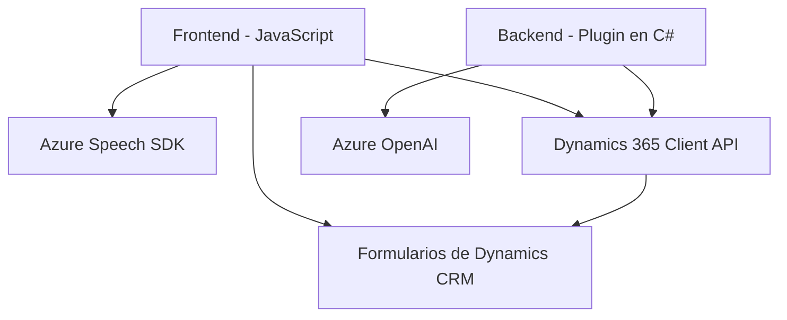

### **Análisis Técnico**

#### **1. Qué tipo de solución es**
Este repositorio incluye una solución orientada a aplicaciones empresariales que integran servicios cloud, específicamente un **frontend** para gestión e interacción con formularios de Dynamics 365 y un **backend plugin** desarrollado sobre Microsoft Dynamics CRM, que se conecta con servicios de **Azure Speech** y **Azure OpenAI** para habilitar funcionalidades avanzadas de procesamiento de lenguaje natural.

---

#### **2. Qué tecnologías, frameworks y patrones se están usando**
**Tecnologías y frameworks:**
- **Frontend (JavaScript)**:
  - Core JavaScript para el manejo de datos de formularios.
  - Dynamically loaded **Azure Speech SDK** para funciones de reconocimiento y síntesis de voz.
  - Integraciones con **Microsoft Dynamics CRM Client API** para manipulación de formularios y datos de entidades.
- **Backend Plugin (C#)**:
  - Plugin desarrollado en .NET Framework utilizando la API de Microsoft Dynamics CRM.
  - Uso de **Newtonsoft.Json** para el manejo de estructuras JSON.
  - **Azure OpenAI GPT-4**: Para procesamiento avanzado de lenguaje.

**Patrones de diseño y arquitectura:**
- **Facade:** Los archivos JS encapsulan operaciones complejas del Azure Speech SDK y las interacciones con la plataforma Dynamics, proporcionando una API simplificada al sistema.
- **Asynchronous Callback:** Uso de funciones de callback para garantizar la carga dinámica del SDK y realizar tareas asincrónicas.
- **Modularidad:** Uso de funciones especializadas que separan preocupaciones, cada una enfocándose en una tarea específica.
- **Service-Oriented Architecture (SOA):** Uso de servicios externos (Azure Speech y Azure OpenAI) para delegar funcionalidades específicas.
- **Plugin Design Pattern:** El archivo C# implementa un plugin que se registra y ejecuta dentro del ecosistema Dynamics CRM.

---

#### **3. Qué tipo de arquitectura tiene**
La arquitectura de la solución puede clasificarse como **multicapa SOA**:
1. **Frontend Layer**: La interacción de usuarios con Dynamics 365 mediante formularios utiliza componentes JavaScript y el SDK de Azure Speech.
2. **Business Logic Layer (BLL)**: El plugin en Dynamics CRM se encarga de realizar operaciones internas y lógica relacionada con los datos empresariales.
3. **Integration Layer**: Comunicación entre el plugin y la API de Azure OpenAI para el procesamiento de lenguaje natural.

Este enfoque modular y dependiente de servicios permite integrar capacidades avanzadas de inteligencia artificial directamente en aplicaciones empresariales.

---

#### **4. Dependencias o componentes externos**
- **Azure Speech SDK**: Para servicios de reconocimiento y síntesis de voz.
- **Azure OpenAI**: Para interactuar con modelos como GPT-4 y realizar transformaciones avanzadas de texto.
- **Dynamics 365 Client API**: Acceso y manipulación de datos de formularios y entidades del CRM.
- **Newtonsoft.Json**: Para serialización/deserialización de estructuras JSON en el servidor.
- **Microsoft.Xrm.Sdk**: API principal de Microsoft Dynamics para desarrollar plugins.

---

#### **5. Diagrama Mermaid (100 % compatible con GitHub Markdown)**

---

### **Conclusión Final**
Este repositorio implementa una integración avanzada entre un frontend en JavaScript y un backend C# alojado como un plugin en Dynamics CRM, habilitando capacidades de síntesis y reconocimiento de voz mediante Azure Speech SDK en el frontend, y procesamiento de texto con Azure OpenAI en el backend. La solución simplifica la interacción humano-máquina en un flujo de procesamiento de formularios mediante tecnologías cloud como Dynamics, Azure Speech, y Azure OpenAI. 

La arquitectura es claramente de **multicapa con orientación a servicios (SOA)**, lo que permite mantener modularidad y escalabilidad en el sistema. Sin embargo, podrían optimizarse ciertos aspectos, como evitar el uso de claves hardcodeadas en el código fuente del plugin y considerar una estructura más robusta para la gestión de errores en las solicitudes a servicios externos.