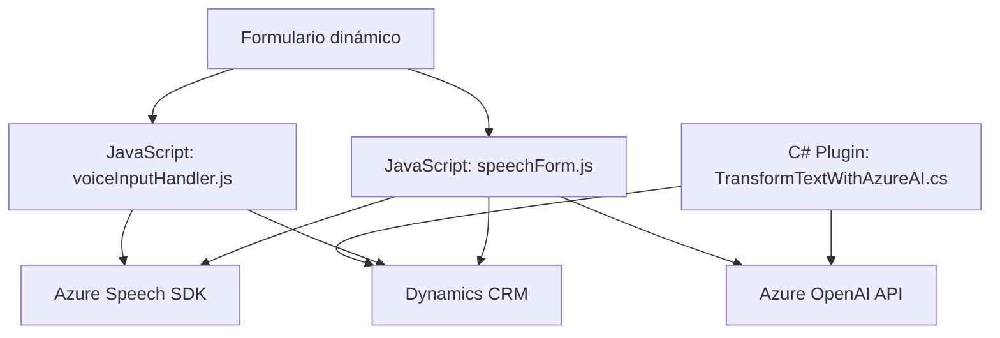

### Breve Resumen Técnico
El repositorio aborda la creación e integración de soluciones para Dynamics CRM mediante JavaScript en el frontend y C# en plugins. Utiliza servicios externos como **Azure Speech SDK** para funcionalidades de voz y transcripción, y **Azure OpenAI** para transformar datos textuales en JSON. La solución combina un frontend dinámico con procesamiento asincrónico y lógica empresarial orientada a la IA.

---

### Descripción de Arquitectura
La solución está diseñada con una arquitectura **orientada a servicios y plugins**, que se organiza en capas:
1. **Frontend (JavaScript):** Interactúa con el usuario mediante formularios y la síntesis/entrada de voz. Utiliza **Azure Speech SDK** para integrar funcionalidad avanzada de generación y transcripción de voz.
2. **Backend (C# Plugin):** Extiende la lógica empresarial dentro de Dynamics CRM. Procesa datos mediante servicios de **Azure OpenAI**, siguiendo reglas específicas, y genera respuestas consumibles en formato JSON.

Patrones observados:
- **Service Layer:** Se delega la mayoría de la lógica compleja a funciones específicas (por ejemplo, transformación de datos, manejo de errores).
- **Integración de servicios externos:** A través de APIs como Speech SDK y OpenAI.

---

### Tecnologías Usadas
1. **Lenguajes:**
   - JavaScript para el frontend.
   - C# para los plugins en Dynamics CRM.

2. **Servicios Externos:**
   - **Azure Speech SDK:** Para síntesis y transcripción de voz.
   - **Azure OpenAI:** Para procesamiento de texto y generación de JSON estructurado.

3. **Frameworks y librerías:**
   - **Dynamics CRM SDK:** Para extender la lógica empresarial en el backend.
   - **Newtonsoft.Json:** Para manipulación de JSON.
   - **DOM API:** Para interacción directa con elementos en el frontend.

4. **Modelos de Integración:**
   - Comunicación HTTP con Azure OpenAI mediante `System.Net.Http`.
   - Configuración dinámica del servicio de voz en el frontend utilizando API de **Speech SDK**.

---

### Diagrama Mermaid válido para GitHub

---

### Conclusión Final
Esta solución integra tecnologías avanzadas de Azure para simplificar la interacción en formularios mediante síntesis y entrada de voz, además de extender la lógica empresarial de Dynamics CRM con procesamiento AI. Aunque emplea una arquitectura de capas distribuida, no alcanza el nivel de microservicios. Se caracteriza por ser modular, reutilizable y centrada en la integración de servicios externos. Ideal para entornos con requerimientos de inteligencia artificial aplicada a datos dinámicos.