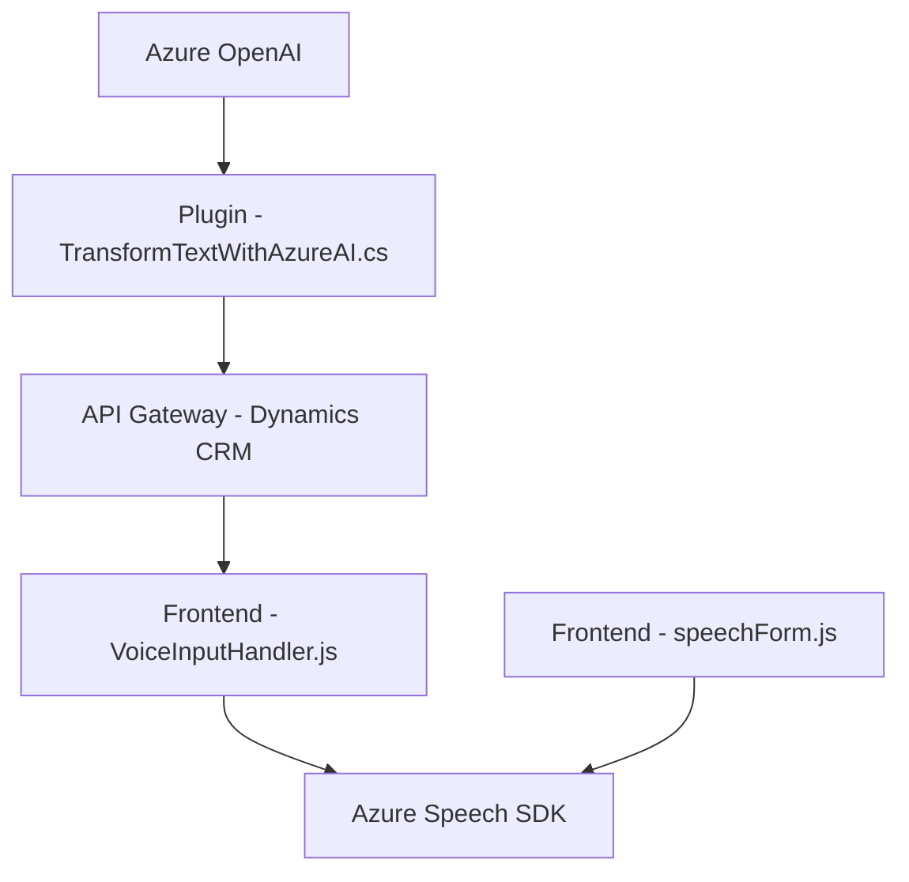

### Breve Resumen Técnico  
El repositorio es una solución completa que integra múltiples capas de interacción entre usuarios, tecnologías de Microsoft (Dynamics CRM y Xrm.WebApi), y servicios de Azure (Speech SDK, OpenAI). Su propósito principal es proporcionar una interfaz que permita la captura de datos mediante voz y el procesamiento de texto usando inteligencia artificial, con la comunicación estructurada entre frontend y backend.

---

### Descripción de Arquitectura  
1. **Arquitectura General:**
   - **Frontend:** Consiste en scripts JavaScript que implementan interacción con Azure Speech SDK para reconocimiento y síntesis de voz. Además, integra comunicación asíncrona con APIs internas en Dynamics CRM.
   - **Backend:** Implementa un plugin en C# que procesa texto con reglas específicas utilizando Azure OpenAI. Este se integra directamente con eventos disparados en Dynamics CRM.
   - **Patrón de Interacción:** Basado en **Microservicios**, donde se delegan funcionalidades específicas a Azure Speech SDK y Azure OpenAI para ofrecer modularidad y escalabilidad en tareas específicas.

2. **Patrones de Diseño Adoptados:**
   - **MVC influenciado:** Separación en lógica para obtener datos del formulario (modelo), manipulación del lenguaje hablado (controlador), y presentación al usuario mediante síntesis de voz (vista).
   - **Plugins en Dynamics CRM:** Representa un estilo Event-driven programming, ejecutándose según disparadores del contexto CRM.
   - **Desacoplamiento:** La solución utiliza varios servicios externos (Azure) para minimizar la carga del CRM y mantener la arquitectura flexible.

---

### Tecnologías Usadas  
- **Frontend:**  
  - Azure Speech SDK: Captura de voz y síntesis, configuración dinámica desde un script cargado.  
  - DOM API: Interacción con formularios visibles y manipulación de datos.  
  - Comunicación con APIs internas usando `Xrm.WebApi`.

- **Backend:**  
  - Dynamics CRM (Plugins): Lógica CRM extendida con eventos y servicios personalizados.  
  - Azure OpenAI: Procesamiento y transformación avanzada de texto.  
  - .NET Framework: Desarrollado en C# con dependencias como `Newtonsoft.Json` y `System.Text.Json` para manipulación JSON y conexión a APIs externas.  

- **Externo:** APIs y servicios de Azure, configuraciones como claves API y regiones específicas (ej. `es-ES-AlvaroNeural` para síntesis de voz).

---

### Diagrama Mermaid  

---

### Conclusión Final  
La solución implementa una arquitectura basada en **Microservicios** con integración de varios servicios externos potenciados por Azure. Combina un frontend que actúa como capa de interacción entre usuarios y APIs, y un backend que amplifica el procesamiento de datos mediante plugins en Dynamics CRM y el servicio OpenAI. Es escalable, modular y extensible, lo que permite adaptarse a diferentes necesidades futuras (por ejemplo, ajustes regionales o soporte de nuevos idiomas).