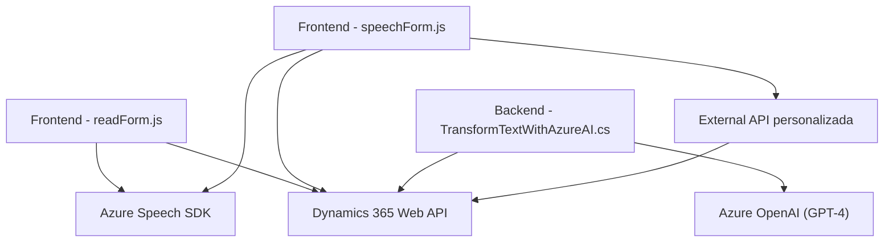

### Breve resumen técnico:
El repositorio integra soluciones específicas para procesar formularios mediante reconocimiento de voz, síntesis de voz, e inteligencia artificial dentro de un sistema Dynamics 365, complementado con un plugin para transformación de texto a través de Azure OpenAI. Es una solución de software modular que combina frontend y backend con integración de servicios externos.

---

### Descripción de arquitectura:
La arquitectura empleada sigue un enfoque **orientado a servicios (SOA)** y **n-capas**, integrando servicios externos (Azure Speech SDK y Azure OpenAI) para extender la funcionalidad del sistema central (Dynamics 365). Por un lado, está la capa frontend implementada en **JavaScript**, que interactúa con el usuario a través de reconocimiento y síntesis de voz para operar formularios. Por otro, la capa backend implementa un **plugin** en Dynamics 365 para realizar transformaciones con Azure OpenAI.

En el frontend, los scripts utilizan el patrón **event-driven** al depender de eventos y callbacks para manejar la lógica de síntesis y reconocimiento de voz. En el backend, los plugins en C# aseguran el cumplimiento de reglas de negocio mediante integración directa con servicios externos.

---

### Tecnologías usadas:
#### Frontend:
- **JavaScript**: Implementación general del procesamiento de voz y manipulación de formularios.
- **Azure Speech SDK**: Reconocimiento y síntesis de voz a través de servicios en la nube.
- **Modular Utility Functions**: Diseño basado en funciones reutilizables.

#### Backend:
- **C#**: Desarrollo del plugin que implementa integración con Azure OpenAI.
- **Dynamics 365 CRM SDK**: Para la interacción con el sistema Dynamics.
- **Azure OpenAI (GPT-4)**: Transformación avanzada de texto vía modelos de IA.
- **Newtonsoft.Json**: Procesamiento de datos JSON.
- **HTTP Client**: Para comunicación directa con APIs externas.

#### Patrones:
- **Service Layer**: Abstracción de los servicios Azure Speech y OpenAI para reducir acoplamiento.
- **Encapsulación funcional**: Uso de métodos especializados para cada interacción y lógica específica.
- **Dynamic Resource Loading**: Carga en tiempo real de SDKs para optimizar la utilización de recursos.
- **Event-Driven Architecture**: Dependencia de eventos específicos para iniciar procesos (carga de SDK, reconocimiento, síntesis).

---

### Diagrama Mermaid válido para GitHub:

---

### Conclusión final:
El repositorio representa una solución robusta de **orientación a servicios** que integra funcionalidad avanzada de voz y procesamiento de texto mediante tecnologías de Azure. La separación del frontend y backend, junto con la encapsulación de lógica en capas, refuerza la modularidad y escalabilidad del sistema, lo cual es óptimo para sistemas empresariales como Dynamics 365. Sin embargo, cualquier expansión futura debe considerar la optimización de latencias y costos derivados de la alta dependencia de servicios externos (como Azure).