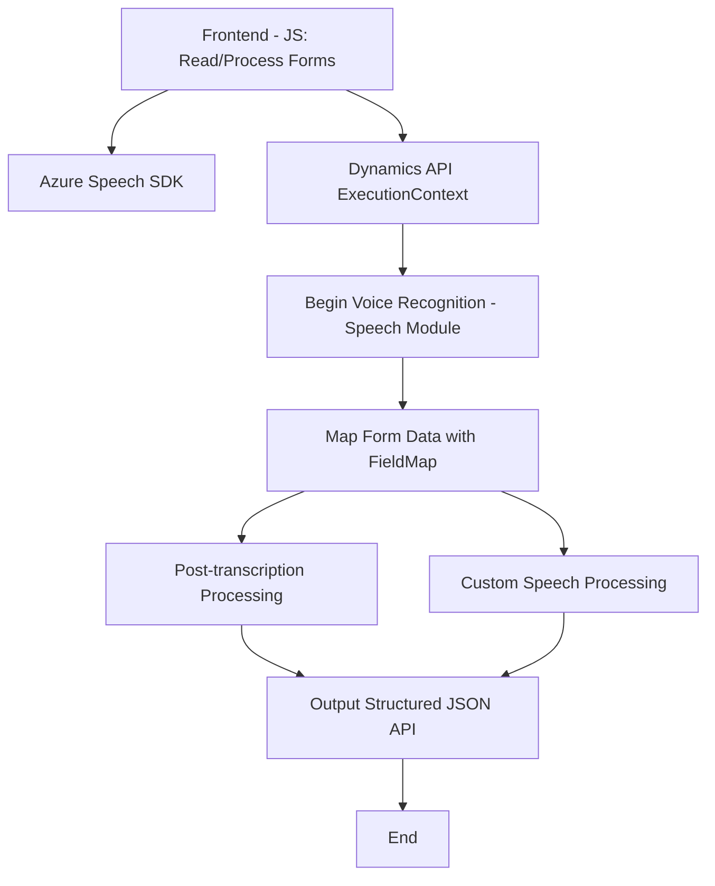

# Resumen técnico del repositorio

El repositorio contiene diferentes componentes diseñados para trabajar en un ecosistema orientado a formularios en aplicaciones Dynamics 365, con funcionalidades de conversión de voz a texto, síntesis de texto a voz, y transformación del texto utilizando servicios externos de Azure (Voice SDK, Speech SDK y OpenAI). Está principalmente orientado a aplicaciones empresariales que integran APIs de Microsoft y Azure.

---

## Descripción de la arquitectura

Este sistema combina arquitectura basada en **n capas** con componentes especializados que incluyen:

1. **Frontend (JavaScript)**: 
   - Funciona como un cliente ligero para interactuar con formularios y recursos externos. Los módulos como `readForm.js` y `speechForm.js` están diseñados para ejecutar lógica en el navegador, procesar datos del formulario, y comunicarse con APIs externas (Azure Speech SDK).
   
2. **Backend (Dynamics 365 Plugins)**:
   - Los archivos `.cs`, como `TransformTextWithAzureAI.cs`, implementan extensiones de lógica empresarial mediante plugins de Dynamics 365, integrándose con el servicio OpenAI de Azure para procesamiento avanzado.

3. **Servicios externos**:
   - Se requiere interacción con Azure Speech SDK (Síntesis y Transcripción de Voz) y el servicio Azure OpenAI para transformar texto según reglas predefinidas.

4. **Estructura modularizada**:
   - Cada módulo está dedicado a una funcionalidad específica: lectura del formulario, síntesis de texto a voz, reconocimiento de voz a texto, mapeo dinámico de campos, y transformación de los datos mediante AI.

Este repositorio integra elementos de **n capas** en una arquitectura híbrida donde las responsabilidades están claramente distribuidas según los roles de frontend (interacción y procesamiento) y backend (procesadores basados en plugins).

---

## Tecnologías utilizadas

1. **Frontend**:
   - **JavaScript**:
     - Manipulación de DOM y funcionalidad dinámica en el navegador.
     - Importación dinámica de SDK externo (Azure Speech SDK).
   - **Azure Speech SDK**:
     - Síntesis de voz y transcripción.
2. **Backend**:
   - **C# con Dynamics CRM SDK**:
     - Extensiones mediante plugins en Dynamics 365.
     - Operaciones de transformación JSON en los servicios (con interacción basada en REST).
   - **Azure OpenAI** (GPT-4) para procesamiento en el backend utilizando APIs REST.
3. **Ambient Technologies**:
   - Microsoft Dynamics 365 (Framework empresarial).
   - Navegador como host para ejecutar lógica frontend.

---

## Dependencias y componentes externos

1. **Dependencias externas**:
   - **Azure Speech SDK**: Usado para la síntesis de texto y transcripción de datos.
   - **Azure OpenAI**: Procesamiento avanzado de texto por medio del modelo GPT-4.
   - **Microsoft Dynamics 365**: Utilizado como base para la gestión de formularios.
   - **Xrm.WebApi**: Comunicaciones entre plugins y entidades de Dynamics CRM.

2. **Componentes internos**:
   - **Front-End**: Módulos JS como `voiceInputHandler.js`, luchando por la interacción rápida.
   - **Backend**: Plugins `.cs` para lógica empresarial avanzada.
   - **Data mapeo dinámico con JSON**: Reconocimiento y asociación de campos en formularios usando `getFieldMap`.

---

## Diagrama **Mermaid** para representación de arquitectura

---

## Conclusión final

El sistema implementa una solución robusta basada en integración profunda con el ecosistema Microsoft Azure/Dynamics 365. Su arquitectura principal es de **n capas**, con funcionalidades específicas para el manejo de formularios, transcripciones de voz, y generación de contenido dinámico mediante Azure OpenAI. Está diseñado con modularidad y una clara separación de responsabilidades entre frontend y backend, apoyado en patrones y servicios escalables que facilitan el procesamiento y síntesis en tiempo real.