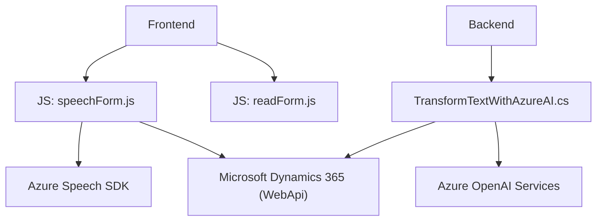

### Breve Resumen Técnico
El repositorio incluye tres áreas diferentes para la implementación de una solución que involucra la interacción con formularios dentro del entorno de Microsoft Dynamics 365, la integración con servicios de Microsoft Azure (Azure Speech SDK, Azure OpenAI), y la funcionalidad de síntesis y reconocimiento de voz, junto con la generación de formatos estructurados como JSON. La solución presenta un enfoque basado en la interacción entre componentes frontend, plugin backend en C#, y servicios en la nube de Azure.

---

### Descripción de Arquitectura
1. **Tipo de solución:** Principalmente se trata de una solución híbrida que incluye:
   - Frontend web: Para la interacción con el usuario y la funcionalidad de síntesis/entrada de voz.
   - Backend plugin: Operaciones relacionadas con procesamiento avanzado de texto utilizando Azure OpenAI.
   - API: Integración directa con servicios de Azure Speech SDK y Azure OpenAI Services.

2. **Arquitectura:**  
   La arquitectura seguida es **N capas**, con distintas responsabilidades distribuidas:
   - **Capa de presentación**: Archivos en `FRONTEND/JS` alojan la lógica para síntesis y reconocimiento de voz en el lado del cliente.
   - **Capa negocio/aplicación**: Plugins en el backend gestionan transformaciones inteligentes del texto y determinan la lógica relacionada con Dynamics CRM.
   - **Servicios externos**: Azure Speech SDK y Azure OpenAI actúan como herramientas para procesar entrada/salida de datos.

3. **Tecnologías y frameworks utilizados:**
   - **Frontend:**  
     - JavaScript como lenguaje base.
     - Azure Speech SDK para implementación de reconocimiento y síntesis de voz.
     - Microsoft Dynamics framework para integrar con formularios y objetos Xrm.
   - **Backend:**  
     - C# y .NET Framework con Dynamics CRM (plugins).
     - Microsoft.Xrm.SDK para integración en Dynamics.
     - Newtonsoft Json y System.Text.Json para manipulación de JSON.
     - Azure OpenAI Services (GPT-4) para procesamiento inteligente.

4. **Patrones:**  
   - Uso de patrones como:
     - Modulares: Separación en funciones especializadas para interacción con formularios y SDKs.
     - Plugin pattern: En el lado backend para ejecutar lógica bajo eventos predefinidos.
     - Event-driven: Uso de los callbacks en el ciclo de vida del SDK (como la carga del servicio de reconocimiento de voz y síntesis).
     - 3rd Party API Integration: Conexión directa con servicios de Azure.

5. **Dependencias externas:**  
   - **Azure Speech SDK:** SDK para reconocimiento y síntesis de voz en tiempo real.
   - **Azure OpenAI Services:** Para generación de contenido con reglas específicas mediante modelos GPT.
   - **Dynamic-related Libraries:** `Xrm.WebApi` y `Microsoft.Xrm.SDK` para integración con Dynamics CRM.
   - **JSON Libraries:** `Newtonsoft.Json` y `System.Text.Json` para manipulación de JSON tanto en solicitudes como en respuestas.

---

### Diagrama Mermaid

---

### Conclusión Final
Esta solución combina una arquitectura N capas que integra un frontend interactivo con capacidades de síntesis y reconocimiento de voz, un backend robusto construido como plugin para procesar texto de manera inteligente mediante potentes servicios de Azure OpenAI, y conectividad nativa con Microsoft Dynamics CRM mediante APIs. Se emplean buenos principios como modularidad, uso de APIs externas y el plugin pattern, aunque el enfoque en funciones globales en el frontend podría dificultar la escalabilidad. Mejora significativa sería adoptar un framework como React o Angular para el frontend, optimizando mantenibilidad y ampliación. La solución es adecuada para sistemas empresariales que requieren interacción dinámica con datos mediante voz y reglas avanzadas de procesamiento.