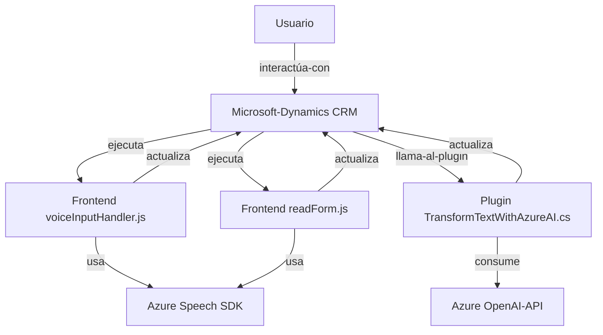

### Breve resumen técnico
El repositorio analizado configura una solución orientada a una integración empresarial con CRM, utilizando Microsoft Dynamics CRM y servicios externos de Azure (Speech SDK y OpenAI API). Los archivos analizados sugieren que esta solución es una **API y sistema de microservicio** para interactuar con formularios dinámicos y transformar la información basada en entrada por voz o texto.

---

### Descripción de arquitectura
1. **Tipo de solución**: Integra la capa de frontend dinámica en Microsoft Dynamics CRM con APIs externas (Azure Speech y OpenAI). Utiliza eventos y plugins para procesar voz y transformar texto con IA en respuestas precisas que actualizan automáticamente los datos del formulario CRM.

2. **Arquitectura**:
   - **Cliente-servidor**: La solución presenta una arquitectura distribuida que combina un frontend con funciones dinámicas en JavaScript y un plugin para Microsoft Dynamics CRM.
   - **Orientación por eventos**: Lógica basada en callbacks (evento de carga del SDK, eventos de plugins).
   - **Microservicios y API-centric**: Incorporación de Azure Speech SDK para reconocimiento de voz y síntesis de texto hablado, y Azure OpenAI para procesamiento automático de texto.
   - **Integración de servicios externos**: Arquitectura de servicios trabajando en conjunto con el ecosistema CRM y sus capacidades nativas como `WebApi` y plugins.

3. **Patrones usados**:
   - **Modularización**: Código dividido en funciones que implementan partes específicas de la lógica (modular por funcionalidad).
   - **Separación de responsabilidades**: Cada archivo sigue un principio claro de cumplimiento de una única responsabilidad (por ejemplo, entrada por voz o procesamiento de transcripciones).
   - **Service-oriented architecture (SOA)**: Utiliza APIs externas como servicios para distribuir la lógica empresarial.
   - **Event-driven architecture**: Dependencia de eventos en tiempo real que gestionan la interacción.

---

### Tecnologías usadas
1. **Frontend (JavaScript)**:
   - **Azure Speech SDK**: Proporciona reconocimiento de voz y síntesis de texto a voz.
   - **Dynamics CRM Web API**: Para interacciones y modificaciones en formularios.
   - **HTML/JavaScript**: Para el frontend (acciones como obtener campos visibles del formulario).

2. **Backend (Plugin .NET)**:
   - **Microsoft Dynamics CRM SDK**: Contribuye a la construcción de un Plugin que amplía la funcionalidad del sistema CRM.
   - **Azure OpenAI API**: Permite el procesamiento de lenguaje natural.
   - **.NET Framework**: Base de desarrollo general para el plugin de Dynamics CRM.
   - **Newtonsoft.Json**: Utilizado para manejo de JSON en transformaciones y creación de payloads.

---

### Dependencias y componentes externos

1. **Dynamics CRM SDK**:
   - Interactúa con la plataforma CRM para acceder y actualizar formularios, contextos y atributos.

2. **Azure Speech SDK**:
   - SDK para el reconocimiento de voz y síntesis de texto en tiempo real.
   - Utilizado mediante la URL oficial: `https://aka.ms/csspeech/jsbrowserpackageraw`.

3. **Azure OpenAI API**:
   - Endpoint externo para procesamiento y transformación avanzada de texto con IA.
   - Requiere configuración de claves API y región.

4. **Complementos dinámicos con plugins**:
   - El uso de Dynamics plugins agrega lógica personalizada al flujo del formulario y permite ejecutar acciones relacionadas con datos y reglas definidas por usuarios.

---

### Diagrama Mermaid válido para GitHub

---

### Conclusión final
La solución integra componentes que habilitan una interacción avanzada entre la entrada por voz (Azure Speech SDK), procesamiento de texto asistido por Inteligencia Artificial (Azure OpenAI), y manipulación dinámica de datos en Microsoft Dynamics CRM mediante un plugin (`TransformTextWithAzureAI.cs`). Su estructura modular y orientación hacia APIs externas y eventos en tiempo real sugiere una arquitectura **SOA** mezclada con características de diseño por **microservicios** (datos procesados por IA). Además, la integración con Dynamics CRM para manejar formularios representa una arquitectura eficaz para soluciones empresariales interactivas.

La solución está técnicamente robusta y podría extenderse fácilmente incluyendo nuevos flujos como análisis más avanzados en AI (e.g., modelos GPT).