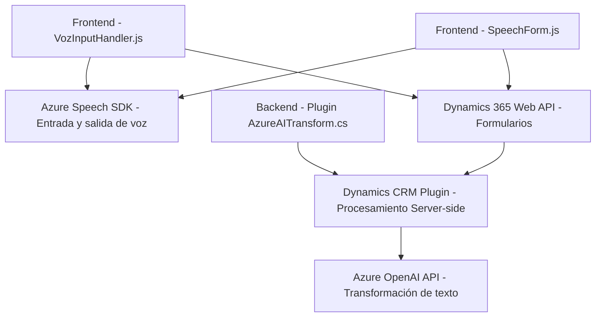

Breve resumen técnico:
El repositorio corresponde a una solución híbrida que integra un frontend dinámico basado en JavaScript y un backend diseñado sobre Microsoft Dynamics CRM. La solución utiliza funcionalidades avanzadas como entrada de voz y generación de texto estructurado con Azure Speech SDK y Azure OpenAI.

---

### Descripción de arquitectura:
La arquitectura es **n-capas** con una separación entre un frontend interactivo (que utiliza lógica de cliente para manejar entrada de voz y visualización/formularios) y un backend compuesto por plugins que gestionan operaciones avanzadas en Dynamics CRM. Los SDKs externos enriquecen las capacidades del cliente y el servidor.

- **Frontend:** Implementa lógica para procesar entrada y salida de voz (Azure Speech SDK) y manipular formularios de Dynamics en tiempo real.
- **Backend:** Contiene un plugin que utiliza Azure OpenAI para transformar texto según reglas específicas, exponiendo un microservicio de Dynamic mediante API.

---

### Tecnologías usadas:
1. **Frontend:**
   - **JavaScript:** Lenguaje principal para el manejo de lógica cliente y manipulaciones DOM.
   - **Azure Speech SDK:** Para entrada y salida de voz en tiempo real.
   - **Dynamics 365 Web API ("Xrm.WebApi"):** Permite realizar operaciones como lectura, escritura y búsqueda en formularios Dynamics 365.

2. **Backend:**
   - **C#:** Desarrollo de plugins y lógica personalizada para Dynamics CRM.
   - **Microsoft.Xrm.Sdk:** Librerías de CRM para acceder y manejar datos del contexto.
   - **Azure OpenAI API:** Para procesamiento NLP avanzado, conectado mediante solicitudes HTTP.
  
3. **Comunes:**
   - **JSON:** Formato de intercambio entre backend y servicios (Azure OpenAI).

---

### Dependencias o componentes externos:
1. **SDK principales:**
   - **Azure Speech SDK:** Externalizado desde un CDN.
   - **Microsoft Dynamics (Xrm):** API nativa para interacción.
2. **Servicios externos:**
   - **Azure OpenAI API:** Provee transformación avanzada del lenguaje.
3. **Bibliotecas adicionales:**
   - `Newtonsoft.Json`, `System.Text.Json`, entre otras, para serialización JSON.
4. **Conexiones dinámicas:** Solicitudes HTTP seguras al entorno Azure, gestionadas por claves y endpoint configurados.

---

### Diagrama Mermaid válido:

---

### Conclusión final:
El repositorio presenta una solución avanzada implementando tecnologías modernas para enriquecer la experiencia de usuario en aplicaciones de Dynamics CRM. El diseño n-capas ofrece una separación clara entre frontend y backend, haciéndolo eficiente, extensible y altamente adaptable. El uso de SDKs externos como Azure Speech SDK y OpenAI asegura un comportamiento enriquecido en procesamiento de texto y entrada de voz. Sin embargo, es crucial manejar mejor las configuraciones sensibles (como claves API) para evitar riesgos de seguridad.