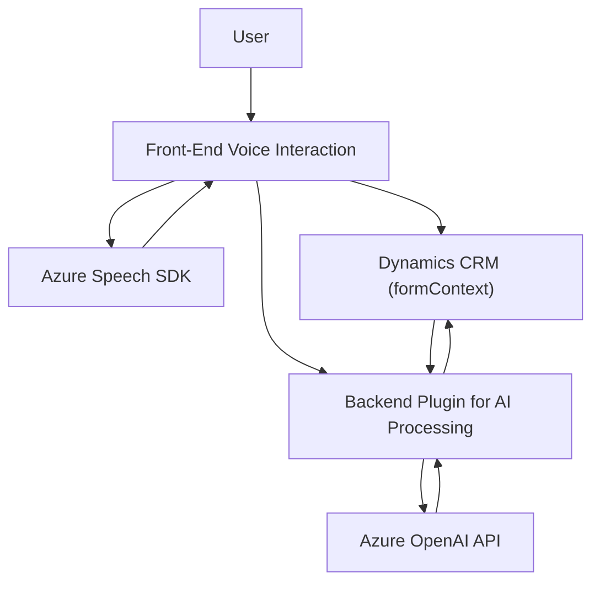

### **Resumen técnico**
El repositorio contiene tres archivos que implementan funcionalidades utilizando *JavaScript* y una extensión basada en *C#* para Microsoft Dynamics CRM. Estas desarrollan funcionalidades como: entrada de voz para interactuar con formularios (usando el SDK de Azure Speech y Dynamic Forms), transcripción y aplicación de valores de entrada por voz en formularios, así como el procesamiento en AI de Azure OpenAI para transformar texto en estructuras JSON útiles para el sistema CRM.  

---

### **Descripción de arquitectura**
La arquitectura del repositorio es híbrida, con:
1. **Front-End con separación lógica de capas**, cada archivo destinado para una tarea específica.
2. **Backend Plugin** que utiliza el patrón de extensión del CRM basado en *plugin*.  
3. **Integración con APIs externas**: Tanto el Azure Speech SDK en la parte de Frontend para reconocimiento y síntesis de voz, como Azure OpenAI para procesamiento de contenido en el Backend.  
El diseño es modular: los módulos están separados, cada uno cumpliendo una tarea específica, y existen referencias claras a las dependencias en cada parte del código.  

Podría clasificarse como una **arquitectura de n capas**, donde el frontend gestiona la interacción del usuario y el backend integra AI y realiza transformaciones internas.  

---

### **Tecnologías usadas**
- **Lenguajes y frameworks**: 
  - Frontend: JavaScript (usando Dynamic Forms).
  - Backend: C# con Microsoft Dynamics CRM SDK.
- **Servicios externos**:
  - Azure Speech SDK: Para reconocimiento de voz y síntesis de texto.
  - Azure OpenAI API: Para transformar texto en estructuras JSON.
- **Dependencias**:
  - `Newtonsoft.Json`, `System.Text.Json`, `Microsoft.Xrm.Sdk`, `System.Net.Http`.

---

### **Diagrama Mermaid**

---

### **Conclusión final**
1. **Tipo de solución**: Este repositorio implementa una solución orientada a la integración de servicios **inteligentes (voz y texto)** en formularios dinámicos, dentro de un entorno CRM. Combina **Frontend interactivo** con funcionalidades de **API externas** y **extensiones de Backend**.
  
2. **Patrones aplicados**:  
   - *Callback Pattern*: Gestión de eventos en el SDK de voz y en el plugin de CRM.  
   - *Integration Pattern*: Comunicación entre APIs externas (Azure Speech y OpenAI).  
   - *Modular Design*: Separación de funcionalidades en módulos especializados.

3. **Arquitectura**: De forma general, se implementa una **arquitectura de n capas con componentes externos** destacados. Frente al propósito, es adecuada por la dependencia de formularios dinámicos y módulos reutilizables. Si se busca escalar más funcionalidades, podría evolucionar hacia *microservicios*.  

El enfoque modular e integrativo del repositorio lo convierte en una solución robusta para gestionar formularios dinámicos y transformar contenido a través de procesos de voz e inteligencia artificial.