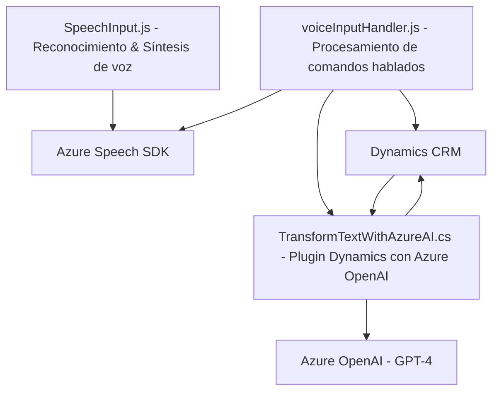

### Breve Resumen Técnico:
Este repositorio contiene soluciones para el manejo de reconocimiento y síntesis de voz (`SpeechInput.js` y `voiceInputHandler.js` en frontend) y procesamiento avanzado de texto con IA usando Azure OpenAI (`TransformTextWithAzureAI.cs` en backend, como un plugin de Dynamics CRM). Las funcionalidades están orientadas para integrarse con formularios dinámicos en un CRM corporativo (como Dynamics 365).

---

### Descripción de Arquitectura:
La solución presenta una arquitectura híbrida:

1. **Frontend (Speech-enabled Form Interaction Tools):**
   - Basado en un enfoque modular de funciones utilitarias.
   - Usa el SDK de Azure Speech para proporcionar acceso a síntesis y reconocimiento de voz, y comunica los datos procesados al backend.

2. **Backend (CRM Azure OpenAI Plugin):**
   - El plugin interactúa con el servicio Dynamics CRM mediante arquitectura de **plugins**.
   - Consume un microservicio de Azure OpenAI para transformar y analizar texto con reglas predefinidas.
   - Este componente sigue el patrón de arquitectura **n-capas**, con separación entre presentación (CRM), lógica de negocio y servicios externos.

La combinación de estos componentes implica una arquitectura basada en **client-server** con la integración de servicios a través de **APIs REST**, y una orientación hacia un modelo de **event-driven architecture** para el manejo del flujo de datos de voz y texto.

---

### Tecnologías Usadas:
1. **Frontend:**
   - **JavaScript (ES6)**: Para implementación de funciones utilitarias.
   - **Azure Speech SDK (JavaScript package)**:
     - Herramienta de síntesis y reconocimiento de voz.
     - Dinámicamente cargado desde un CDN.

2. **Backend (Plugins):**
   - **Microsoft Dynamics CRM SDK**: Extensión directa del ecosistema Dynamics para gestionar entidades y flujos de trabajo.
   - **Azure OpenAI**:
     - Usado para procesamiento de texto con el modelo GPT-4 mediante llamada REST.
   - **Newtonsoft.Json**: Procesamiento avanzado de estructuras JSON.
   - **System.Net.Http**: Comunicación HTTP con servicios externos.

---

### Diagrama Mermaid:

---

### Conclusión Final:
La solución ofrece una integración avanzada para mejorar la interacción voz-CRM y el procesamiento de texto inteligente mediante IA. Su especialización en trabajar sobre formularios dinámicos y la dependencia de los servicios de Azure (Speech SDK y OpenAI) reflejan un diseño moderno centrado en la conectividad de servicios (client-server). La arquitectura modularizada del frontend facilita la escalabilidad y el mantenimiento, mientras que el backend se alinea con el patrón de plugins de Dynamics CRM e implementa funcionalidades de microservicios a través de REST APIs (Azure OpenAI). Esto asegura una solución robusta para entornos corporativos y de automatización de procesos.