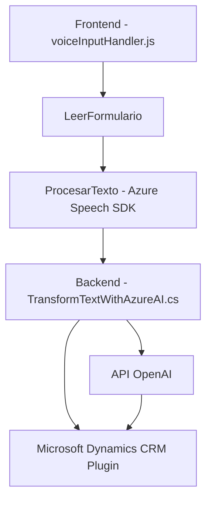

### Breve resumen técnico
El repositorio analizado incluye partes de una solución que combina un frontend basado en JavaScript, SDKs externos como Azure Speech SDK, y un backend vinculado a Microsoft Dynamics CRM utilizando C#. Este sistema está pensado para habilitar accesibilidad por voz y realizar transformaciones mediante Inteligencia Artificial (IA) usando OpenAI, integrando servicios de Azure.

---

### Descripción de arquitectura
1. **Tipo de solución**:  
   - Se trata de una solución híbrida que incluye:
     - **Frontend**: Lógica en JavaScript para habilitar la accesibilidad por voz y manipular datos del formulario.
     - **Backend/Plugins**: Extensiones de Dynamics CRM procesando datos y comunicándose con el servicio de Azure OpenAI para el procesamiento de texto.
   - Usos: Mejorar la accesibilidad y adoptar el uso de tecnologías de IA en escenarios empresariales, como Dynamics.

2. **Arquitectura**:  
   - **Frontend** (en N capas): Usa modularización con funciones especializadas para una arquitectura estructurada en un único contenedor.
   - **Backend**: Plugin de Microsoft Dynamics implementado bajo un enfoque estructurado, con conexión a APIs externas.
   - **Modelo híbrido con servicios externos**: Aprovecha servicios de Azure (Speech SDK y OpenAI) como componentes externos, de forma asincrónica.

3. **Patrones importantes**:  
   - **Frontend**: Modularización, callbacks, asincronía, y uso de Factory Methods.
   - **Backend**: Plugin de Dynamics CRM, conexión a microservicios, y dependencia de servicios externos (Azure).

---

### Tecnologías usadas
1. **Frontend (JavaScript)**:
   - **Azure Speech SDK**: Texto a voz y reconocimiento de voz.
   - **API de Microsoft Dynamics CRM WebApi**: Manipulación del contexto de entornos CRM.
   - DOM Manipulation.

2. **Backend (C#)**:
   - **Microsoft Dynamics SDK**: Implementación estándar de plugins en Dynamics CRM.
   - **Azure OpenAI API**: Procesamiento avanzado de texto con IA.
   - **Newtonsoft.Json**: Manipulación de mensajes en formato JSON estructurado.
   - **System.Net.Http y System.Text**: Comunicación con servicios externos.

---

### Diagrama Mermaid válido para GitHub

---

### Conclusión final
La arquitectura del repositorio destaca por la integración entre tecnologías y servicios externos para potenciar funcionalidades avanzadas de accesibilidad y procesamiento de texto con IA. La solución combina patrones de modularidad y servicios externos (Azure Speech SDK y OpenAI API), manteniendo un enfoque lógico para separar responsabilidades en Frontend y Backend. Aunque es robusta, podría mejorarse el manejo de claves API para mantener la seguridad.