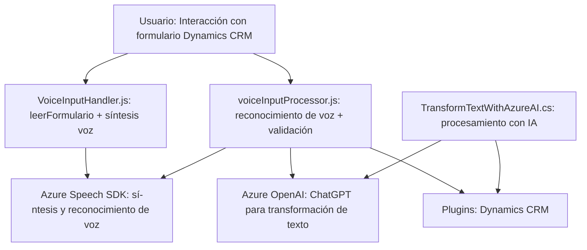

**Breve resumen técnico:**

El repositorio representa una solución informática destinada a la integración de tecnologías de reconocimiento de voz y procesamiento textual con Microsoft Dynamics 365 y Azure AI. Combina funcionalidades de front-end en JavaScript para mejorar la accesibilidad y el procesamiento de formularios, junto con un plugin en C# que conecta Dynamics CRM con servicios avanzados de inteligencia artificial de Azure.

---

**Descripción de arquitectura:**

1. **Tipo de solución:** La solución es una integración de capacidades front-end (procesamiento y síntesis de texto a voz y voz a texto) con un back-end basado en plugins de Dynamics CRM. También conecta servicios de inteligencia artificial mediante Azure OpenAI y herramientas como Azure Speech SDK para funciones avanzadas.
   
2. **Arquitectura:**  
   - **Multicapa:** La solución separa claramente el front-end (JavaScript) del back-end (C# plugin en Dynamics CRM). 
   - **Event-driven:** Los eventos, como los comandos de voz y las interacciones en Dynamics CRM, disparan las funciones correspondientes.
   - **Integración con servicios externos:** Especialmente APIs de Azure como Speech SDK y OpenAI.

---

**Tecnologías usadas:**

1. **Front-end:**
   - JavaScript (para funciones de síntesis de voz y lectura de formularios).
   - Azure Speech SDK (síntesis y reconocimiento de voz).

2. **Back-end:**
   - C# plugin basado en Dynamics CRM.
   - Microsoft.Xrm.Sdk para interactuar con Dynamics CRM.
   - Azure OpenAI para procesamiento de texto con IA.

3. **Patrones:**
   - Callback y Promises para manejar operaciones asíncronas en el front-end.
   - Plugin-based development para integrarse con Dynamics CRM.
   - Modular and reusable functions en los scripts de JavaScript.

---

**Dependencias o componentes externos:**

1. **Azure Speech SDK:** Para realizar síntesis y reconocimiento de voz en el front-end.
2. **Azure OpenAI:** Usado en el plugin de C# para transformar texto con IA.
3. **Dynamics 365 SDK:** Empleado por el plugin en el back-end.
4. **JavaScript DOM API:** Para cargar dinámicamente el SDK de Azure Speech.
5. **API personalizada en Dynamics 365:** Usada en el archivo `voiceInputProcessor.js` para procesar texto.
6. **Bibliotecas de C#:** Como Newtonsoft.Json y System.Text.Json para la manipulación de JSON en el plugin del CRM.

---

**Diagrama Mermaid válido para GitHub:**

---

**Conclusión final:**

Esta solución es un híbrido entre front-end y back-end que actúa como un puente entre la interacción del usuario con formularios en Dynamics CRM y tecnologías avanzadas de reconocimiento de voz y procesamiento de texto provistas por Azure. La arquitectura modular y multicapa permite una separación clara de responsabilidades, reflejando un diseño escalable. A través del uso de APIs externas (Azure Speech SDK y OpenAI), la solución mejora la accesibilidad, gestiona comandos de voz y aplica transformaciones contextuales inteligentes mediante IA, proporcionando una experiencia más inclusiva y automatizada para el usuario final.