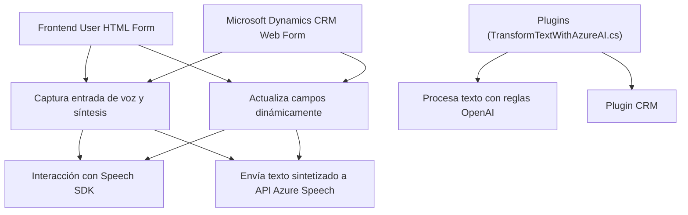

### Breve resumen técnico

El repositorio está diseñado para extender funcionalidades en **Microsoft Dynamics 365**, dotándolo de capacidades avanzadas de reconocimiento y síntesis de voz mediante **Azure Speech SDK** y procesamiento de texto con **Azure OpenAI Services**. Los archivos analizados se dividen principalmente entre código para frontend, con integración directa en formularios del CRM, y un plugin backend orientado a procesamiento del texto con APIs de inteligencia artificial.

---

### Descripción de arquitectura

#### Tipo de solución:
La solución implementa una arquitectura híbrida para **Dynamics CRM**:
1. **Frontend:** Código JavaScript integrado en formularios del CRM para la interacción directa con usuarios a través de síntesis y reconocimiento de voz.
2. **Backend:** Plugins que extienden la funcionalidad del CRM añadiendo capacidades avanzadas de procesamiento mediante comunicación con Azure OpenAI.

#### Arquitectura:
- **Multicapa (n capas):**  
  Existe separación entre:
  - Capa de presentación (frontend/JavaScript interactuando con el usuario).
  - Capa de lógica de negocio (plugins para procesamiento avanzado).
  - Capa de integración (integración con Azure Speech y OpenAI).
  
- **Integración con servicios distribuidos:** El diseño aprovecha servicios en la nube como Azure Speech y OpenAI para delegar procesos pesados fuera del servidor del CRM.

- **Event-driven y modular:** Se utilizan callbacks y métodos especializados para tareas específicas (correcto uso del SRP). La carga dinámica de SDKs ejemplifica el uso de patrones modernos como **lazy-loading**.

---

### Tecnologías usadas

1. **Frontend:**
   - **JavaScript:** El código está altamente modular, enfocado en extensiones para los formularios de Dynamics.
   - **Azure Speech SDK:** Para síntesis y reconocimiento de voz.
   - Patrones utilizados:
     - **Lazy-loading:** SDK de Azure Speech cargado dinámicamente.
     - **Event-driven programming:** Manejo asincrónico de eventos del SDK y APIs.

2. **Backend:**
   - **C# (.NET):** Código plugin implementado para extender Dynamics CRM.
   - **Microsoft.Xrm.Sdk:** Librería oficial para integración con Dynamics CRM.
   - **Azure OpenAI (REST API):** Procesamiento y transformación de texto a formatos estructurados con JSON.
   - Patrones utilizados:
     - **Dependency Injection:** Uso típico en plugins para obtener servicios como organización y entidades CRM.
     - **Integración de APIs externas:** Manejo de solicitudes HTTP REST.

3. **Servicios externos:**
   - **Azure Cognitive Services:** Speech SDK y OpenAI.
   - **Dynamics CRM WebAPI:** Interacción con datos del CRM.

---

### Diagrama Mermaid

---

### Conclusión final

Este repositorio implementa una solución avanzada sobre **Microsoft Dynamics 365**, extendiendo sus funcionalidades mediante la integración de servicios de inteligencia artificial y capacidades de procesamiento con **Azure Speech** y **OpenAI**. La arquitectura está diseñada con un enfoque en modularidad, separación de responsabilidades y uso de patrones modernos como **lazy-loading** y **API Gateway**, permitiendo escalabilidad y rápida adaptabilidad ante nuevas funcionalidades.

Los puntos relevantes:
1. **Multicapa:** El diseño establece una separación clara entre frontend (interacción de usuario), integración con servicios en la nube (Azure), y backend (procesamiento avanzado con plugins).
2. **Reutilización:** Las funciones y componentes están diseñados para máximo desacoplamiento.
3. **Servicios externos:** La dependencia de Azure Speech y OpenAI agrega capacidades de última generación, pero también introduce retos relacionados con la gestión de credenciales y costos operativos en producción.