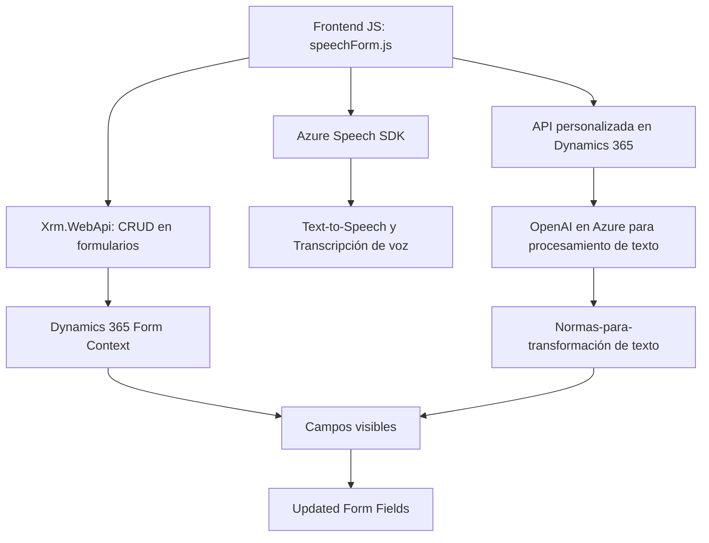

### Breve resumen técnico
El proyecto presentado tiene una sólida arquitectura que integra múltiples capas y utiliza un enfoque modular para ofrecer servicios avanzados dentro del ecosistema de **Dynamics 365 CRM**. El objetivo principal es la implementación de funcionalidades de síntesis de voz, entrada de voz y procesamiento de datos estructurados por medio de servicios de inteligencia artificial como el SDK de Azure Speech y OpenAI en Azure.

---

### Descripción de arquitectura
#### 1. Tipo de solución
La solución combina varios elementos:
- **API personalizada**: Plugins como `TransformTextWithAzureAI.cs` se comportan como extensiones del CRM que procesan datos y los presentan como respuesta.
- **Frontend**: Códigos JavaScript que gestionan la interacción con formularios del sistema CRM.
- **Servicios externos**: Integración con el SDK de Azure Speech para síntesis y transcripción de voz en tiempo real, además de llamadas remotas a un servicio de Azure OpenAI.

#### 2. Tipo de arquitectura
La solución utiliza una **arquitectura de n capas**:
- **Capa de presentación:** Archivos JS como `speechForm.js` y `readForm.js` implementan la funcionalidad en el lado del cliente (frontend asociado a Dynamics 365).
- **Lógica de negocio:** Plugins como `TransformTextWithAzureAI` procesan datos dinámicamente y ofrecen reglas específicas como parte del CRM.
- **Capa de servicios externos:** Integración con SDKs y APIs de Azure, encapsulados en distintas funciones y clases modulares.

#### 3. Patrones usados
- **Modularidad:** Las funciones en los archivos JavaScript y las clases en C# están claramente delimitadas según su responsabilidad.
- **Gestión de dependencias externas:** En JavaScript, los SDKs de Azure se cargan dinámicamente. En C#, las dependencias necesarias se configuran en tiempo de ejecución.
- **Factory Pattern:** Uso extendido en la configuración de objetos como en funciones que crean configuraciones del Azure Speech SDK (`SpeechConfig.fromSubscription`).
- **Plugin Pattern:** En el caso del archivo `.cs`, implementa el patrón típico de plugins para Dynamics 365 CRM.

---

### Tecnologías usadas
- **Frontend:**
  - JavaScript con integración en Dynamics 365.
- **Backend:**
  - C# como lenguaje principal para los plugins en Dynamics 365 CRM.
- **Servicios externos:**
  - Azure Speech SDK: Transcripción y síntesis de voz.
  - Azure OpenAI API: Procesamiento avanzado de texto.
- **Frameworks y dependencias:**
  - `Microsoft.Xrm.Sdk` para comunicación con Dynamics 365 CRM.
  - `Newtonsoft.Json.Linq` para manejar JSON en el plugin.
  - `System.Net.Http` para solicitudes HTTP desde C#.
  - `Azure API Services` para llamadas remotas al servicio OpenAI.

---

### Diagrama Mermaid válido para GitHub Markdown

---

### Conclusión final
El repositorio está diseñado para extender y mejorar las funcionalidades de Dynamics 365 CRM utilizando tecnologías modernas como Azure Speech SDK y OpenAI. La solución sigue un enfoque modular y arquitectura de n capas, asegurando separación de responsabilidades y escalabilidad en cada módulo. Su integración con SDKs y APIs externas le otorgan capacidades avanzadas, como procesamiento de voz en tiempo real y transformación de texto con inteligencia artificial.