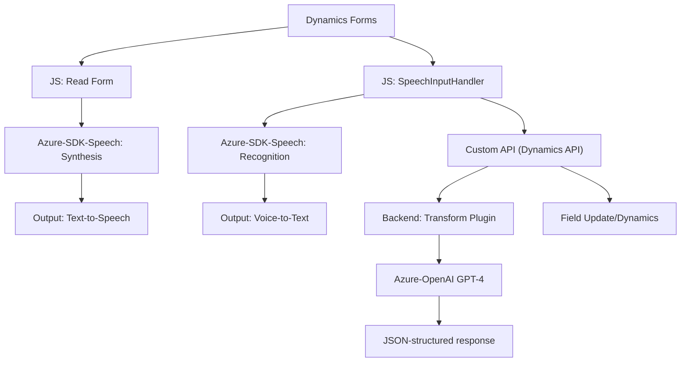

### Breve Resumen Técnico
El repositorio contiene una solución basada en múltiples componentes que integran la funcionalidad de un frontend (JavaScript) sobre Dynamics 365 y un backend basado en plugins y una integración directa con servicios externos como Azure Speech SDK y Azure OpenAI. Los archivos analizados indican que se trata de una solución híbrida para automatización y manejo avanzado de datos de formularios, utilizando reconocimiento de voz, síntesis de voz y procesamiento semántico de texto.

---

### Descripción de Arquitectura
La arquitectura global parece estar orientada a una solución **n capas** utilizada en el entorno de Dynamics 365:
1. **Capa de presentación (Frontend/JS)**: Contiene scripts de JavaScript que interactúan con los formularios de Dynamics 365, manejan datos de entrada del usuario y los envían a las capas internas para procesamiento.
2. **Capa de servicios externos**: Usa el Speech SDK para la síntesis y el reconocimiento de voz, además de la API de Azure OpenAI para el procesamiento semántico avanzado.
3. **Capa de negocio (Plugins)**: Implementa plugins personalizados para la plataforma Dynamics 365, concentrándose en la transformación del texto y la integración con el backend de Azure.

---

### Tecnologías Usadas
1. **Frontend (JavaScript):**
   - `Azure Speech SDK`: Reconocimiento y síntesis de voz.
   - `DOM Manipulation`: Para el acceso dinámico y actualización de formularios.
   - Integración asíncrona con APIs mediante `fetch`.

2. **Backend (C# Plugins):**
   - `IPlugin`: Dinámica de creación modular en Dynamics 365.
   - `HttpClient`: Envío de solicitudes HTTP hacia el servicio de Azure OpenAI GPT-4.
   - `Newtonsoft.Json`: Procesamiento de JSON para intercambios de datos estructurados.
   - **Azure OpenAI GPT-4**: Procesamiento avanzado de texto con IA.

---

### Diagrama Mermaid Válido para GitHub

---

### Conclusión Final
La solución analizada combina tecnologías modernas como Azure Speech SDK y Azure OpenAI con las capacidades personalizadas de Dynamics CRM. Se evidencia una arquitectura de **n capas**, donde cada módulo realiza una tarea muy específica según el principio de responsabilidad única. 
- **Fuerzas**: Modularidad bien definida, integración con APIs externas avanzadas, y manejo asincrónico.
- **Debilidades**: Dependencia directa de Azure SDKs y Dynamics CRM, lo que compromete la agilidad de cambio hacia otros entornos. 

Esta solución es ideal para automatizar formularios y manejar datos complejos con procesamiento de IA.