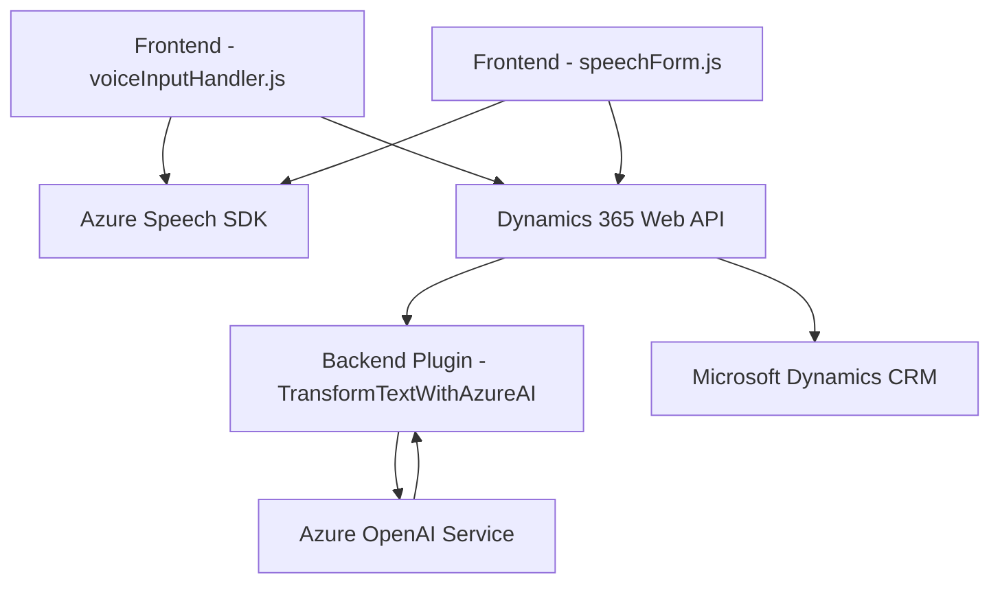

### Breve resumen técnico
El repositorio corresponde a una solución de software integrada con Microsoft Dynamics CRM, que utiliza varias tecnologías para habilitar funcionalidades de interactividad basadas en voz y transformación de texto con Inteligencia Artificial (IA). Está orientada a mejorar la accesibilidad, facilitar interacciones con datos dinámicos y procesar información de manera inteligente y automatizada.

---

### Descripción de la arquitectura
La solución está compuesta por tres componentes principales:
1. **Frontend**: Archivos JavaScript (`voiceInputHandler.js`, `readForm.js`, `speechForm.js`) que interactúan directamente con el cliente del navegador y servicios de Azure, para habilitar funcionalidades de entrada y salida de voz, así como la manipulación de campos de formularios en Dynamics CRM.
2. **Backend (Plugins)**: Clasificado por `TransformTextWithAzureAI.cs`, diseñado como un plugin de Microsoft Dynamics CRM que consume servicios de Azure OpenAI para transformar texto y estructurarlo como JSON según normas específicas.
3. **Integración en la nube**: Ambas partes están interconectadas mediante servicios externos de Azure (Speech SDK y OpenAI), con una capa de integración orientada a promover la interacción dinámica en entornos de negocio.

### Tipo de arquitectura
La arquitectura del proyecto es **combinada** y puede clasificarse como:
- **N cap layers (capas)**: Estructura separada entre frontend, lógica de negocio (plugins) y servicios externos (Azure).
- **Orientación a servicios (SOA)**: Los servicios alojados en Azure (Speech SDK, OpenAI) forman parte esencial de la arquitectura, actuando como dependencias externas para prestación de funcionalidades específicas.

---

### Tecnologías usadas
- **Frontend**:
  - **JavaScript**: Implementación de lógica de síntesis y reconocimiento de voz basada en el SDK de Azure Speech.
  - **Dynamics 365 Web API**: Para manipular datos dinámicos del formulario.
- **Backend**:
  - **C# con Dynamics CRM SDK**: Para crear plugins personalizados.
- **Dependencias Externas**:
  - **Azure Speech SDK**: Para síntesis y transcripción de voz.
  - **Azure OpenAI Service**: Para transformación de texto con IA.
  - **Microsoft Dynamics 365**: Plataforma de los formularios dinámicos.

### Dependencias o componentes externos
1. **Azure Speech SDK**: Responsable del reconocimiento y síntesis vocal.
2. **Azure OpenAI Service**: Proporciona la plataforma de Inteligencia Artificial para transformar texto.
3. **Dynamics 365 Web API**: Interacción directa con datos del entorno Dynamics CRM.
4. **Microsoft Dynamics CRM SDK**: Para la ejecución de plugins en un entorno CRM.
5. **JSON Serialization Libraries**: Herramientas como `System.Text.Json` y `Newtonsoft.Json.Linq` para parseo y serialización de datos estructurados en JSON.

---

### Diagrama **Mermaid** válido para GitHub Markdown

---

### Conclusión final
Este repositorio presenta una solución destinada a entornos empresariales basados en Microsoft Dynamics CRM, con un enfoque en la accesibilidad y automatización. Aprovecha servicios de voz y procesamiento inteligente facilitados por Azure, integrando una arquitectura modular y escalable. La solución se adapta bien para procesos empresariales que busquen comunicación dinámica, accesibilidad y automatización inteligente mediante plataformas de IA avanzadas. Además, una buena organización modular de componentes asegura mantenibilidad y extensibilidad.