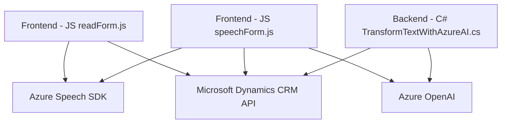

### Resumen técnico
Este repositorio define un sistema integrado basado en la interacción entre un frontend basado en JavaScript y la lógica de backend en C#. La solución implementa tecnologías de reconocimiento y síntesis de voz utilizando **Azure Speech SDK**, contenido automáticamente en formularios de Microsoft Dynamics 365 CRM, mientras que los plugins utilizan **Azure OpenAI** para el procesamiento avanzado de datos textuales. 

### Descripción de arquitectura
La arquitectura sigue un enfoque distribuido para la integración de servicios en múltiples capas:
1. **Frontend**:
   - Script de **JavaScript** para interacción con formularios en Dynamics CRM.
   - Lógica centrada en el reconocimiento y síntesis de voz a través de **Azure Speech SDK**.
2. **Backend (Plugins)**:
   - Plugins de **C#** que extienden funcionalidad de Dynamics CRM. 
   - Comunicación con **Azure OpenAI** para transformar datos. 

El sistema utiliza una arquitectura **en capas**, donde las capas incluyen:
- **Presentación**: Interfaz proporcionada por Microsoft Dynamics CRM.
- **Aplicación**: Scripts del frontend manejan el procesamiento local y llaman a servicios externos.
- **Lógica de Negocio**: Plugins de Dynamics CRM para extensibilidad y reglas de negocio personalizadas.
- **Servicios Externos**: Conexión con tecnologías externas como Azure Speech SDK y Azure OpenAI.

### Tecnologías usadas
- **Frontend**:
  - **JavaScript ES6+**: Usado para lógica de client-side.
  - **Azure Speech SDK**: Para reconocimiento y síntesis de voz.
  - API de **Dynamics 365 CRM**: De acceso a datos y manipulación de formularios.
- **Backend (Plugins)**:
  - **C# con ASP.NET** (para plugins): Incluye integración con Dynamics CRM y procesamiento de datos. 
  - **Azure OpenAI**: Para procesamiento de texto mediante HTTP Requests.
  - **Newtonsoft.Json**: Manejo avanzado de JSON.
  - **System.Net.Http** y **System.Text.Json**: Solicitudes HTTP hacia Azure OpenAI.

### Modelo arquitectónico
La solución emplea una arquitectura **en capas**, dado que:
1. Cada proceso está dividido entre:
   - Frontend: Interacción y procesamiento inicial del usuario.
   - Backend: Extensión del CRM con lógica para procesamiento y comunicación con servicios externos.
   - Servicios externos: Uso de Azure Speech y OpenAI para funcionalidades adicionales.
2. La comunicación entre capas utiliza patrones como **Facade** y **Request/Response**.

### Dependencias externas o componentes utilizados
- **Azure Speech SDK**: Para el procesamiento de texto a voz (síntesis) y entrada por voz (reconocimiento).
- **Microsoft Dynamics 365 CRM Web API**: Para interacción con el entorno CRM.
- **Azure OpenAI**: Para transformación avanzada de texto basado en reglas.
- **Newtonsoft.Json**: Para el manejo de datos JSON en el plugin de C#.
- **System.Net.Http**: Para realizar solicitudes API al servicio OpenAI.

### Diagrama Mermaid

### Conclusión final
El sistema implementado en el repositorio establece una solución distribuida y dinamizada por la integración entre Microsoft Dynamics CRM, tecnologías de Azure, y scripts de frontend en JavaScript. La estructura emplea una arquitectura **en capas** que organiza de forma lógica las responsabilidades del frontend, los plugins backend y los servicios externos. Es una solución sólida que utiliza patrones bien definidos para garantizar el funcionamiento modular y la separación de responsabilidades.