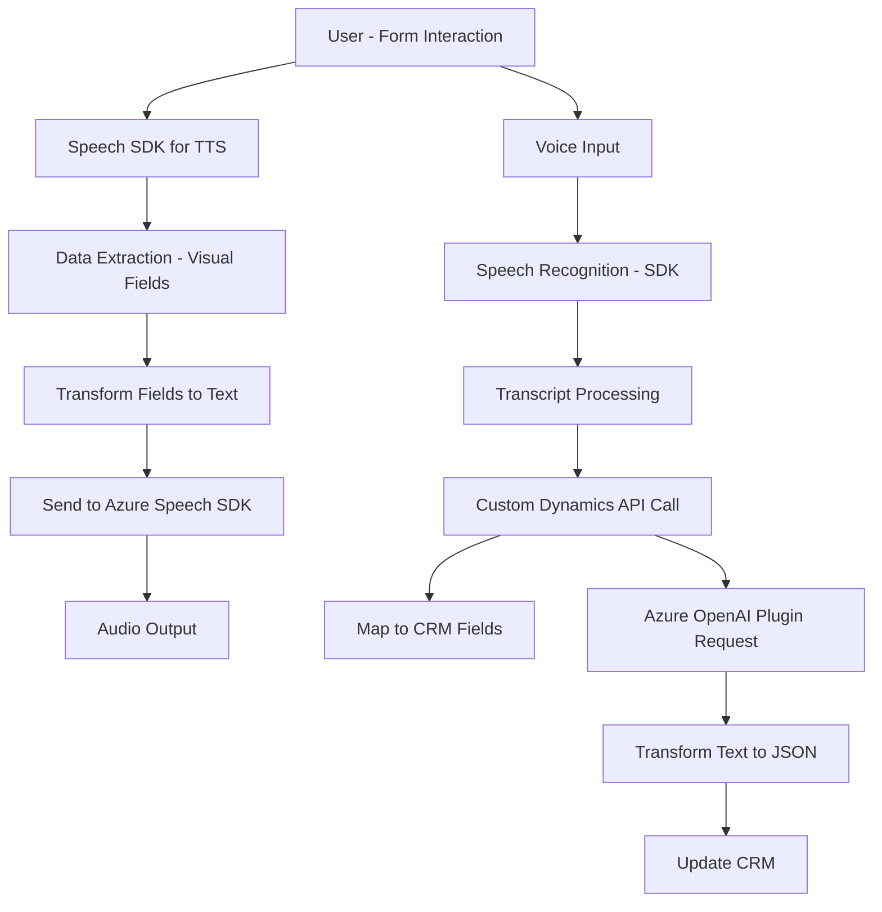

### Breve Resumen Técnico:
El repositorio contiene múltiples archivos que implementan funcionalidades para convertir datos de formularios en texto hablado y también para capturar entrada de voz, procesándola con el **Azure Speech SDK** y otras herramientas en el contexto de **Microsoft Dynamics CRM**. Además, un plugin en C# utiliza Azure OpenAI para transformar texto en un formato JSON estructurado, complementando la solución general.

---

### Descripción de Arquitectura:
1. **Tipo de solución:**  
   La solución representa una **integración de capas entre frontend y backend** que interactúa con APIs externas. Está diseñada para usarse en un entorno CRM (Dynamics) y semanticamente incluye elementos de una **API**, un **frontend**, y un **plugin** para procesamiento mediante **Azure AI**.

2. **Tecnologías y Frameworks usados:**  
   - **Frontend:** JavaScript y Azure Speech SDK.  
   - **Backend:** Microsoft Dynamics CRM SDK (C#) y plugin basado en C#.  
   - **Microservicio Externo:** API REST de Azure OpenAI y Azure Speech SDK.  
   - **Patterns:** Modularidad, event-driven architecture, facade/proxy, factory pattern, external API integration, plugin pattern.

3. **Tipo de arquitectura:**
   - **Hexagonal Architecture:** La implementación del frontend muestra características de la interacción entre interfaces y servicios externos. Además, los elementos del plugin siguen patrones de integración para lógica empresarial dentro de Dynamics CRM, manteniendo las dependencias organizadas.  
   - Sistema híbrido que utiliza **servicios externos (Azure)** y **event-driven architecture**, destacándose, además, una clara modularidad en su diseño.

4. **Componentes externos:**
   - **Azure Cognitive Services:** Speech SDK para síntesis, reconocimiento de voz y procesamiento de datos visuales en el frontend.  
   - **Azure OpenAI:** Endpoint para transformar texto en formato estructurado JSON usando modelos de lenguaje como GPT.
   - **Microsoft Dynamics CRM SDK:** Extensiones y plugins del sistema CRM de Microsoft para la gestión de formularios y datos organizativos.
   
   Estas dependencias requieren conexión a servicios en la nube, donde las configuraciones de claves y regiones son cruciales.

---

### Tecnologías Usadas:
- **Frontend:**  
  - JavaScript (DOM manipulation, ES6 standard).  
  - Azure Cognitive Services Speech SDK (API de síntesis/reconocimiento de voz).  
  - Microsoft Dynamics CRM Web APIs (`Xrm.WebApi`).

- **Backend:**  
  - C# y Microsoft Dynamics CRM SDK (`IPlugin`, `IOrganizationService`, `IExecutionContext`).  
  - Azure OpenAI Services API (sentencias HTTP con `HttpClient`).  
  - JSON handling libraries (`System.Text.Json`, `Newtonsoft.Json.Linq`).

---

### Diagrama Mermaid:

---

### Conclusión Final:
La solución combina tecnologías de Microsoft Dynamics CRM, Azure Speech SDK, y Azure OpenAI para ofrecer un sistema integrado de conversión y procesamiento entre texto hablado y campos de formularios en entornos corporativos. La arquitectura, principalmente de estilo hexagonal y evento-dirigida, destaca por su modularidad y fuerte integrabilidad con APIs. Cada archivo tiene una función bien definida: el frontend trabaja en implementar interacción y síntesis de voz, mientras que el backend se especializa en integrar inteligencia artificial y lógica empresarial. Sin embargo, como posible mejora, se podrían implementar mejores prácticas de error handling y seguridad, especialmente en la gestión de las claves de acceso a Azure.