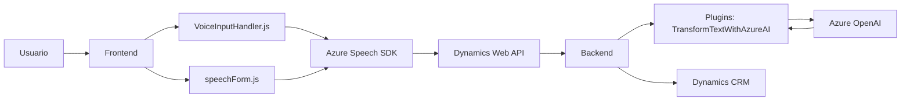

### Breve Resumen Técnico

Este repositorio contiene tres componentes principales para una solución que integra reconocimiento y síntesis de voz, procesamiento de voz con inteligencia artificial y actualización dinámica de formularios en Microsoft Dynamics CRM utilizando servicios de Azure. Los archivos analizados representan un sistema modular basado en la interacción entre un frontend (JavaScript) y un backend (plugin en C#).

---

### Descripción de Arquitectura

La solución tiene una arquitectura híbrida que combina *client-side logic* (mediante JavaScript) con un *backend plugin* desarrollado en C#. El frontend implementa lógica de captura y procesamiento de datos de formularios mediante el uso de **Azure Speech SDK** y lógica auxiliar organizada en funciones. 

El backend utiliza el patrón **Plugin** de Microsoft Dynamics CRM, que permite interceptar eventos del sistema para introducir lógica personalizada. Este plugin se comunica con una API externa (Azure OpenAI Service) utilizando el *patrón Remote Service Invocation* a través de solicitudes HTTP donde se procesa un texto recibido y devuelve un payload JSON estructurado.

La arquitectura puede ser clasificada como **n capas**, con capas principales para el *frontend*, *backend*, y la capa de integración con *APIs externas*.

---

### Tecnologías Usadas

1. **Frontend**:
   - Lenguaje: JavaScript.
   - SDK: Azure Speech SDK.
   - API de soporte: Dynamics 365 Web API.

2. **Backend**:
   - Lenguaje: C#.
   - Framework: Microsoft Dynamics CRM SDK.
   - Librerías: `Newtonsoft.Json`, `System.Text.Json`, y otras.
   - API: Azure OpenAI (GPT).

3. **Externo**:
   - Azure Speech SDK: Para síntesis y reconocimiento de voz basado en cloud.
   - Azure OpenAI Service: Uso de GPT para transformar texto a objetos JSON.

4. **Patrones de diseño**:
   - Modularidad: Separación clara de lógica en funciones o clases.
   - DTO (Data Transfer Object): Para estructurar datos dentro del CRM.
   - Integración de servicios externos: Enlaza SDKs y APIs de terceros.
   - Plugin Architecture: Para interceptar eventos y añadir lógica personalizada.
   - Sincronización asíncrona: Uso de promesas en el frontend y REST en el backend.

---

### Diagrama **Mermaid**

---

### Conclusión Final

Este repositorio implementa una solución híbrida (frontend y backend) que utiliza servicios y APIs como Azure Speech SDK y Azure OpenAI. Está diseñada para potenciar formularios de Microsoft Dynamics 365 con funcionalidades avanzadas de reconocimiento de voz, síntesis de voz e integración con inteligencia artificial. Utiliza una arquitectura **n capas** con modularidad, lo cual ofrece flexibilidad para ampliar la solución en el futuro. La combinación de tecnologías como JavaScript, C#, Azure SDKs y APIs demuestra un enfoque sólido hacia la interacción usuario-sistema y procesamiento dinámico en aplicaciones empresariales.