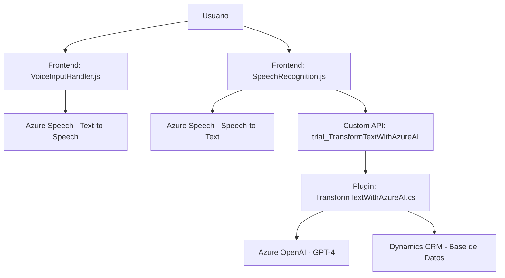

### Breve Resumen Técnico

El repositorio presentado tiene como objetivo principal implementar una solución integrada de reconocimiento de voz, síntesis de texto a voz y procesamiento de texto mediante servicios externos en un entorno de Dynamics CRM. La solución destaca por su integración estrecha con Azure Speech SDK y Azure OpenAI para lograr funcionalidades avanzadas de procesamiento de lenguaje natural.

---

### Descripción de Arquitectura

La arquitectura tiene características de **"n capas"**, donde cada componente (Frontend, API/Plugin, servicios externos) tiene roles claramente definidos. El frontend interactúa directamente con los usuarios y maneja el reconocimiento de voz y la síntesis de texto a voz. Los servicios backend, representados por el plugin de Dynamics CRM, se encargan de transformar y almacenar la información procesada con soporte de Azure OpenAI. Las capas están desacopladas, permitiendo un flujo estructurado en tareas de entrada, procesamiento y respuesta.

**Arquitectura:**
1. **Frontend**: Implementa funcionalidad de reconocimiento de voz y síntesis con Azure Speech SDK integrado en JavaScript.
2. **Plugins Backend**: En Dynamics CRM, el plugin se encarga de interactuar tanto con los datos de CRM como con el servicio externo Azure OpenAI.
3. **Servicios Externos**: Utiliza Azure Speech para reconocimiento y síntesis de información y Azure OpenAI para transformar texto según reglas específicas.

---

### Tecnologías, Frameworks y Patrones Usados

#### Tecnologías:
- **Azure Speech SDK** (JavaScript): Para reconocimiento de voz y síntesis de texto a voz.
- **Azure OpenAI** (Cloud): Para procesamiento avanzado de texto usando modelos GPT.
- **Dynamics CRM SDK**: Para el desarrollo de plugins en entornos Dynamics 365.
- **Microsoft.Xrm.Sdk**: Elemento esencial en los plugins de Dynamics CRM.
- **Newtonsoft.Json** / **System.Text.Json**: Para trabajar con datos en formato JSON.

#### Patrones:
1. **Modular Functions** en el frontend: Funciones independientes y reutilizables para cada operación (cargar SDK, obtener datos visibles, procesar transcript).
2. **Facade**: Simplificación del flujo de procesos integrados mediante funciones como `startVoiceInput` o `TransformTextWithAzureAI`.
3. **Dynamic Resource Loading**: Carga dinámica de recursos (Azure Speech SDK).
4. **Cliente HTTP Patterns** (en Plugins): Uso de `HttpClient` para consumir servicios externos.
5. **Integración de capas n**: Comunicación estructurada entre frontend, API y servicios externos.

---

### Diagrama Mermaid

---

### Conclusión Final

La solución presentada tiene un diseño orientado a la integración de tecnologías de Azure (Speech y OpenAI) con un entorno Dynamics CRM. La estructura modular del frontend y la lógica del plugin soportan una arquitectura "n capas", permitiendo escalabilidad, flexibilidad y un enfoque centrado en la reutilización. El diagrama ayuda a visualizar los componentes clave y sus interacciones.