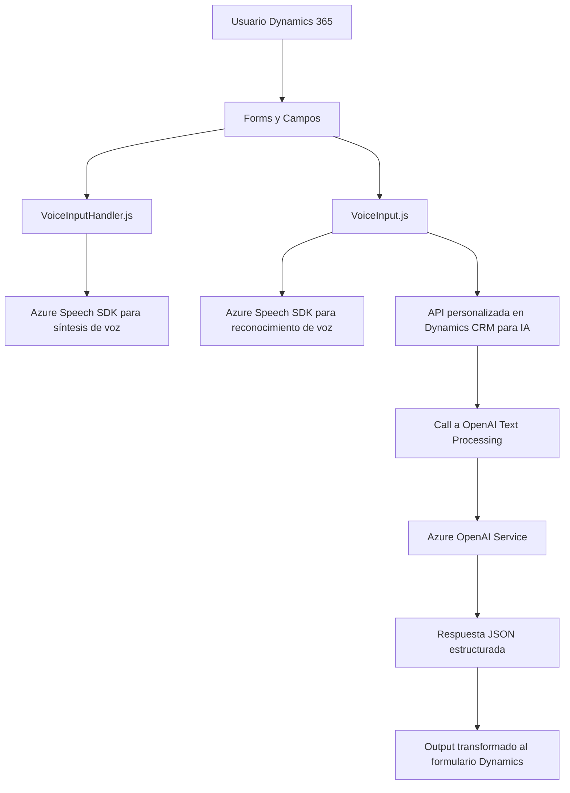

### Análisis del repositorio

#### Breve resumen técnico:
El repositorio incluye archivos destinados a implementar interacción accesible mediante reconocimiento y síntesis de voz integrados con formularios de Dynamics 365, además de un plugin que agrega capacidades avanzadas de procesamiento de texto con Azure OpenAI. Tanto el frontend como el plugin están diseñados para extender funcionalidad en sistemas CRM ERP de Microsoft, utilizando servicios de Azure.

---

### Descripción de arquitectura

1. **Solución tipo**:  
   La solución es una combinación de elementos:  
   - **Frontend (JavaScript)**: Scripts que habilitan reconocimiento y síntesis de voz mediante Azure Speech SDK.
   - **Backend (Plugin en C#)**: Plugin que se ejecuta en Dynamics CRM para procesar datos usando Azure OpenAI directamente desde las entidades y atributos del CRM.

2. **Tecnologías y frameworks:**  
   - **Azure Speech SDK** para síntesis y reconocimiento de voz.  
   - **Dynamics CRM SDK** para extender funcionalidades del CRM con plugins y manejar APIs internas (`IOrganizationService`, `IPluginExecutionContext`).  
   - **Azure OpenAI API** para procesamiento de texto con inteligencia artificial avanzada (GPT-4).  
   - **Librerías de desarrollo .NET**: 
     - `HttpClient` para peticiones web.
     - `System.Text.Json` y `Newtonsoft.Json` para trabajar con JSON transformado por IA.
   - **JavaScript** asociado a Dynamics 365 CRM como scripts externos—extensión de lógica client-side para formularios.

3. **Tipos de arquitectura presentes**:  
   - **Arquitectura de capas** (backend y frontend):  
     Cada componente (plugins, API, y scripts) está diseñado para tener una clara separación de responsabilidades. Por ejemplo:  
     - Frontend (interacción visual y con voz).  
     - API (procesamiento avanzado de texto con IA).  
     - Plugin (business logic en Dynamics para extender capacidades).  
   - **Integración con servicios externos usando patrón connector**:  
     Plugins y frontend conectan directamente con servicios externos de Azure.  
   - **Event Driven Architecture**:  
     Los scripts de frontend y plugins se ejecutan en base a eventos activados por el usuario o el sistema CRM.

4. **Dependencias o componentes externos presentes**:  
   - **Azure Speech SDK**: Para interacción avanzada con voz.  
   - **Azure OpenAI**: Procesamiento de texto y respuesta.  
   - **Dynamics CRM SDK**: Para extender funcionalidad del sistema CRM.  
   - Navegadores modernos con soporte nativo para ES6 y ejecución de scripts en formularios de Dynamics.

5. **Diagrama mermaid**:

---

### Conclusión final

Este repositorio muestra una solución robusta enfocada en accesibilidad y automatización mediante IA para entornos Microsoft Dynamics 365. La solución está compuesta por módulos frontend en JavaScript que usan el SDK de Azure Speech para interacción vocal con formularios y un plugin backend en C# que realiza procesamiento avanzado de texto a través de Azure OpenAI. Gracias a la ejecución modular y la integración con servicios externos mediante APIs, el diseño arquitectónico es flexible y escalable, aunque está altamente centrado en la infraestructura de Azure y Dynamics CRM.