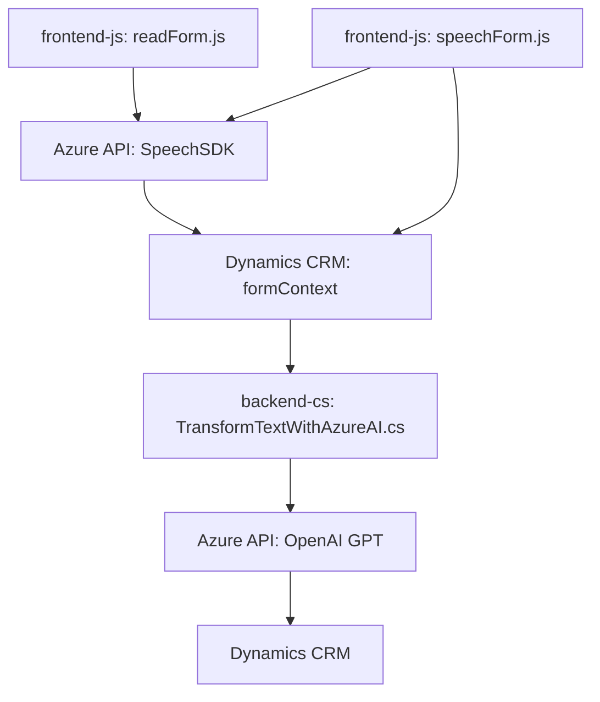

### Breve resumen técnico
El repositorio muestra una combinación de frontend y backend en una solución de integración con Microsoft Dynamics CRM. El frontend se encarga de manejar interacciones basadas en voz utilizando Azure Speech SDK, mientras que el backend implementa un plugin que utiliza Azure OpenAI GPT para transformar texto según reglas específicas. El sistema utiliza arquitecturas modulares con patrones que facilitan la combinación de servicios externos y flujos de trabajo asíncronos.

---

### Descripción de arquitectura
La arquitectura adoptada en el repositorio es híbrida:
- **Frontend**:
  - Un diseño modular basado en funciones de JavaScript que gestiona el reconocimiento de voz, transformación de datos y comunicación con APIs externas (Azure Speech SDK).
  - Actúa como una interfaz que interactúa con el CRM para obtener y mostrar datos al usuario.
- **Backend**:
  - Un plugin respaldado por Microsoft Dynamics CRM SDK siguiendo el **Plugin Design Pattern**.
  - Integración con Azure servicios como Speech SDK y OpenAI para procesamiento avanzado.
- **Flujo de operación**:
  - El frontend administra la entrada y salida de voz, convierte la voz en texto y actualiza formularios en Dynamics CRM.
  - El plugin del backend procesa transformaciones de texto mediante reglas específicas, delegando tareas complejas a Azure OpenAI GPT.

La arquitectura general mezcla componentes de **n capas** y elementos **hexagonales** debido a la dependencia en APIs externas (adaptadores) y contextos acoplados.

---

### Tecnologías usadas
1. **Frontend**:
   - Lenguaje: JavaScript.
   - Framework: Dynamics 365 Frontend JS API.
   - Servicios externos: Azure Speech SDK.
   - Patrones: Encadenamiento funcional, adaptadores, uso de callbacks.

2. **Backend**:
   - Lenguaje: C# (.NET Framework).
   - Framework: Microsoft Dynamics CRM SDK.
   - Servicios externos: Azure OpenAI API.
   - Patrones: Plugin Design Pattern, Service Provider Pattern.

---

### Diagrama Mermaid

---

### Conclusión final
Este repositorio implementa una **integración basada en la nube** que utiliza los servicios de Azure y Dynamics CRM para entrada y salida de voz, así como transformación de texto avanzada. La solución está compuesta por un frontend modular y un backend plugin, ofreciendo una experiencia fluida e interactiva para los usuarios. El diseño es robusto en general, aunque podría beneficiarse de una mejora en la estructura del código para seguir el principio de separación de responsabilidades con mayor claridad, especialmente en el frontend. Además, se debería considerar una mejor gestión de las claves API para proteger los servicios utilizados.