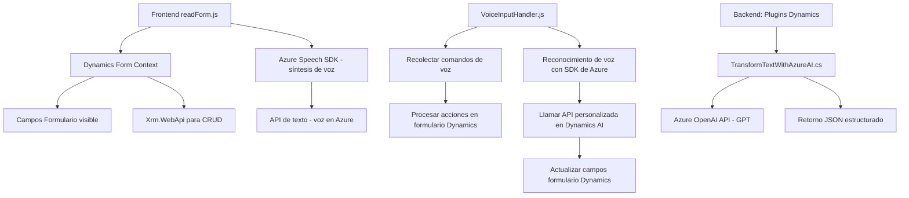

### Análisis del repositorio

#### 1. Resumen técnico

El repositorio contiene archivos específicos para integrar servicios de Azure (Speech SDK y OpenAI) en sistemas de Dynamics 365. Esto sugiere que la solución es principalmente un conjunto de componentes para habilitar funcionalidades como reconocimiento de voz, síntesis de voz, procesamiento de IA y manipulación de formularios de Dynamics 365.

#### 2. Descripción de la arquitectura

La arquitectura sigue un enfoque basado en **n capas**, estructurada de la siguiente manera:
- **Capa de presentación:** Archivos de frontend (`readForm.js`, `speechForm.js`, etc.) interactúan directamente con el usuario y los formularios dinámicos creados en Dynamics 365.
- **Capa de lógica de negocio:** Contiene el archivo `TransformTextWithAzureAI.cs`, que implementa el patrón de plugin para ejecutar la lógica de integración con Azure OpenAI desde Dynamics CRM.
- **Capa de integración:** Interacciones con servicios externos como Azure Speech SDK y Azure OpenAI. Los archivos frontend dependen además de servicios internos proporcionados por el SDK de Dynamics para manipular datos a través de `Xrm.WebApi`.

Adicionalmente, los patrones y elementos indican una arquitectura orientada a servicios (`Service-Oriented Architecture`), debido a la fuerte dependencia de APIs externas como Azure Speech y OpenAI junto con Dynamics CRM.

#### 3. Tecnologías, frameworks y patrones utilizados

- **Tecnologías:**
  - **Frontend:** JavaScript para integrar lógica del navegador y servicios como Azure Speech.
  - **Backend:** Dynamics 365 SDK para plugins y conectividad.
  - **Azure Speech SDK:** Para manipular voz (reconocimiento y síntesis).
  - **Azure OpenAI GPT API:** Para transformar texto según reglas predefinidas.
  
- **Patrones:**
  - **Plug-in Pattern:** Plugin implementado en Dynamics CRM para manejar eventos específicos.
  - **Service Integration Pattern:** Interacción directa con servicios de Azure.
  - **Asynchronous Execution:** Manejo de lógica asíncrona en JavaScript para integraciones con SDKs externos.
  - **Dynamic Forms Mapping:** Identificación de atributos y campos visibles de formularios de manera dinámica.

#### 4. Dependencias o componentes externos

- **Externa:**
  - Azure Speech SDK y Azure OpenAI.
  - Servicios HTTP para interactuar con APIs de Azure.
  - Dynamics 365 SDK (`Xrm.WebApi`) para operaciones CRUD y configuración de formularios.
  
- **Interna:**
  - Métodos auxiliares en el frontend para extracción de datos y asignación dinámica en formularios.
  - Plugins inyectados en el contexto de Dynamics CRM (como `TransformTextWithAzureAI.cs`).

---

#### 5. Diagrama Mermaid válido para GitHub

---

#### Conclusión final

El repositorio combina tecnologías **frontend** (JavaScript) y **backend** (Dynamics CRM plugins) con servicios externos basados en **Azure**. Su arquitectura se enfoca en el manejo de formularios dinámicos de Dynamics y en la ejecución de procesos avanzados de voz e inteligencia artificial. La solución utiliza una mezcla de patrones **n capas** y **orientados a servicios** a través de APIs integradas. Este enfoque es ideal para sistemas empresariales que buscan expandir capacidades de voz e IA para mejorar la experiencia del usuario y automatización avanzada.