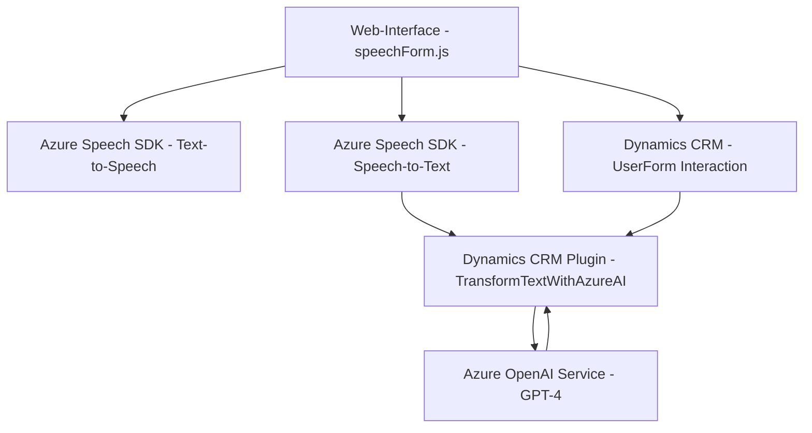

### Breve resumen técnico
El repositorio contiene tres componentes clave relacionados con la integración de servicios de voz y procesamiento de texto a través de **Azure Speech SDK** y **Azure OpenAI**. Además, se observa una conexión con **Microsoft Dynamics CRM**, lo que indica un entorno corporativo adaptado para mejorar la interacción entre clientes y el sistema mediante texto y voz.

1. Los archivos **readForm.js** y **speechForm.js** están orientados al cliente y se encargan de la interacción con el UI del usuario, la integración con Azure Speech SDK, y la manipulación de formularios (mediante **DOM** y posibles APIs de Dynamics CRM).
2. El archivo **TransformTextWithAzureAI.cs** es claramente un **plugin de servidor** diseñado para ejecutarse dentro de Microsoft Dynamics, transformando datos provenientes de un formulario en texto estructurado usando **GPT-4** a través del servicio **Azure OpenAI**.

---

### Descripción de arquitectura
La solución tiene las siguientes características arquitectónicas:
1. **Estilo arquitectónico general**: Arquitectura en capas.
   - **Capa 1 (Frontend)**: Lo representan los archivos **readForm.js** y **speechForm.js**, orientados al consumo de servicios de Azure para voz y texto, y la manipulación de formularios en la interfaz del usuario.
   - **Capa 2 (Backend)**: Representado por el plugin **TransformTextWithAzureAI.cs**, que procesa texto mediante la integración con APIs externas (Azure OpenAI) y responde con datos estructurados que son almacenados o procesados en Microsoft Dynamics CRM.
   - **Capa 3 (Servicios Externos)**: La comunicación con **Azure Speech SDK** y **Azure OpenAI** muestra un modelo centrado en la integración de servicios en la nube.

2. **Patrones utilizados**:
   - **Modular design**: Los distintos componentes del sistema tienen responsabilidades específicas y están desacoplados.
   - **API Gateway Pattern** (del lado del servidor): La interacción con Azure OpenAI forma parte de un servicio que se espera opere como un microservicio o punto de integración con el servicio externo.
   - **Event-driven architecture**: La comunicación de los componentes frontend con el SDK de Azure Speech se basa en eventos y callbacks.
   - **Data Mapping**: La interacción con formularios mediante mapeo dinámico de nombres visibles a claves internas en **speechForm.js**.

---

### Tecnologías usadas
1. **Frontend**:
   - **Azure Speech SDK**: Para reconocimiento de voz y síntesis de texto a voz.
   - **JavaScript**: Lenguaje de programación para el manejo de la interfaz de usuario y la integración con servicios de Azure.
   - **DOM Manipulation APIs**: Para modificar dinámicamente elementos del formulario.
   - **Microsoft Dynamics CRM SDK (e.g., XRM.WebApi)**: Se infiere un modelo de datos basado en CRM dinámico.

2. **Backend**:
   - **Microsoft Dynamics CRM SDK** (C# Plugin): Utilizado para extender las funcionalidades del CRM y ejecutar acciones personalizadas.
   - **Azure OpenAI (GPT-4)**: Servicio backend para la transformación y estructuración de texto.
   - **C#**: Lenguaje de programación principal para plugins de Dynamics.
   - **System.Net.Http** y **System.Text.Json**: Para la comunicación y procesamiento de datos desde APIs externas.

---

### Diagramas Mermaid compatibles con GitHub

### Conclusión final
Este repositorio representa una solución orientada al cliente y centrada en la interacción entre usuarios y datos mediante voz y texto. La arquitectura está diseñada en capas, integrando servicios avanzados como Azure Speech y OpenAI. Los patrones utilizados reflejan una segmentación clara entre la lógica frontend y backend, asegurando mantenibilidad y escalabilidad. La elección de tecnologías como el Azure Speech SDK y Dynamics CRM sugiere que está destinada a ser alojada en un entorno corporativo altamente integrado.

Se sugiere documentar en profundidad las configuraciones de Azure (claves y regiones), asegurar una sólida gestión de errores en las llamadas a servicios externos y considerar herramientas de prueba que emulen eventos y datos externos para validar la funcionalidad.