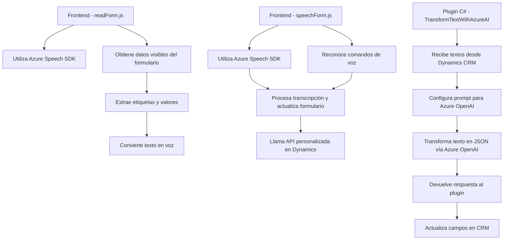

### Breve resumen técnico
Este repositorio integra funcionalidades avanzadas de síntesis de voz, reconocimiento de voz y transformación de datos en un entorno CRM Dynamics, empleando Azure Speech SDK y Azure OpenAI para potenciar la interacción entre usuario y sistema. Los archivos abarcan desde un frontend con JavaScript hasta un backend en C#.

---

### Descripción de arquitectura
La solución implementa una arquitectura **multicapa** con énfasis en integración y servicio. Los componentes JavaScript del frontend interactúan con los usuarios, capturan y procesan datos de formularios, mientras que la capa backend (plugin en C#) se comunica con servicios cognitivos avanzados como Azure OpenAI a través de API externas. 

El diseño general puede clasificarse como una **orientación a servicios** (SOA), con puntos de integración bien definidos.

---

### Tecnologías usadas
1. **Frontend**:
   - **JavaScript**: Lenguaje de programación principal para funcionalidades de voz y formularios.
   - **Azure Speech SDK**: Para el soporte de texto a voz y reconocimiento de voz.
   - **Dynamics CRM SDK**: Para acceder a la API del CRM y actualizar formularios.

2. **Backend**:
   - **C# .NET**: Lenguaje de programación utilizado para desarrollar el plugin.
   - **Dynamics CRM Plugins**: Interfaz `IPlugin` utilizada dentro del ecosistema CRM.
   - **Azure OpenAI**: Servicio de procesamiento de texto mediante IA.

3. **Dependencias adicionales**:
   - `Newtonsoft.Json.Linq`: Librería para manejar estructuras JSON en C#.
   - `HttpClient`: Para realizar solicitudes HTTP al servicio de IA de Azure.

---

### Diagrama **Mermaid**

---

### Conclusión final
Esta solución destaca por su capacidad de integrar **servicios cognitivos** avanzados (Azure Speech y OpenAI) en un entorno CRM Dynamics, mejorando la usabilidad y accesibilidad mediante la interfaz de voz y procesamiento inteligente de datos. La arquitectura sigue principios de modularidad, desacoplamiento mediante servicios externos y patrones orientados a eventos, haciendo que sea extensible y adecuada para soluciones empresariales de interacción avanzada.