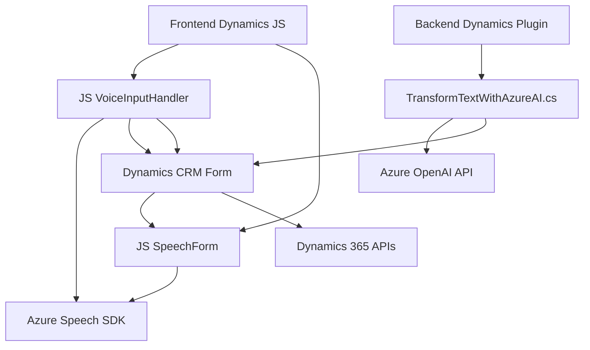

### Breve resumen técnico

Este repositorio define una solución que integra servicios de Microsoft Azure (Speech SDK y OpenAI API) con Dynamics 365 CRM, enfocándose en la interacción con usuarios mediante entrada/salida de voz y procesamiento de texto. Hay tres grandes componentes funcionales:
- **Frontend:** Manejo de eventos del formulario (lectura, entrada de voz, síntesis).
- **Backend:** Un plugin para CRM Dynamics que transforma texto en objetos JSON utilizando Azure OpenAI.

La solución destaca en aplicaciones CRM mejoradas por inteligencia artificial y reconocimiento de voz, planteando un flujo complejo de interacción entre cliente, servidor y servicios externos.

---

### Descripción de arquitectura

La arquitectura es un híbrido entre un **modelo de capa única de presentación** y una integración con servicios externos. Presenta características de **arquitectura dirigida por eventos** al reaccionar a entradas de usuario (voz o formularios). Aunque no se implementa estrictamente una arquitectura de microservicios, algunos elementos del sistema son externalizados (como el procesamiento del texto vía Azure OpenAI).

Se pueden identificar tres capas funcionales:
1. **Frontend (interfaz de usuario en Dynamics 365 CRM):** Responsabilidad de capturar y procesar datos contextuales a través de entrada de voz y formularios.
    - Contexto del formulario es enviado como datos visibles para síntesis en el Speech SDK.
2. **Backend (Plugin de Dynamics 365):** Responsabilidad de procesar texto dinámico usando inteligencia artificial (AI con OpenAI) y estructuras predefinidas.
3. **Servicios externos:** Uso intensivo de recursos de nube para soporte de entrada/salida de voz y transformación avanzada mediante OpenAI y Speech SDK.

---

### Tecnologías usadas

1. **Frontend:**
   - **JavaScript:** Manejo de eventos y lógica frontend para Dynamics.
   - **Azure Speech SDK:** Para reconocimiento y síntesis de voz.
   - **Dynamics 365 APIs:** Manipulación de formularios mediante funciones `Xrm.WebApi`.

2. **Backend:**
   - **C#:** Lenguaje para el desarrollo del plugin de Dynamics CRM.
   - **Azure OpenAI API:** Procesamiento lingüístico avanzado.
   - **Newtonsoft.Json:** Manejo de objetos JSON.
   - **System.Net.Http:** Envío de solicitudes HTTP al servicio Azure.

3. **Servicios en la nube (Microsoft Azure):**
   - Speech SDK: Reconocimiento y síntesis de voz.
   - OpenAI API: Conversión de texto dinámico con normas predefinidas.

4. **Patrones de desarrollo:**
   - Modularidad y separación de responsabilidades.
   - Event-Driven: Activación de tareas relacionada con eventos del frontend.
   - Integración con APIs externas en el backend.

---

### Diagrama Mermaid válido para GitHub

---

### Conclusión final

La solución tiene una arquitectura modular e integrada que combina servicios en la nube, lógica backend y frontend altamente acoplada a Dynamics 365 CRM. Principalmente sirve como una extensión del sistema CRM que mejora la interacción basada en voz y texto mediante inteligencia artificial. Aunque no utiliza estrictamente patrones complejos como hexagonal o microservicios, se enfoca en aprovechar eventos y modularizar la funcionalidad, lo que le permite interactuar eficientemente con servicios externos de la nube para funcionalidades avanzadas.

Esta solución puede escalar fácilmente al añadir nuevos servicios externos (como procesamiento de imágenes o expansión del flujo de la IA), siempre que se mantenga el vínculo con Dynamics 365.