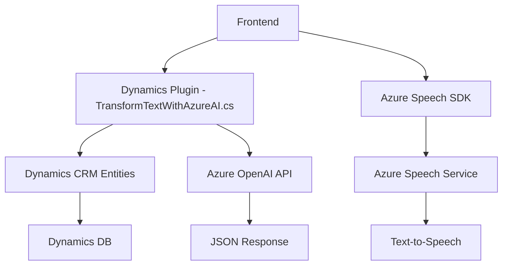

### Breve resumen técnico:
El repositorio contiene varios componentes que trabajan en conjunto para habilitar la captura, síntesis, transformación y procesamiento de datos a través de interacción por voz. Utiliza el contexto de los formularios en Dynamics CRM para proporcionar capacidades avanzadas como entrada por voz, síntesis de texto a voz y modificación dinámica de datos mediante integración con Azure Speech SDK y Azure OpenAI (GPT).

---

### Descripción de arquitectura:
La solución representa una integración de *front-end* y *back-end* con servicios externos, lo que la categoriza como una arquitectura híbrida compuesta por al menos dos capas principales:
1. **Capas cliente (front-end):** Manejo de entrada de voz, procesamiento local (formContext) y conexión con APIs externas.
2. **Capas del servidor (back-end):** Plugin que ejecuta operaciones en el entorno de Dynamics CRM, conectándose directamente a servicios externos (Azure OpenAI API) para procesamiento y transformación de datos.

Se utiliza una arquitectura en **n capas** en el lado del servidor (Dynamics CRM), con lógica claramente separada que interactúa con formularios del cliente (*front-end*). Además, se observa el uso del patrón de **integración de servicios externos** para comunicación con Azure Speech SDK y Azure OpenAI.

---

### Tecnologías usadas:
#### Front-End (JS):
- **Azure Speech SDK**: Para reconocimiento de voz, síntesis de texto a voz, y procesamiento de entrada de voz.
- **JavaScript (ES6)**: Para lógica y manipulación de eventos del cliente.
- **Dynamics CRM Context (`formContext`)**: Acceso a formularios, atributos y control de datos en la experiencia del usuario.

#### Back-End (C#):
- **Dynamics CRM SDK:** Extensión del CRM mediante un plugin.
- **Azure OpenAI API (GPT-4):** Procesamiento avanzado de texto.
- **System.Net.Http:** Realización de solicitudes HTTP hacia la API de Azure OpenAI.
- **System.Text.Json:** Manejo de JSON tanto para el envío como la recepción de respuestas.

#### Patrones:
- *Cargar recursos dinámicos*: El SDK de Azure Speech se carga solo cuando es necesario, optimizando recursos.
- *Facade*: Funciones en el front-end simplifican el flujo de funcionamiento complejo.
- *Delegación*: Uso de métodos como `ensureSpeechSDKLoaded` para ejecutar tareas cuando el SDK está disponible.
- *Microservicio API Gateway*: Comunicación con Azure OpenAI API desde el plugin para delegar la lógica de transformación pesada.

---

### Diagrama **Mermaid**:

---

### Conclusión final:
Este repositorio representa una solución integrada para Dynamics CRM que combina la funcionalidad de síntesis y procesamiento de datos mediante voz (Azure Speech SDK) y servicios avanzados de inteligencia artificial (Azure OpenAI). La arquitectura híbrida en **n capas**, con separación entre front-end y back-end, permite una clara distinción entre la interfaz de usuario (captura y síntesis de voz) y el procesamiento avanzado (transformación a JSON en un plugin). Los principales puntos fuertes de esta solución son la modularidad del código del front-end y la integración fluida con servicios externos a través de la nube y el uso de plugins en Dynamics CRM. Sin embargo, se debe considerar optimizar el manejo de respuestas en el back-end para escenarios que requieran alta concurrencia.