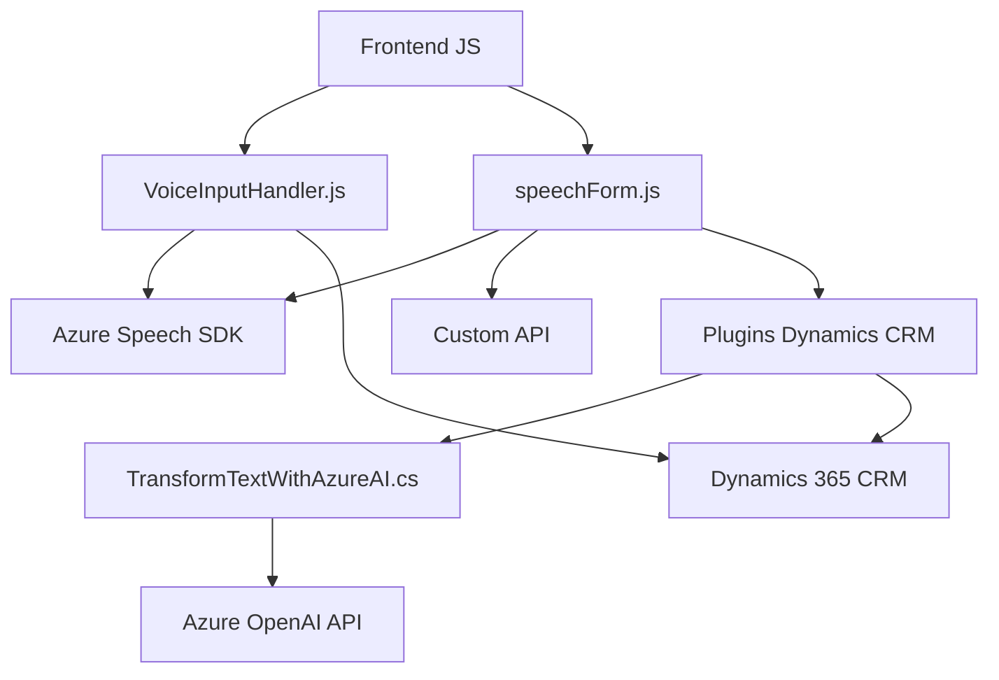

## Análisis detallado

### Breve resumen técnico
El repositorio presentado describe una solución de software compuesta por varios componentes orientados al manejo de formularios usando funcionalidades de voz y procesamiento de lenguaje natural (PLN). Está diseñada para integrarse con sistemas CRM, presumiblemente **Dynamics 365**, y utiliza **Azure Speech SDK** para síntesis y transcripción de voz, así como **Azure OpenAI** para transformar texto en datos estructurados. 

Se trata de un sistema híbrido que combina funcionalidad de frontend (interacción y procesamiento local) y backend (plugin de Dynamics).

---

### Descripción de arquitectura
La solución utiliza una arquitectura **Cliente-Servidor** orientada a servicios externos, con una integración principal entre el frontend (JavaScript) y el backend (Dynamics plugin en C#). Además, el uso del plugin de Dynamics y su configuración como intermediario con la API de Azure OpenAI sugiere un diseño que delega tareas especializadas en microservicios externos mientras su consolidación final se realiza en el ecosistema central del CRM.

Al nivel de frontend, se sigue una arquitectura modular, donde funciones específicas interactúan entre sí para dividir responsabilidades, como:
- Extracción de datos de formularios.
- Validación de atributos.
- Integración y manejo del SDK de Azure Speech para síntesis y transcripción de voz.

Por otro lado, el backend (plugin) utiliza un enfoque de integración con **Dynamics CRM SDK** y se comunica con servicios externos de manera desacoplada, en este caso, una API de Azure OpenAI.

En líneas generales, el sistema sigue una arquitectura de **aplicación multicapa**: 
1. **Frontend:** Capa de presentación e interacción con el usuario.
2. **Backend:** Servicios CRM vía plugins y solicitudes HTTP a Azure OpenAI API.
3. **Integración externa:** Intervención de servicios remotos, como **Azure Speech SDK** y **Azure OpenAI API** para voz y procesamiento de texto.

---

### Tecnologías y frameworks usados
1. **Frontend:**
   - **JavaScript:**
     - Funciones definidas para interactuar con formularios.
     - Manejo del estado asincrónico y carga dinámica.
   - **Azure Speech SDK:** Se utiliza para transcripción de voz y síntesis de audio.
   - **Xrm. API** (Dynamics CRM): Manipulación de atributos y controles del formulario en un sistema CRM.
2. **Backend:**
   - **C# y Dynamics SDK:**
     - Programación basada en `IPlugin` para integrarse directamente en el flujo de trabajo de Dynamics CRM.
     - Manejo de solicitudes HTTP para consumir la Azure OpenAI API.
   - **Azure OpenAI API:** Usada para transformar texto en datos estructurados mediante inteligencia artificial.
   - **System.Net.Http**, `Newtonsoft.Json`, `System.Text.Json`: Herramientas para manipular JSON y realizar solicitudes HTTP.
3. **Patrones/Conceptos de Arquitectura:**
   - Modularización en el diseño del frontend.
   - Integración con servicios externos.
   - Cliente-Servidor.
   - Adaptador: Mapeos entre datos frontend y entidades en el CRM.
   - Load-on-demand: Carga dinámica del SDK de Azure Speech.

---

### Diagrama Mermaid
Basándonos en el análisis anterior, generamos un diagrama que muestra los componentes principales y cómo interactúan entre sí.

---

### Conclusión final
La solución está diseñada para ser utilizada como integración en un sistema CRM que permite a los usuarios interactuar con formularios mediante comandos de voz y lectura de información en tiempo real. Utiliza tecnologías de Azure como el Speech SDK y OpenAI API junto con Dynamics CRM plugins para incorporar tanto funcionalidades locales como procesamiento avanzado en la nube.

Por su diseño, se considera una arquitectura **híbrida cliente-servidor con integración de servicios externos** bajo un esquema multicapa, ya que distribuye responsabilidades entre un frontend modular, una capa de backend dentro del CRM y servicios inteligentes (Azure Speech y OpenAI) en la nube. Es extensible y puede evolucionar para incorporar nuevas funcionalidades en otros sistemas o formularios.