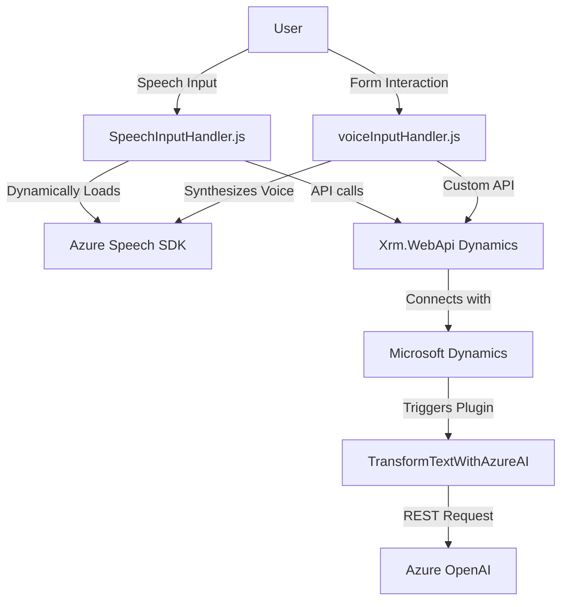

### Breve resumen técnico
El repositorio contiene soluciones enfocadas en la interacción entre formularios de Microsoft Dynamics 365 y servicios de Azure, específicamente Azure Speech SDK (para síntesis y transcripción de voz) y Azure OpenAI (para transformar texto con inteligencia artificial). Los archivos implementan funcionalidades tanto en frontend como en plugins de la plataforma Dynamics CRM.

---

### Descripción de arquitectura
La solución tiene dos componentes principales:
1. **Frontend (JavaScript):** Se utiliza para la interacción entre los usuarios, los formularios de Dynamics 365 y los servicios externos de voz y texto.
2. **Backend (Plugin en C#):** Implementa lógica personalizada en Dynamics CRM para transformar el texto utilizando Azure OpenAI.

La arquitectura tiene características distribuidas, combinando elementos de integración con servicios externos (Azure Speech SDK y Azure OpenAI) y lógica específica en un entorno de Dynamics CRM. Usa un enfoque híbrido que mezcla **hexagonal** y **n capas**, donde el CRM actúa como un núcleo que conecta con servicios externos siguiendo patrones como integración (Proxy) y delegación de responsabilidades.

---

### Tecnologías usadas
1. **Frontend**
   - **JavaScript ES6+**: Para la programación en el navegador.
   - **Microsoft Dynamics Form Context API**: Manipulación de objetos de formulario dentro de Dynamics 365.
   - **Azure Speech SDK**: Para síntesis y transcripción de voz desde Azure.
2. **Backend**
   - **C# (.NET)**: Para la implementación del plugin.
   - **Microsoft Dynamics CRM SDK**: Manejo de interfaces, entidades y eventos en el sistema CRM.
   - **Azure OpenAI API**: Uso de inteligencia artificial generativa para procesar texto.
   - **Third-party libraries**:
     - `Newtonsoft.Json` y `System.Text.Json`: Manejo de objetos JSON.
     - `System.Net.Http`: Realización de solicitudes REST.
3. **Communication protocols**
   - **HTTP(S)**: Para llamadas a APIs externas.
   - **REST API**: Integración con Azure Speech SDK y OpenAI.

---

### Diagrama Mermaid válido para GitHub

---

### Conclusión final
El repositorio implementa una solución integradora que conecta formularios de Dynamics 365 con la capacidad avanzada de procesamiento de voz y texto mediante servicios de Microsoft Azure. La arquitectura sigue principios de modularidad y utiliza patrones modernos como proxies para abstraer y delegar la lógica compleja a servicios externos. Estas herramientas son idóneas para entornos empresariales donde la utilización de IA y datos estructurados en formularios es crítica.

Aunque la arquitectura presenta buena separación de responsabilidades, dependerá considerablemente de configuraciones externas y conectividad con los servicios de Microsoft Azure, lo que puede ser un reto para algunas implementaciones en entornos restringidos.