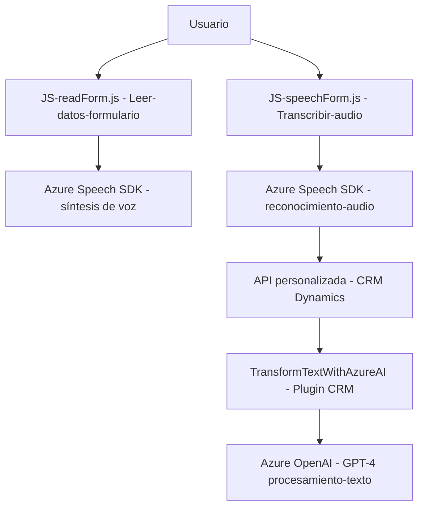

### Breve resumen técnico
Este repositorio contiene una solución basada en la integración de servicios externos, que proporciona funcionalidades relacionadas con la síntesis de voz, transcripción de audio a texto, y transformación de datos mediante inteligencia artificial en Microsoft Dynamics CRM. Los archivos detallados representan un sistema orientado a facilitar la interacción y manipulación dinámica de formularios mediante voz y capacidades de inteligencia artificial.

---

### Descripción de la arquitectura
**Tipo de arquitectura:**  
Combina una arquitectura **n capas** y **orientada a servicios**.  
- El sistema opera en diferentes capas, desde la lógica del frontend (JS) hasta servicios integrados como Azure Speech SDK y Azure OpenAI.  
- Gracias a tecnologías como Azure Speech SDK, la arquitectura también adopta principios de **orientación a servicios**, delegando funcionalidades complejas a servicios externos mientras mantiene la lógica interna de procesamiento.  
- El plugin en C# sigue un **Plugin Pattern**, típico de extensiones en Dynamics CRM.

---

### Tecnologías usadas
1. **Frontend (JavaScript):**
   - Azure Speech SDK para síntesis de voz y reconocimiento de audio.
   - Lógica para manipulación de formularios de Dynamics CRM.
2. **Backend (Microsoft Dynamics CRM plugin en C#):**
   - Azure OpenAI para procesamiento de texto mediante GPT-4.
   - Microsoft Dynamics CRM SDK para la ejecución de plugins y manipulación de datos organizacionales.
   - HTTP cliente para consumir servicios externos (Azure APIs).
3. **API y servicios:**
   - Azure Speech SDK: Reconocimiento de voz y síntesis de texto a voz.
   - Azure OpenAI API: Procesamiento y transformación avanzada de datos.

---

### Diagrama Mermaid válido para GitHub

---

### Conclusión final
Esta solución implementa un sistema interactivo basado en voz y procesamiento de datos, con una arquitectura orientada a integración de servicios externos. El uso de Azure Speech SDK y Azure OpenAI permite encapsular funcionalidades avanzadas de audio y procesamiento de texto, mientras que los plugins en Microsoft Dynamics CRM facilitan manejar lógica específica de negocio. La arquitectura combinada de n capas y servicios es adecuada para sistemas con lógica empresarial compleja.