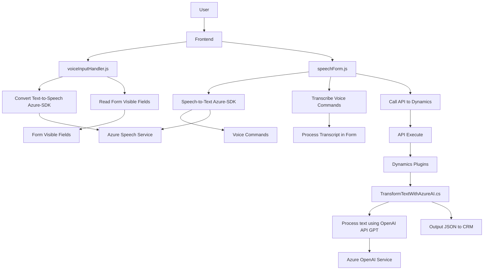

### Breve resumen técnico:
La solución analizada tiene un enfoque particular en la integración entre una cliente web (frontend), Microsoft Dynamics CRM y servicios de Azure, conformando una plataforma que permite a los usuarios interactuar con formularios de manera avanzada. El frontend procesa datos de formularios y ejecuta funcionalidades como conversión de texto a voz y reconocimiento de voz, mientras que el backend aplica procesamiento de lenguaje natural mediante Azure OpenAI y sirve como puente para integrar las capacidades del CRM.

---

### Descripción de la arquitectura:
La arquitectura implementada en esta solución puede calificarse como **n-capas con integración de servicios externos**. Presenta tres capas principales:
1. **Capa de presentación**: Implementada en JavaScript, gestiona la interacción de los usuarios con los formularios visualizados en el frontend.
2. **Capa de lógica de negocio**: Implementada en forma de plugins (C#) para Microsoft Dynamics CRM, donde se orquesta la lógica de manipulación de datos y conectividad.
3. **Capa de integración de servicios**: Usa dos servicios externos de Microsoft Azure (Speech SDK y OpenAI) para añadir funcionalidades avanzadas de procesamiento y síntesis de texto/voz.

Se emplean patrones arquitectónicos como:
- **Patrón de Plugin**: Para ejecutar la lógica vinculada a eventos específicos en Dynamics CRM.
- **Service-Oriented Architecture (SOA)**: Consumo de servicios externos como Azure Speech SDK y Azure OpenAI.
- **Factory/Wrapper Pattern**: Carga condicional de SDKs, facilitando la modularidad y extensibilidad.
- **Event-Driven Architecture**: En el frontend, las interacciones de voz/formulario están vinculadas a eventos.
- **Modularización**: Código JavaScript dividido en funciones independientes y dirigidas a tareas específicas, siguiendo el principio de responsabilidad única.

---

### Tecnologías usadas:
1. **Frontend**:
   - **JavaScript**: Para lógica del navegador y control de formularios.
   - **Azure Speech SDK**: Uso de APIs de síntesis y reconocimiento de texto/voz.
   - **API personalizada**: Llamadas al backend para procesamiento de datos en tiempo real.

2. **Backend Dynamics CRM**:
   - **Microsoft.Xrm.Sdk**: Para implementar y ejecutar plugins en el CRM.
   - **Azure OpenAI API**: Manejo de modelos de lenguaje como GPT para transformar texto en JSON.

3. **Otros componentes**:
   - **Newtonsoft.Json.Linq** y **System.Text.Json**: Para el manejo dinámico de objetos JSON en C#.
   - **System.Net.Http**: Para realizar solicitudes a servicios Azure.

---

### Diagrama Mermaid:

---

### Conclusión final:
La solución presentada integra herramientas modernas y avanzadas para asistir al usuario en la manipulación de formularios mediante tecnologías de síntesis y reconocimiento de voz. Utiliza Azure Speech SDK y OpenAI para garantizar precisión y eficiencia en la transformación de texto y voz. Su diseño combina una arquitectura n-capas con SOA, logrando modularidad y flexibilidad, adecuada para entornos empresariales como Microsoft Dynamics CRM. La implementación cumple con el paradigma de diseño limpio y eficiente, usando patrones adecuados para robustez y escalabilidad.