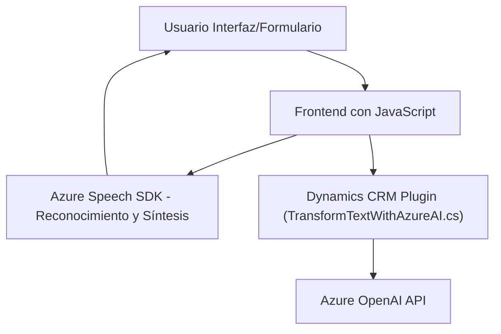

### Breve resumen técnico
El repositorio implementa una solución híbrida que incluye un **frontend basado en JavaScript** integrado con **Azure Speech SDK** y un **plugin en C# para Microsoft Dynamics CRM** que utiliza inteligencia artificial de **Azure OpenAI**. Su propósito es automatizar procesos de reconocimiento de voz, síntesis de audio, procesamiento textual y transformación de datos hacia formularios dinámicos.

---

### Descripción de arquitectura
1. **Tipo de solución**:
   - **API**: Utiliza servicios externos (Azure Speech SDK y OpenAI) para tareas específicas.
   - **Frontend**: Implementación en JavaScript para interacción con formularios Dynamics 365 mediante reconocimiento de voz y síntesis.
   - **Plugin**: Integración directa en Dynamics CRM para transformar texto con IA.

2. **Arquitectura global**:
   - La solución tiene una arquitectura de **capas**:
     - **Capa de presentación**: JavaScript y Azure Speech SDK trabajando en el frontend.
     - **Capa lógica**: Transformación textual usando IA en un plugin de Dynamics CRM.
     - **Capa externa**: Servicios de Azure Speech SDK y OpenAI.
   - Utiliza un enfoque de **integración API** y prácticas basadas en **eventos** en el entorno Dynamics CRM.

---

### Tecnologías usadas
1. **Frontend**:
   - **JavaScript**: Implementación basada en funciones para manipular formularios y transformar datos.
   - **Azure Speech SDK**: Reconocimiento de voz y síntesis en español (`es-ES-AlvaroNeural`).

2. **Backend (Plugin)**:
   - **C#**: Desarrollo orientado a plugins de Dynamics CRM.
   - **Azure OpenAI**: Procesamiento avanzado de texto ingresado desde Dynamics.
   - **APIs de Dynamics CRM**: Manejo de formularios dinámicos con `Xrm.WebApi`.

3. **Patrones observados**:
   - **Inversión de control**: `IServiceProvider` en plugins de CRM.
   - **Modularidad**: Frontend basado en funciones independientes por contexto (controlador, síntesis, transcripción).
   - **Integración Microservices**: Uso externo de servicios como OpenAI y Speech SDK.

---

### Dependencias o componentes externos
1. **Azure Speech SDK**:
   - Reconocimiento de voz y síntesis de audio.
   - Clave y región específicas configuradas.
   
2. **Azure OpenAI**:
   - Procesamiento textual avanzado utilizando IA.
   - Requiere un endpoint configurado y credenciales de acceso.

3. **Microsoft Dynamics CRM**:
   - Plugins específicos para manejar formularios y datos dinámicos.
   - Dependencia en APIs propias de Dynamics.

4. **Librerías internas y externas utilizadas**:
   - En JavaScript: DOM APIs para manipulación de formularios.
   - En C#: `Newtonsoft.Json`, `System.Net.Http`, `System.Text.Json`.

---

### Diagrama Mermaid válido para GitHub

---

### Conclusión final
La solución presentada tiene una **arquitectura multinivel** que combina frontend dinámico con servicios avanzados proporcionados por Azure Speech SDK y Azure OpenAI, integrados dentro de Dynamics CRM. Esta integración crea un flujo que parte de la interacción del usuario (voz/inputs) y convierte estos datos en acciones dentro de los formularios mediante un plugin C#.

Aunque eficiente, hay oportunidades de mejora en:
1. **Externalización de configuraciones sensibles**: Las claves y endpoints de Azure podrían moverse a un sistema seguro de configuración.
2. **Modularidad del código**: Para escalabilidad y mantenimiento, se podrían definir interfaces que separen interacción entre frontend, API externa y servidor CRM.

En general, es una solución sólida para escenarios de automatización que requieren interacción avanzada mediante voz y procesamiento textual.