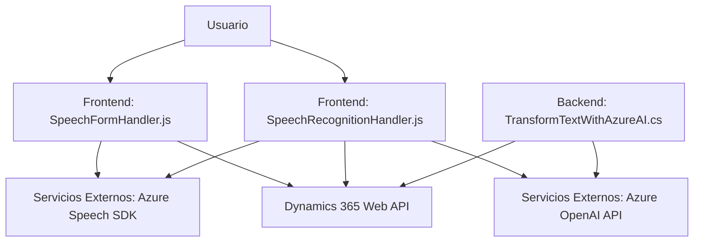

#### Breve Resumen Técnico:
El repositorio parece implementar módulos para una solución que integra reconocimiento y síntesis de voz con Microsoft Dynamics 365. Los archivos en **FRONTEND/JS** gestionan el lado cliente para la interacción con formularios en Dynamics 365, mientras que **Plugins/TransformTextWithAzureAI.cs** extiende la funcionalidad CRM mediante un plugin que utiliza Azure OpenAI para la transformación y generación de datos.

---

#### Descripción de Arquitectura:
La solución presenta una **arquitectura de n capas**:
1. **Frontend**: Módulos JavaScript que integran Azure Speech SDK para la interacción con el usuario mediante voz y texto; depende de Dynamics 365 como backend.
2. **Backend/Business Logic**: Plugins en C# que extienden la funcionalidad de Dynamics 365, mezclando lógica lógica empresarial y comunicación con el servicio Azure OpenAI.
3. **External APIs**: Integración mediante REST con Azure Speech y OpenAI API.

El patrón de arquitectura incluye:
- **Modularidad**: Cada componente tiene responsabilidades específicas.
- **Integración con Servicios Externos**: Dependencia directa de SDKs y microservicios como Azure Speech y Azure OpenAI.

---

#### Tecnologías Usadas:
1. **Frontend**:
   - **JavaScript**: Implementación de lógica y mecanismos de comunicación con SDKs.
   - **Azure Speech SDK**: Para reconocimiento y síntesis de voz.
   - **Dynamics 365 Web API**: Para consumo de endpoints vinculados al CRM.

2. **Backend**:
   - **C#/.NET**: Implementación de plugins bajo el marco de Dynamics 365.
   - **Microsoft.Xrm.Sdk**: API oficial para interactuar con el CRM.
   - **Azure OpenAI**: Servicio IA para generación de datos en formato JSON.

3. **Otros**:
   - **REST API**: Comunicación con servicios de Azure.
   - **JSON Libraries**: Para manejo de estructuras JSON (Newtonsoft y System.Text.Json).

---

#### Diagrama Mermaid (compatible con GitHub Markdown):

---

#### Conclusión Final:
Este repositorio corresponde a una solución híbrida basada en integración de **SDKs y servicios cloud** con **Microsoft Dynamics CRM**. Combina funcionalidades avanzadas de reconocimiento y síntesis de voz mediante Azure Speech SDK y genera transformaciones dinámicas de texto en JSON con Azure OpenAI API. La arquitectura se organiza en **n capas**, separando completamente las responsabilidades de Frontend, lógica empresarial en Backend y manejo de servicios externos. Esto asegura escalabilidad, mantenibilidad y una interacción óptima con usuarios mediante voz y automatización avanzada.