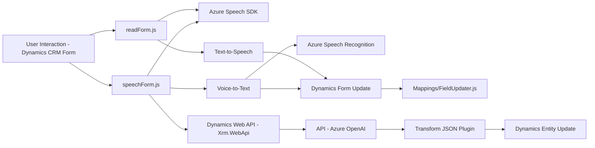

### Breve Resumen Técnico

Este repositorio contiene componentes diseñados para integrar funcionalidades avanzadas en Microsoft Dynamics CRM mediante herramientas como Azure Speech SDK y Azure OpenAI. El conjunto de scripts en JavaScript interactúa directamente con formularios en Dynamics CRM para proporcionar funcionalidades como Text-to-Speech y Voice-to-Text. Además, integra un plugin para transformar texto en formato JSON utilizando Azure OpenAI. 

### Descripción de Arquitectura

La solución sigue una **arquitectura modular en capas** centrada en la interacción con servicios externos de Azure. Está diseñada como un **monolito extendido**, donde los componentes front-end interactúan directamente con formularios de Dynamics CRM, mientras que los plugins y APIs procesan datos en segundo plano. Las principales capas son: 
- **Front-End (JavaScript)**: Procesamiento y manipulación de datos en el formulario.
- **Back-End (Plugins y APIs)**: Transformación avanzada de datos con servicios externos.

No hay evidencia de microservicios ni arquitectura hexagonal; la solución parece depender de servicios centralizados y contextos de Dynamics CRM.

### Tecnologías Usadas

1. **JavaScript**:
   - Dinámico para la interacción con formularios y SDKs como SpeechSDK.
   - Integración con Dynamics CRM (Xrm.WebApi).
   
2. **C# (Plugin)**:
   - Dynamics CRM Plugin SDK.
   - Integración con Azure OpenAI Service.
   - Librerías para manejo de JSON (`Newtonsoft.Json`, `System.Text.Json`) y HTTP (`System.Net.Http`).

3. **Servicios Externos**:
   - **Azure Speech SDK**: Reconocimiento y síntesis de voz.
   - **Azure OpenAI Service**: Transformación textual avanzada.

4. **Patrones de Diseño**:
   - Modularidad: Separación de lógica por funcionalidad (voz, texto, transformación).
   - Integración de APIs: Comunicación con Azure para AI y Speech.
   - Event-driven: Callback para cargar el Speech SDK.

### Dependencias o Componentes Externos

1. **Externos**:
   - Azure Speech SDK: Para funciones de voz (Text-to-Speech y Voice-to-Text).
   - Azure OpenAI Service: Procesamiento textual avanzado.
   - Dynamics CRM Web API (`Xrm.WebApi`).

2. **Internos**:
   - Dynamics CRM: Contexto y ejecución del flujo lógico en formularios.

---

### Diagrama Mermaid

---

### Conclusión Final

Este repositorio representa una solución integrada que une capacidades de Microsoft Dynamics CRM y Azure Cloud para ofrecer funcionalidades avanzadas relacionadas con voz y procesamiento textual. Usando una arquitectura de capas, modulares y servicios externos, esta implementación permite aprovechar tecnologías punteras como el Speech SDK y OpenAI para mejorar la experiencia y la automatización en el uso de formularios dinámicos. Sin embargo, está estructurado como un complemento monolítico para Dynamics CRM, sin intenciones evidentes de convertirlo en un esquema distribuido como microservicios.