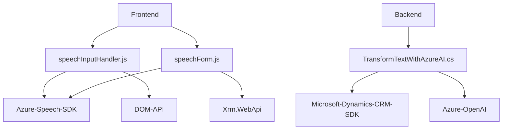

### Breve resumen técnico
Este repositorio parece ser un conjunto de componentes destinados a proporcionar funcionalidad avanzada de entrada y salida de voz (ubicados en el frontend) y procesamiento de texto usando IA (en el backend), integrándolo con formularios dinámicos y plugins de Microsoft Dynamics CRM.

La solución combina un frontend basado en JavaScript que utiliza el Azure Speech SDK y un backend (C#) que conecta con Azure OpenAI para manejar flujos inteligentes y estructuras de datos según reglas específicas. El objetivo es dotar a los formularios dinámicos de capacidades como síntesis y reconocimiento de voz, además de la transformación de datos con inteligencia artificial.

---

### Descripción de arquitectura
#### Tipo de arquitectura:
1. **Frontend:** Arquitectura cliente basada en funciones modulares organizadas por responsabilidades para interacción con usuarios y servicios externos.
2. **Backend:** Un **plugin de Dynamics CRM** (orientado a eventos) que implementa una arquitectura capa-por-capa (layered) para estructurar las responsabilidades.
3. **Cliente-Servidor:** El sistema opera bajo este principio, con comunicación entre el cliente (frontend en JavaScript) y el servidor (Azure Speech SDK y Azure OpenAI APIs).

#### Flujo de integración:
- **Frontend:** Solicita voz o texto al usuario, utiliza servicios de Azure y comunica los resultados mediante APIs. Procesa y organiza los datos según etiquetas visibles de los formularios dinámicos.
- **Backend:** Responde eventos del CRM (Dynamics), transforma textos siguiendo reglas dadas y emplea el Azure OpenAI mediante solicitudes HTTP en el plugin.

---

### Tecnologías usadas
1. **Frontend:**
   - JavaScript ES6+.
   - Azure Speech SDK para síntesis y reconocimiento de voz.
   - APIs de formularios dinámicos basadas en Dynamics CRM (`Xrm.WebApi`).
   - DOM API para manipulación de script y extracción de datos de formularios.

2. **Backend:**
   - Lenguaje C# (framework .NET).
   - Microsoft Dynamics CRM SDK (`Microsoft.Xrm.Sdk`).
   - Azure OpenAI para transformación de texto basado en IA.
   - JSON y HTTP libraries (`System.Text.Json`, `System.Net.Http`) para comunicación.

#### Patrones utilizados:
- **Modularización:** Funciones aisladas por responsabilidades específicas (p.ej., `startVoiceInput`, `ensureSpeechSDKLoaded`).
- **Wrapper/Facade:** Abstracción para manejar SDKs externos (Azure Speech SDK).
- **Service-Oriented Architecture (SOA):** Integraciones orientadas a servicios como Azure OpenAI y APIs externas.
- **Plugin Pattern:** Uso de la interfaz `IPlugin` para responder eventos dentro de Dynamics CRM.

---

### Dependencias o componentes externos
1. **Azure Speech SDK:** Funcionalidad de síntesis y reconocimiento de voz en el frontend.
2. **Azure OpenAI:** Procesamiento de texto inteligente en el backend.
3. **Microsoft Dynamics CRM SDK:** Para establecer medidas en eventos dentro de formularios dinámicos.
4. **Xrm.WebApi:** APIs integradas con Dynamics CRM para interactuar con los datos y formularios dinámicos.
5. **JSON Libraries:** Para la administración de datos estructurados.
6. **Library de numeración (posible interna):** Método `palabrasANumeros` evidencia la necesidad de convertir strings numéricos en valores enteros.

---

### Diagrama Mermaid válido para GitHub

---

### Conclusión final
El repositorio mezcla aplicaciones cliente (frontend) y un componente servidor (plugin) dentro del ecosistema de Microsoft Dynamics CRM. Está diseñado para integrar capacidades de voz y procesamiento de texto avanzado usando servicios externos como Azure Speech SDK y Azure OpenAI, brindando una solución moderna basada en IA dentro de formularios dinámicos.

La arquitectura, aunque separa múltiples funcionalidades, podría beneficiarse de mejores prácticas como mayor desacomplamiento entre componentes, especialmente en el backend. Sin embargo, a nivel de funcionalidad, es un ejemplo compuesto que aprovecha el potencial de herramientas líderes y orientaciones modernas como SOA y el uso de SDKs.