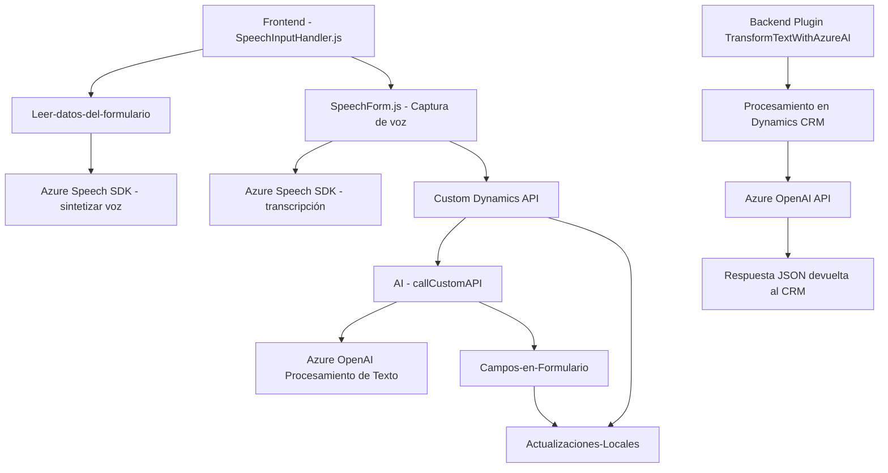

### Breve resumen técnico
El repositorio contiene tres archivos principales con funcionalidades relativas a la integración de formularios, inteligencia artificial y servicios externos como Azure Speech SDK y Azure OpenAI. Está diseñado para manejar tanto el procesamiento de voz como datos estructurados desde formularios en sistemas CRM, probablemente Dynamics 365.

---

### Descripción de arquitectura
La solución sigue una **arquitectura modular n-capas** distribuida entre:
1. **Frontend:** Manejo de datos del formulario e integración con el servicio Azure Speech SDK.
2. **Backend personalizado:** Plugins implementados en Dynamics CRM con Azure OpenAI API para la transformación de texto.
3. **Servicios externos:** Uso de Azure Cognitive Services (Speech SDK) y Azure OpenAI para síntesis y procesamiento de voz e inteligencia artificial.

Se destaca un patrón **event-driven** en el frontend, con funciones orientadas a la interacción con el usuario y asincronismo. En el backend, sigue **Single Responsibility Principle (SRP)**, distribuyendo responsabilidades entre el manejo del evento de ejecución del plugin y la comunicación con un servicio externo (Azure OpenAI).

---

### Tecnologías usadas
1. **Backend:**
   - Lenguaje: C# (Microsoft Dynamics Plugin Framework).
   - Librerías: `Newtonsoft.Json`, `System.Text.Json`, `Microsoft.Xrm.Sdk`.
   - Dependencias externas: Azure OpenAI API.

2. **Frontend:**
   - Lenguaje: JavaScript.
   - SDK: Azure Speech SDK.
   - Dependencias: Dynamics Web API (Xrm.WebApi).

3. **Patrones:**
   - **Event-driven:** Reconocimiento de voz y respuestas asincrónicas en el frontend.
   - **Integración modular:** Plugins y servicios externos se gestionan dinámicamente.
   - **Separation of Concerns:** Codificación en módulos especializados (SDK, formularios, complementos).

---

### Diagrama Mermaid

---

### Conclusión final
La solución está diseñada principalmente para integrarse con **Microsoft Dynamics CRM** y enriquecer la experiencia del usuario a través del **reconocimiento de voz** y la **inteligencia artificial**. Consta de dos capas principales:

1. **Frontend:** Responsable de la interacción directa con el usuario y manejo del reconocimiento de voz. Usa **Azure Speech SDK** para sintetizar o transcribir información desde formularios.
2. **Backend (Dynamics Plugin):** Procesamiento de texto avanzado mediante **Azure OpenAI**, transformando los datos en JSON para aplicar reglas definidas.

La arquitectura modular y uso de APIs externas como Azure Speech y OpenAI posicionan este sistema como una solución moderna y extensible. Sin embargo, la seguridad de las claves de API y el manejo de errores merecen atención en una implementación completa.