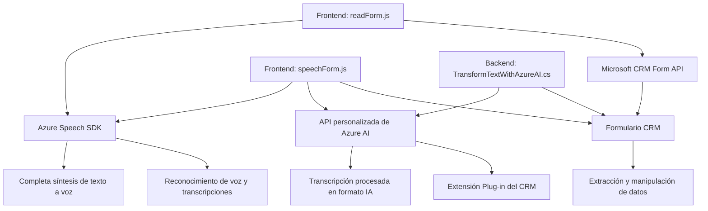

### Breve resumen técnico:
Este repositorio contiene una solución híbrida orientada a maximizar la accesibilidad y automatización mediante la integración de funcionalidades de reconocimiento y síntesis de voz. Además, utiliza servicios de inteligencia artificial (OpenAI mediante Azure) para el procesamiento avanzado de texto. Está dividido entre implementación frontend basada en JavaScript y plugins backend para Microsoft Dynamics CRM.

---

### Descripción de arquitectura:
#### Tipo de solución:
La solución en el repositorio está diseñada como un sistema integrado de **frontend y backend**, donde los elementos frontend (JavaScript) manejan interacción en tiempo real mediante el navegador y la integración con Azure Cognitive Services, mientras que el backend (C#) extiende la funcionalidad de Microsoft Dynamics CRM mediante plugins personalizados para mandatos específicos.

#### Arquitectura:
1. **Frontend**: 
   - Modular orientado a funciones con una estructura basada en eventos.
   - Comunicación con SDK externos y APIs REST (Azure Speech y OpenAI).
2. **Backend**: 
   - Extensible a través del **plug-in pattern**. El uso de Microsoft Dynamics CRM indica una arquitectura **n-capas**, especialmente diseñada para interacciones cliente-servidor con servicios basados en eventos CRM.

3. **Modelo híbrido**: Hay elementos que pueden definir una **arquitectura de integración de servicios**, ya que los servicios en Azure y APIs RESTful tienen una alta participación en el flujo de datos.

---

### Tecnologías usadas:
1. **Frontend**:
   - **Programación**: JavaScript (NodeJS no especificado explícitamente).
   - **Azure Cognitive Services**:
     - Speech SDK (synthetic speech y reconocimiento). 
   - **Microsoft Dynamics CRM**: Manipulación de atributos, extracción y modificación de valores en formularios.
   - DOM API: Carga y modificación dinámica en el navegador.
  
2. **Backend**:
   - **Microsoft Dynamics CRM SDK**: 
     - `IPlugin`: Plugin dentro del entorno CRM.
     - `IOrganizationService`: Para realizar operaciones sobre entidades CRM.
   - **Azure OpenAI Service**:
     - Procesamiento de texto vía modelos GPT alojados en Azure.
   - `System.Net.Http` y `System.Text.Json` (network & JSON handling).

---

### Dependencias externas y componentes:
- **Azure Cognitive Services**: 
  - Speech SDK mediante un CDN externo.
  - OpenAI API para el procesamiento de texto inteligente en JSON.
- **Microsoft Dynamics CRM SDK**: 
  - Dependencia interna, necesaria para la interacción y gestión de la base de datos CRM.
- **Paquetes y APIs**: 
  - `Newtonsoft.Json` y otros paquetes del framework .NET (para manipulación y comunicación asíncrona).

---

### Diagrama Mermaid válido para GitHub:

---

### Conclusión final:
El repositorio representa una solución híbrida con un enfoque en accesibilidad y automatización. El frontend utiliza servicios externos de sintetización y reconocimiento de voz (Azure Speech SDK), mientras que el backend con C# extiende Microsoft Dynamics CRM al aprovechar el poder de procesamiento avanzado de texto mediante Azure OpenAI. Es una arquitectura escalable n-capas que aprovecha la modularización en frontend y plugins en backend para ofrecer una interacción fluida y enriquecida con IA.