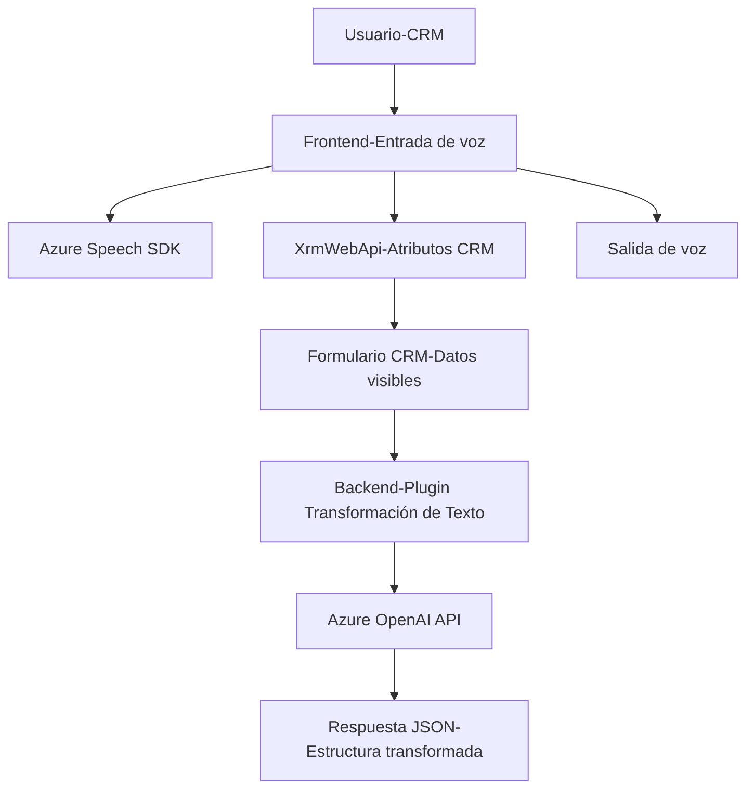

### Breve resumen técnico

El repositorio parece estar orientado a software que integra un sistema CRM (Dynamics) con capacidades avanzadas de procesamiento de entrada de voz y transformación de texto utilizando servicios externos como **Azure Speech SDK** y **Azure OpenAI API**. Las tecnologías principales incluyen JavaScript y C#, complementadas con APIs de Azure para funciones específicas. Combina módulos frontend para entrada de voz y backend con plugins para transformación dinámica de datos en un sistema CRM.

---

### Descripción de arquitectura

La arquitectura detectada puede clasificarse como **n capas** con integración de servicios externos. En el lado cliente (frontend), los archivos en JavaScript habilitan funcionalidades que procesan voz y datos en un CRM (Dynamics). El backend está representado por código en C#, implementando plugins que se integran directamente con Dynamics CRM para ejecutar automatizaciones específicas y trabajar con servicios en la nube como Azure OpenAI API.

El flujo permite desacoplar responsabilidades mediante la siguiente arquitectura:
1. **Frontend (entrada de voz):** Encargado de la interacción del usuario y extracción de datos visibles de formularios.
2. **Backend (procesamiento de texto):** Responsable de transformaciones mediante IA.
3. **Servicios externos:** Dependencias en la nube (Azure Speech SDK, OpenAI) que ejecutan operaciones especializadas, como la síntesis de voz o generación de JSON estructurado.

El diseño modular está orientado hacia una integración híbrida de servicios CRM y dependencias externas, funcionando como capas horizontales que colaboran.

---

### Tecnologías usadas

1. **Frontend:**
   - **JavaScript:** Para la implementación de lógica de entrada de voz.
   - **Azure Speech SDK:** Capacidad avanzada de síntesis de texto a voz y reconocimiento de voz.
   - **Xrm.WebApi (Dynamics CRM):** Manipulación de datos CRM desde un cliente frontend.

2. **Backend:**
   - **C#:** Implementación de plugins de CRM.
   - **Azure OpenAI API:** Transformaciones inteligentes de texto vía GPT modelos (probablemente GPT-3.5 o GPT-4).
   - **System.Net.Http:** Para realizar solicitudes HTTP hacia APIs en Azure.

3. **Servicios externos/dependencias:**
   - SpeechSDK para integración de voz.
   - Llamada a APIs REST.

---

### Diagrama **Mermaid**

A continuación, se presenta un diagrama **Mermaid** que describe el flujo de trabajo y componentes principales del sistema:

El flujo comienza en el **CRM**, donde el usuario interactúa con un formulario. El **Frontend** permite entrada y salida de voz, interactuando con **Azure Speech SDK** y el sistema CRM mediante **XrmWebApi** para manipulación de datos del formulario. En un siguiente paso (Backend), el **plugin en C#** llama a **Azure OpenAI API** para transformar el texto y devolver datos estructurados.

---

### Conclusión final

La solución implementada en este repositorio es una combinación de:
1. **Frontend funcional:** Captura voz, extrae atributos dinámicos del CRM y sintetiza salida de voz.
2. **Backend especializado:** Plugins de Dynamics CRM para transformar texto con Azure OpenAI API.
3. **Híbrido de servicios y capas:** La arquitectura combina n capas con servicios externos que procesan datos mediante APIs especializadas.

Es una solución modular, eficiente y reutilizable, ideal para su uso en empresas que buscan mejorar la interacción entre humanos y formularios dinámicos mediante IA. Su diseño claramente separa responsabilidades y optimiza la integración de servicios de nube para tareas específicas.