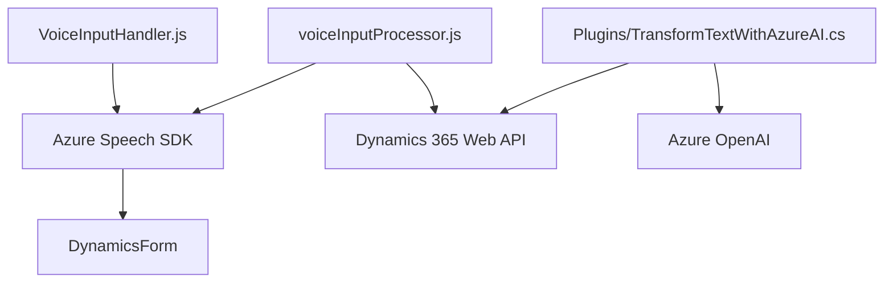

# Breve resumen técnico

Los archivos proporcionados son elementos clave de una solución integrada que une tecnologías de reconocimiento de voz, generación de voz, procesamiento de texto mediante IA y un sistema CRM (Dynamics 365). Las funcionalidades están diseñadas para mejorar la interacción usuario-sistema mediante voz, textos procesados y datos dinámicos en formularios. El sistema usa tecnologías como Azure Speech SDK y Azure OpenAI para ofrecer capacidades avanzadas dentro de un contexto empresarial.

---

# Descripción de arquitectura

La arquitectura de este sistema parece ser híbrida. Los componentes tienen un enfoque basado en capas (vista/controlador), integraciones con servicios externos y combinación de lógica servidora (plugins en C#) con lógica cliente (JavaScript). Las funcionalidades se ajustan al patrón *MVC-like* donde:
- **Modelo**: Representación de atributos y datos del formulario dentro del CRM.
- **Vista**: Lado cliente (formularios dinámicos).
- **Controlador**: Funciones de actualización de datos, transformación y procesamiento.

### Observaciones arquitectónicas:
- **Modular**: Uso de funciones sueltas para separar responsabilidades.
- **Integración API externa**: Servicios como Azure Speech SDK y Azure OpenAI.
- **Servicios**: Funcionalidades en forma de microservicios implementadas en plugins C# (expuestos como API).
  
El sistema no es completamente microservicial, pero sí muestra modularidad que facilita continuar con una transformación hacia arquitecturas más orientadas a servicios cuando se requiera.

---

# Tecnologías y patrones usados

### Principales tecnologías:
1. **Frontend (JavaScript)**:
   - Gestor dinámico basado en **Dynamics CRM** para actualizar formularios con resultados procesados por voz o AI.
   - **Azure Speech SDK**: Captura de voz y generación de texto hablado.
   - **REST API**: Utilizada para integración con servicios de Dynamics 365 y Azure AI.
   - **ES6+ Modern JavaScript**.

2. **Backend (C#)**:
   - **Microsoft Dynamics CRM Plugin**: `IPlugin` para introducir lógica personalizada en eventos del CRM.
   - **Azure OpenAI (GPT-4)**: Procesamiento y transformación avanzada de texto.
   - **System libraries**: `Newtonsoft.Json`, `HttpClient`, `Xrm.Sdk`.

### Patrones de diseño:
1. **Modularidad**: Alta cohesión en funciones y clases para una arquitectura organizada y reusable.
2. **Integración externa** (API): Servicios como Azure Speech y OpenAI son utilizados vía REST para aumentar la capacidad del sistema.
3. **Callback Design Pattern**: Usado en la carga dinámica del SDK de Azure Speech.
4. **Mutable State Management**: Control y actualización de atributos de formularios en Dynamics 365.
5. **DTO** (Data Transfer Object): Uso de objetos JSON para comunicación entre sistemas (C# y Azure OpenAI).

---

# Diagrama Mermaid

---

# Conclusión final

Este sistema es una solución **híbrida** con una arquitectura que destaca por su modularidad y capacidad de integración. Utiliza:
- **Frontend basado en JS** para manejar interacción de usuario y voz.
- **Backend C# (plugin)** para procesamiento avanzado vía Azure OpenAI.

La solución está diseñada para funcionar con Dynamics 365, usando servicios como Azure Speech SDK para entrada/salida de voz y Azure OpenAI para IA avanzada.

### **Ventajas:**
1. Diseño modular y escalable.
2. Integraciones con servicios externos que agregan valor (IA, voz).
3. Uso de patrones bien definidos para reutilización y separación de responsabilidades.

### **Desafíos:**
1. Seguridad: Manejo de claves API debería externalizarse.
2. Complejidad en mantenimiento: Diversos puntos dependientes de servicios externos.
3. Mejoras en manejo de errores para respuestas API inconsistentes.

Se trata de una base sólida que puede evolucionar hacia arquitecturas distribuidas más complejas, como microservicios.