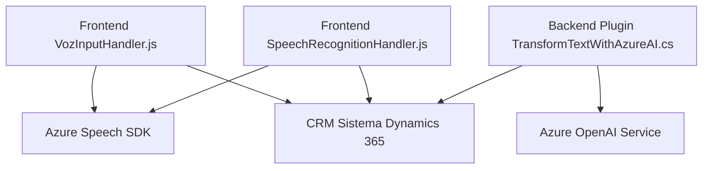

### Breve resumen técnico
El repositorio parece implementar una solución integrada **frontend-backend** dentro de un **sistema CRM (Dynamics 365)**. En el **front-end**, se destaca la interacción entre reconocimiento/síntesis de voz y datos visuales del formulario. En el **backend**, hay soporte para transformar texto mediante APIs de Azure OpenAI. Todo está orientado a mejorar la interacción entre el usuario y el sistema mediante tecnologías de procesamiento de lenguaje natural (NLP) y voz.

---

### Descripción de arquitectura
La arquitectura principal del repositorio es **n-capas** integrada con servicios externos. Hay una separación de responsabilidades en **tres niveles principales**:
1. **Frontend (JavaScript)**: Se encarga de la integración en tiempo real con datos del formulario, procesamiento de la voz y manipulación de campos mediante reconocimiento de voz/síntesis.
2. **Backend (C#, plugins)**: Centraliza la lógica empresarial avanzada mediante un plugin para CRM y delega procesamiento avanzado al servicio Azure OpenAI.
3. **Servicios externos**: Uso del **Azure Speech SDK** para gestión de voz y del **Azure OpenAI Service** para transformación de texto.

Aunque los archivos individuales siguen principios de modularidad, los componentes dependen del sistema CRM y servicios Azure, lo que sugiere una arquitectura hibrida **n-capas con servicios desacoplados**.

---

### Tecnologías usadas
1. **Frontend**:
   - Lenguaje: **JavaScript**.
   - SDK externo: **Azure Speech SDK**.
   - Frameworks: Aunque no se menciona explícitamente, el uso de SDK dinámico sugiere una integración directa con el DOM y potencial uso dentro de Dynamics CRM.

2. **Backend**:
   - Lenguaje: **C#** (con Dynamics CRM SDK).
   - Librerías: **Newtonsoft.Json**, **System.Net.Http**, **System.Text.Json**.

3. **Servicios Externos**:
   - **Azure Speech SDK**: Para síntesis y reconocimiento de voz.
   - **Azure OpenAI Service**: Procesamiento de texto con soporte para IA.

4. **Patrones Arquitectónicos**:
   - **Modular Design**: Separación de funciones por responsabilidad.
   - **Plugin Pattern**: En el backend, los plugins extienden la funcionalidad del CRM.
   - **Service-Oriented Architecture (SOA)**: Integración con múltiples APIs externas.
   - **Facade Pattern**: Consolida la comunicación con servicios externos a través de clases específicas.

---

### Diagrama Mermaid

---

### Conclusión final
El repositorio implementa una solución híbrida **frontend-backend** con integración a un **CRM**. Su diseño **modular** y orientación hacia servicios **desacoplados** permite manejar la interacción de datos del formulario con voz/síntesis mediante Azure Speech SDK, a la vez que transforma texto usando IA con Azure OpenAI. La arquitectura sigue un modelo **n-capas** complementado con llamadas externas, optimizando la experiencia del usuario y manteniendo buena integridad entre los componentes del sistema.